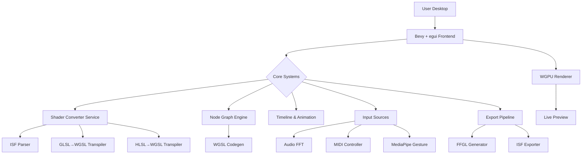
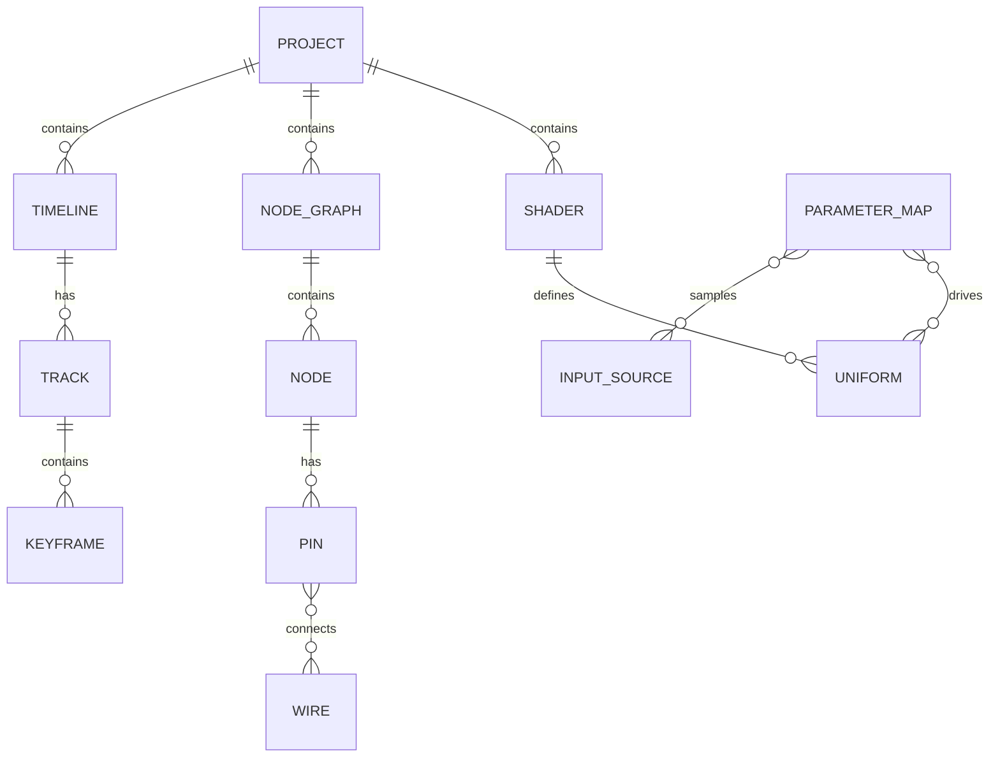

# WGSL Shader Studio – Technical Architecture (Complete Implementation)

## 1. Architecture Overview



## 2. Technology Stack

| Layer | Tech | Purpose |
|-------|------|---------|
| Frontend | Bevy 0.17 + bevy_egui 0.38 | Cross-platform windowing, input, egui UI |
| UI Toolkit | egui 0.33 | Immediate-mode GUI, dockable panels |
| GPU API | wgpu 22 | WebGPU native, fallback to Vulkan/DX12/Metal |
| Audio | cpal + rustfft + realfft | Low-latency audio capture, FFT, beat/onset |
| MIDI | midir | Cross-platform MIDI I/O, device hot-plug |
| Vision | mediapipe-rs (or onnxruntime) | Hand/pose tracking, depth-camera support |
| Parser/AST | tree-sitter + custom grammars | GLSL, HLSL, ISF parsing to unified AST |
| Transpiler | custom WGSL emitter | AST → WGSL with comment & uniform preservation |
| Export | binaryen (optional) | WGSL→SPIR-V for FFGL, ISF JSON meta |

## 3. Core Modules

### 3.1 Shader Converter Service
- **ISF Parser**: validates against ISF 1.2 JSON schema, extracts uniforms, categories, credits
- **GLSL Transpiler**: handles #version 450, layout(location), uniform blocks, samplers
- **HLSL Transpiler**: supports Texture2D, SamplerState, cbuffer, row-major matrices
- **Uniform Analyzer**: deduces ranges, defaults, UI widgets (slider, color, bool)
- **Live Error Linter**: line-accurate diagnostics with quick-fix suggestions

### 3.2 Node Graph Engine
- **Graph Container**: petgraph StableGraph, serde save/load, undo/redo stack
- **Node Registry**: trait-based nodes (math, texture, time, audio, midi, geometry)
- **Type System**: float, vec2/3/4, mat4, texture2D; implicit casts where lossless
- **Code Generator**: topological sort, emits WGSL functions, uniform blocks, main()
- **Mini-Preview**: compile single node to 64×64 texture, overlay on node thumbnail

### 3.3 Timeline & Animation
- **Track System**: uniform tracks, marker tracks, BPM track, nested groups
- **Keyframe Types**: step, linear, Bezier (cubic), hold; copy/paste JSON
- **Playback Engine**: fixed timestep 120 Hz, interpolation cache, loop regions
- **Export Drivers**: PNG sequence (rayon parallel), MP4 (ffmpeg librust), GIF (gifski)

### 3.4 Input Sources
- **Audio**: cpal capture thread → ring buffer → FFT → beat/onset detectors → parameter map
- **MIDI**: midir input thread → CC map → NRPN reassembly → clock sync → parameter map
- **Gesture**: camera thread → MediaPipe graph → landmark smoothing → calibration → parameter map
- **Parameter Aggregator**: blend sources (timeline, audio, midi, gesture) with priority weights

### 3.5 Export Pipeline
- **WGSL Bundle**: main.wgsl, uniforms.json, thumbnail.png, metadata.json
- **FFGL Generator**: C++ wrapper, CMakeLists, parameter auto-mapping, Windows DLL & macOS dylib
- **ISF Exporter**: reverse-convert WGSL→ISF, embed textures as base64, validate with ISF Tool

## 4. Data Models



### 4.1 Key Structures

```rust
// Core identifiers
type ProjectId = Uuid;
type ShaderId = Uuid;
type NodeId = u64;
type UniformName = String;

// Shader variants
enum ShaderKind { ISF, GLSL, HLSL, WGSL, NodeGraph }
struct Shader { id: ShaderId, kind: ShaderKind, source: String, uniforms: Vec<Uniform> }

// Uniform descriptor
struct Uniform { name: UniformName, utype: UniformType, default: f32, min: f32, max: f32, widget: Widget }
enum UniformType { Float, Vec2, Vec3, Vec4, Color, Bool, Int, Array(usize) }
enum Widget { Slider, ColorPicker, Checkbox, Combo(Vec<String>) }

// Node graph
struct NodeGraph { nodes: Vec<Node>, wires: Vec<Wire> }
struct Node { id: NodeId, kind: NodeKind, inputs: Vec<Pin>, outputs: Vec<Pin>, pos: Vec2 }
struct Pin { id: PinId, name: String, ptype: PinType, value: Option<Value> }
struct Wire { from: PinId, to: PinId }

// Timeline
struct Timeline { tracks: Vec<Track> }
struct Track { target: UniformName, keys: Vec<Keyframe> }
struct Keyframe { time: f64, value: f32, interp: Interp }
enum Interp { Step, Linear, Bezier((f64,f64),(f64,f64)) }
```

## 5. API Contracts

### 5.1 Converter Service
```rust
impl ConverterService {
    fn isf_to_wgsl(json: &str, vert: &str, frag: &str) -> Result<WGSL, Vec<Diagnostic>>;
    fn glsl_to_wgsl(source: &str, stage: Stage) -> Result<WGSL, Vec<Diagnostic>>;
    fn hlsl_to_wgsl(source: &str, stage: Stage) -> Result<WGSL, Vec<Diagnostic>>;
}
```

### 5.2 Node Graph
```rust
impl NodeGraph {
    fn add_node(kind: NodeKind, pos: Vec2) -> NodeId;
    fn remove_node(id: NodeId);
    fn connect(from: PinId, to: PinId) -> Result<(), ConnectError>;
    fn generate_wgsl() -> String; // topological codegen
}
```

### 5.3 Timeline
```rust
impl Timeline {
    fn set_keyframe(uniform: &str, time: f64, value: f32, interp: Interp);
    fn delete_keyframe(uniform: &str, index: usize);
    fn evaluate(time: f64) -> HashMap<UniformName,f32>;
    fn export_mp4(path: &Path, fps: u32) -> Result<(), ExportError>;
}
```

## 6. Performance Targets

| Metric | Budget | Measurement |
|--------|--------|-------------|
| Startup cold | ≤ 3 s | wall-clock until first pixel |
| Shader compile | ≤ 2 s | GLSL 500 lines → WGSL |
| Node graph → WGSL | ≤ 500 ms | 50 nodes, 100 wires |
| Preview FPS | ≥ 60 | 1920×1080, typical shader |
| Audio latency | ≤ 50 ms | capture → parameter update |
| MIDI latency | ≤ 10 ms | note-on → visual change |
| Memory usage | ≤ 2 GB | typical project, 4k textures × 4 |
| Export 10 s 1080p | ≤ 30 s | PNG sequence on 8-core |

## 7. Security & Sandboxing
- Shader compilation sandboxed in separate thread; no file system access except user-selected folders
- Network disabled unless user opts-in for update checks
- Autosave encrypted with project-scoped key (optional user password)
- FFGL plugin build uses containerized toolchain to prevent malicious codegen

## 8. Testing Strategy
- **Unit**: parser round-trips, node codegen, keyframe interpolation, parameter blending
- **Integration**: audio→FFT→parameter, MIDI learn, gesture calibration, export pipeline
- **Snapshot**: WGSL output for every example shader, node graph JSON, ISF round-trip
- **Performance**: nightly benchmark suite; regression alerts on CI
- **QA Matrix**: Windows 10/11, macOS 12/13/14, Ubuntu 20.04/22.04; Intel/Apple-Silicon/NVIDIA/AMD

## 9. Deployment & Updates
- **Installer**: MSI (Windows), DMG (macOS), deb/rpm/AppImage (Linux); optional portable zip
- **Auto-update**: Tauri-updater or Sparkle; delta patches; user can defer
- **Telemetry**: opt-in crash reports, performance samples; no source code uploaded

## 10. Risks & Mitigations
| Risk | Impact | Mitigation |
|------|--------|------------|
| MediaPipe binary size | 100 MB+ bundle | optional download; lighter ONNX fallback |
| ISF spec ambiguity | export incompatibility | maintain ISF 1.2 test suite; submit clarifications |
| Node graph cyclic | infinite loop | topological sort with cycle detection; UI warning |
| GPU driver bugs | crashes | fallback CPU renderer; blacklist table; prompt user update |
| Export patent encumbrance (H.264) | legal | offer royalty-free VP9 + AAC; optional ffmpeg for H.264 |