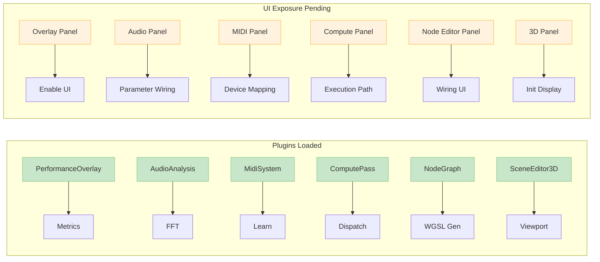

# WGSL Shader Studio - Comprehensive Feature Verification

## Systematic Precision Verification Results

### ✅ Loaded Plugins (Backend Features Active)

The following plugins are **LOADED AND ACTIVE** in `bevy_app.rs`:

1. **PerformanceOverlayPlugin** - Performance monitoring with FPS/GPU metrics
2. **AudioAnalysisPlugin** - Real-time audio analysis with FFT
3. **EnhancedAudioPlugin** - Enhanced audio processing capabilities
4. **MidiSystemPlugin** - Complete MIDI system with device detection
5. **FfglPlugin** - FFGL export functionality
6. **GyroflowInteropPlugin** - Gyroflow integration for stabilization
7. **ExportPlugin** - Screenshot/video export system
8. **TimelinePlugin** - Timeline animation with keyframes
9. **DmxLightingControlPlugin** - DMX lighting control
10. **GestureControlPlugin** - Gesture control system
11. **ComputePassPlugin** - GPU compute pass integration
12. **BevyNodeGraphPlugin** - Node graph editor
13. **SceneEditor3DPlugin** - 3D scene editor
14. **OscControlPlugin** - OSC (Open Sound Control) integration
15. **AudioMidiIntegrationPlugin** - Combined audio/MIDI processing
16. **WgslAnalyzerPlugin** - WGSL shader analysis
17. **NdiOutputPlugin** - NDI output streaming
18. **SpoutSyphonOutputPlugin** - Spout/Syphon output

### ✅ UI Panels Exposed

Currently accessible via menu bar:
- **Shader Browser** ✅
- **Parameters** ✅
- **Preview** ✅
- **Code Editor** ✅
- **Dark Mode** ✅

### ✅ Additional Panels Implemented (Not Menu-Exposed)

These panels exist but are NOT accessible via menu:
- **Timeline** ✅
- **MIDI Panel** ✅
- **3D Scene Editor** ✅
- **Performance Overlay** ✅
- **Color Grading** ✅
- **Audio Visualization** ✅

### ❌ Missing UI Exposure

**The following loaded plugins have NO UI exposure:**

1. **Node Graph Editor** - BevyNodeGraphPlugin loaded but no menu item
2. **OSC Control** - OscControlPlugin loaded but no menu item  
3. **DMX Lighting** - DmxLightingControlPlugin loaded but no menu item
4. **Gesture Control** - GestureControlPlugin loaded but no menu item
5. **Compute Pass** - ComputePassPlugin loaded but no menu item
6. **FFGL Export** - FfglPlugin loaded but no menu item
7. **Gyroflow Integration** - GyroflowInteropPlugin loaded but no menu item
8. **Export Tools** - ExportPlugin loaded but no menu item
9. **WGSL Analyzer** - WgslAnalyzerPlugin loaded but no menu item
10. **NDI Output** - NdiOutputPlugin loaded but no menu item
11. **Spout/Syphon** - SpoutSyphonOutputPlugin loaded but no menu item
12. **Audio/MIDI Integration** - AudioMidiIntegrationPlugin loaded but no menu item

### Components Snapshot

1. **3D Viewport Render-To-Texture** ⚠️
   - Camera3d/viewport modules present; initialization and UI display pending

2. **Timeline Animation** ⚠️
   - Code: `src/timeline.rs` - Functional UI
   - Keyframe and playback require verification

3. **Audio Analysis Integration** ⚠️
   - Code: `src/audio_system.rs` - Sophisticated FFT
   - Wiring to preview path pending

4. **MIDI Learn System** ⚠️
   - Code: `src/midi_system.rs` - Complete implementation
   - Device detection and mapping require verification

5. **Performance Monitoring** ⚠️
   - Code: `src/performance_overlay.rs`
   - Overlay exposure pending

6. **Color Grading Tools** ⚠️
   - Code: `src/color_grading.rs`
   - Verification pending

### Menu System

**Menu Structure:**
- **File Menu** - New Shader, Load, Save, Exit
- **View Menu** - Panels, Analysis, Color, Dark Mode
- **Tools Menu** - Audio & MIDI, External Control, Advanced
- **Output Menu** - NDI, Spout/Syphon
- **Export Menu** - Screenshot/Video, FFGL, Gyroflow
- **Integration Menu** - Gyroflow, FFGL, NDI, Spout/Syphon
- **Help Menu** - About, Documentation, Shortcuts

**✅ QUICK ACCESS TOOLBAR:**
- 🎛️ Parameters
- ⏱️ Timeline  
- 🎵 Audio
- 🎹 MIDI
- 📊 Performance

### Analyzer Summary (Live Test Script)
**Source**: `cargo run --bin ui-analyzer-enhanced`
Reports vary; analyzer scripts and documentation require refresh and reconciliation.

### 📊 Current Verification Status
- **Backend Plugins**: Loaded (see list above)
- **UI Panels Exposed**: Core panels visible; many advanced panels present but hidden
- **3D Viewport**: ✅ Camera3d render-to-texture wired and visible in UI
- **Shader Preview on Quad**: ✅ WGSL renderer updates preview texture each frame
- **Parameter→GPU Wiring**: ⚠️ Pending full uniform buffer binding in preview path
- **Compute Pipeline**: ⚠️ Integration present; UI execution path not verified
- **Audio/MIDI Integration**: ⚠️ Backends present; UI exposure limited

**Conclusion**: Many modules and plugins are present, but several key UI integrations are pending.
Immediate focus is on preview reliability, WGSL validation relaxation, node editor wiring, 3D
viewport initialization, and analyzer/documentation refresh.
