# WGSL Shader Studio

## Documentation

For comprehensive guides on shader development, conversion, and best practices, see our [Shader Studio Cookbook](docs/SHADER_STUDIO_COOKBOOK.md).

### Complete Documentation Suite

Our comprehensive documentation suite includes:

- [WGSL Fundamentals](docs/WGSL_FUNDAMENTALS.md) - Complete reference for WebGPU Shading Language
- [GLSL Fundamentals](docs/GLSL_FUNDAMENTALS.md) - Comprehensive guide to OpenGL Shading Language
- [HLSL Fundamentals](docs/HLSL_FUNDAMENTALS.md) - Detailed documentation for High Level Shading Language
- [ISF Fundamentals](docs/ISF_FUNDAMENTALS.md) - Complete guide to Interactive Shader Format
- [Shader Conversion Framework](docs/SHADER_CONVERSION_FRAMEWORK.md) - System for converting between shading languages
- [Application Usage Guide](docs/APPLICATION_USAGE_GUIDE_COMPLETE.md) - Complete guide to using WGSL Shader Studio
- [Technical Architecture](docs/WGSL_SHADER_STUDIO_ARCHITECTURE.md) - Detailed technical architecture documentation
- [Advanced Features](docs/ADVANCED_FEATURES.md) - Documentation for professional-grade features
- [Comprehensive Documentation Index](docs/COMPREHENSIVE_DOCUMENTATION_INDEX.md) - Complete index of all documentation

## Current State (2025-12-16)
- App boot: reliable after egui context scheduling fixes; UI systems run on the proper pass to prevent early context use.
- Preview: renderer output textures use `Rgba8UnormSrgb` (src/shader_renderer.rs:914). 3D preview textures aligned to `Rgba8UnormSrgb` (src/scene_editor_3d.rs:128, 141). Pixel size validation prevents Bevy image panics (src/scene_editor_3d.rs:297–299). Black preview resolved by unifying formats.
- Node graph: WGSL generation stabilized; crashes addressed by generating pipeline-compatible WGSL and safe defaults. Ongoing verification for edge cases; UI exposure active.
- 3D editor: viewport texture created and preview quad displays the shader; camera orbit/pan implemented. See src/scene_editor_3d.rs:151–164 for camera setup and 173–183 for preview quad.
- Outputs UI: NDI/Spout/Syphon/OSC/DMX controls live in the right sidebar `Outputs` section; floating windows removed. See UI integration in src/editor_ui.rs:1030–1094.
- Feature enforcement: one-time initialization ensures all panels and features are enabled and prevents loops; enforcement referenced by `pub mod enforcement_system;` (src/lib.rs:32). Startup system enables all flags once within app initialization.
- Known issues: dynamic resize of preview may still require texture recreation; `wgpu_renderer` uses `Bgra8UnormSrgb` for surface which is acceptable but separate from preview texture path; ongoing work to harden node-edge cases.
- Verification: `cargo check` passes; runtime verified locally. Follow-up tasks include resize robustness and end-to-end node graph rendering validation.

## Current Reality (2025-12-14)
- Preview panel is unreliable; WGSL fragment pipeline integration is being repaired.
- External WGSL shaders may fail due to strict validation/binding rules; validation is being relaxed.
- Node-based editor UI is present; wiring and UI exposure in the main app are incomplete.
- 3D scene editor modules exist; viewport initialization and panel wiring are pending.
- Live analyzer scripts exist; generated reports are inconsistent and require overhaul.

### What Works (partial)
- Bevy + egui application boots with multiple panels.
- Shader systems and render modules are present; preview wiring is under repair.
- ISF loading/parsing modules exist; CLI tools build for diagnostics.
- Node graph UI and compilation modules exist; editor wiring needs activation.
- Timeline modules and export system exist; integration requires verification.

### What’s Broken/Missing
 - Preview panel frequently blank; renderer initialization/resize handling under repair
 - External WGSL shader validation too strict; binding rules being relaxed
 - Node editor is not fully wired/exposed in the UI
 - 3D editor viewport initialization and display not stable
 - Live analyzer documentation and scripts are outdated and inconsistent

### Placeholder vs Real (snapshot)
- Real modules present: `shader_renderer.rs`, `isf_loader.rs`, node graph integrations, timeline, CLI utilities.
- Implemented, needs repair/integration: audio/MIDI integration, compute execution UI path, node editor UI wiring, frame recording/export UI.

### Immediate Plan
- Repair preview pipeline and relax WGSL validation for external shaders
- Enable node editor plugin and expose wiring UI
- Fix 3D editor viewport initialization and panel activation
- Refresh analyzer scripts and documentation to reflect current reality

A shader development environment built with Bevy 0.17 and bevy_egui 0.38, featuring WGSL shader compilation, ISF support modules, and visual editing capabilities under active repair.

## Current Reality

**Framework**: Bevy 0.17 + bevy_egui 0.38  
**Build Status**: Builds with multiple modules; preview path under repair  
**Core Features**: Many modules implemented; several integrations need repair  
**Critical Systems**: Node graph, analyzer, and renderer modules present; UI wiring ongoing

## Recent Integration Highlights

### Implemented Modules (examples)

#### 1. WGSL AST Parser (`src/wgsl_ast_parser.rs`)
- AST node types, parsing utilities, diagnostics scaffolding

#### 2. Shader Module System (`src/shader_module_system.rs`)
- Module loading/caching, import resolution scaffolding

#### 3. Transpiler Framework (`src/shader_transpiler.rs`)
- Multi-format conversion stubs and integration points

#### 4. Bevy Shader Graph Integration (`src/bevy_shader_graph_integration.rs`)
- Node/port types, graph compilation scaffolding

#### 5. Egui Node Graph UI (`src/egui_node_graph_integration.rs`)
- Pan/zoom, selection, connections UI scaffolding

## Architecture

### Technology Stack
- **Engine**: Bevy 0.17 (ECS game engine)
- **UI**: bevy_egui 0.38 (immediate mode GUI)
- **Rendering**: WGPU (cross-platform graphics API)
- **Audio**: Custom FFT analysis system with midir MIDI support
- **Platform**: Windows, macOS, Linux support

```mermaid
flowchart TD
    A[WGSL Shader Studio] --> B[Bevy 0.17]
    A --> C[bevy_egui 0.38]
    A --> D[WGPU Renderer]
    A --> E[Audio/MIDI]
    A --> F[Node Graph]
    A --> G[Timeline & Export]
    D --> D1[Fragment]
    D --> D2[Compute]
    D1 --> D3[Uniforms & Bind Groups]
    D2 --> D4[Workgroups & Dispatch]
    E --> E1[Audio FFT]
    E --> E2[MIDI Learn]
    E1 --> E3[Parameter Mapping]
    E2 --> E3
    F --> F1[Visual Node Editor]
    F --> F2[Graph→WGSL Generation]
    G --> G1[Screenshots]
    G --> G2[Video Export]
```


### Module Structure (Diagram)


#### Module Graph (Flow)


#### Subsystem Dataflow


### Extended Architecture Diagrams

#### System Overview


#### Shader/Data Flow


#### Preview Repair Pipeline


## Technical Notes

### Quality Snapshot
- Multiple modules compile; preview path under repair
- Diagnostics/analyzer scripts exist; reports require refresh
- Threading/concurrency patterns vary across modules


### Reference Patterns
- use.gpu patterns: AST parsing, module systems, transpilation
- bevy_shader_graph patterns: node graphs, compilation concepts
- egui_node_graph patterns: UI interactions

## Next Phase Goals

### UI Enablement and Live Validation
1. Visual Node Editor: enable plugin and expose UI
2. Node Graph: fix rendering details and window integration
3. Live Analyzer: refresh scripts and generated audit reports
4. Preview: ensure reliable WGPU initialization and rendering

### Advanced Features
1. Audio/MIDI integration with real-time mapping
2. Timeline animation with keyframes and curve editors
3. FFGL plugin export
4. Advanced shader features

### Actionable Goals (Summary)
- Canonicalize node system to `bevy_node_graph_integration_enhanced.rs`
- Complete node palette and WGSL codegen with validation/diagnostics
- Feed `generate_wgsl()` output into preview with fallbacks and error overlays
- Initialize 3D viewport textures; add camera/gizmos; render basic meshes/materials
- Stabilize renderer lifecycle (init/resize/present) and add status overlays
- Bind parameter panel values and timeline outputs to shader uniforms and graph inputs
- Ensure borrow-safe timeline UI rendering; playback/loop/scrub; JSON export/import
- Map audio analyzer outputs to uniforms; implement MIDI CC mapping and MIDI learn
- Surface Naga/WGSL diagnostics in preview; validate node graphs
- Implement open/save for shaders and graphs; persist graph JSON; recent files
- ISF import with parameter mapping and WGSL generation; basic FFGL export path
- Add performance overlay metrics; optimize preview paths; guard egui/WGPU startup
- Integration tests (node WGSL, preview smoke, timeline eval, parameter binding); Windows CI runner

## Usage

### Building
```bash
cargo build --release
```

### Running
```bash
cargo run --bin isf-shaders
```
Optional UI diagnostics:
```bash
cargo run --bin ui-analyzer
```
Enhanced analysis:
```bash
cargo run --bin ui-analyzer-enhanced
```

## Safety Notes

- Documentation and analyzer reports are being reconciled to reflect actual current status.

## Status Snapshot

- Build: Compiles with multiple modules; preview path under repair
- Renderer: WGSL preview unreliable; repairs in progress
- Node Editor: UI present; wiring/exposure pending
- 3D Editor: Modules present; viewport initialization pending
- Analyzer: Scripts exist; reports require refresh

## Success Criteria (near-term)

- Preview panel displays WGSL output reliably
- External WGSL shaders compile with relaxed validation
- Node editor wiring enabled and exposed in UI
- 3D editor viewport renders and updates correctly
- Analyzer outputs accurate, useful reports

## 📚 Documentation

- [UI Audit Report](UI_AUDIT_REPORT.md) - Current UI status and priorities
- [Frontend Features](docs/FRONTEND_FEATURES.md) - Target design and current progress
- [3D Scene Editor Status](docs/3D_SCENE_EDITOR_STATUS_REPORT.md) - Integration progress

## 🔗 Reference Repositories Integrated

- [use.gpu](https://github.com/use-gpu/use-gpu) - WGSL AST parsing and transpilation patterns
- [bevy_shader_graph](https://github.com/Neopallium/bevy_shader_graph) - Node graph editor patterns
- [egui_node_graph2](https://github.com/setzer22/egui_node_graph) - Advanced UI interaction patterns

---

**Last Updated**: 2025-12-14  
**Status**: Build compiles; preview/node/3D editor under repair  
**Next Milestone**: Repair preview, enable node wiring, initialize 3D viewport

**Assessment**: Active repair and reconciliation of preview, node editor, analyzer, and documentation.
