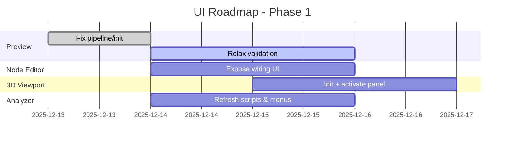

# WGSL Shader Studio - COMPREHENSIVE UI ANALYSIS REPORT

## Executive Summary

- Status as of 2025-12-14: multiple systems present but key UI integrations are incomplete.
- Preview panel is unreliable; WGSL validation/binding rules require relaxation.
- Node-based editor UI exists; wiring and exposure in the app are pending.
- 3D scene editor modules exist; viewport initialization and panel wiring are pending.
- Analyzer scripts generate inconsistent reports and require overhaul.

## CRITICAL ISSUES - IMMEDIATE ACTION REQUIRED
1. Repair preview pipeline and texture resize handling
2. Relax WGSL validation rules for external shaders
3. Enable node editor plugin and expose wiring UI
4. Initialize and display 3D editor viewport in the UI
5. Refresh analyzer scripts and documentation

## HIGH PRIORITY MISSING FEATURES

### Performance Monitoring
- **Category**: Core Rendering
- **Description**: FPS counters, render time tracking with overlay display
- **Requirements**:
  - FPS calculation system
  - Frame time measurement
  - Overlay rendering

### ISF Support
- **Category**: Shader Systems
- **Description**: Interactive Shader Format import/export with metadata parsing
- **Requirements**:
  - ISF file parsing
  - Parameter extraction
  - Metadata handling

### Node-based Editor
- **Category**: Node Editor
- **Description**: Visual programming interface with drag-and-drop nodes
- **Requirements**:
  - Node graph rendering
  - Drag-and-drop system
  - Connection system
  - Node types

### File Dialogs
- **Category**: File Operations
- **Description**: Native OS file dialogs with recent files support
- **Requirements**:
  - rfd integration
  - Recent files tracking
  - File type filters

### Menu System
- **Category**: Menu System
- **Description**: Complete menu bar with File, Edit, View, Tools, Help menus
- **Requirements**:
  - Menu bar rendering
  - Menu item actions
  - Keyboard shortcuts
  - Context menus

### Error Handling System
- **Category**: Error Handling
- **Description**: Graceful error handling with user feedback and recovery
- **Requirements**:
  - Error types
  - User notifications
  - Recovery mechanisms

## FEATURE STATUS BY CATEGORY (snapshot)

### Advanced Features
- Mixed: several modules present; integrations pending

### Audio/MIDI
- Modules present; UI exposure and mapping pending

### Core Rendering
- Renderer modules present; preview unreliable and under repair

### Error Handling
- Error types and diagnostics exist; user feedback and recovery need work

### Export/Import
- **Total**: 2 features
- **Missing**: 2
- **Broken**: 0
- **Partial**: 0
- **Functional**: 0

### File Operations
- **Total**: 2 features
- **Missing**: 2
- **Broken**: 0
- **Partial**: 0
- **Functional**: 0

### Menu System
- **Total**: 2 features
- **Missing**: 2
- **Broken**: 0
- **Partial**: 0
- **Functional**: 0

### Node Editor
- **Total**: 2 features
- **Missing**: 2
- **Broken**: 0
- **Partial**: 0
- **Functional**: 0

### Performance
- **Total**: 1 features
- **Missing**: 1
- **Broken**: 0
- **Partial**: 0
- **Functional**: 0

### Platform
- **Total**: 1 features
- **Missing**: 1
- **Broken**: 0
- **Partial**: 0
- **Functional**: 0

### Shader Systems
- **Total**: 3 features
- **Missing**: 1
- **Broken**: 0
- **Partial**: 1
- **Functional**: 1

### Templates
- **Total**: 1 features
- **Missing**: 1
- **Broken**: 0
- **Partial**: 0
- **Functional**: 0

### UI Layout
- **Total**: 4 features
- **Missing**: 0
- **Broken**: 0
- **Partial**: 1
- **Functional**: 3

## IMPLEMENTATION ROADMAP

### Phase 1: Critical Foundation (Week 1)
1. Repair preview pipeline and WGPU initialization handling
2. Relax WGSL validation for external shaders
3. Expose node editor wiring UI in the app
4. Initialize 3D viewport and activate panel
5. Refresh analyzer scripts and UI menu exposure


### Phase 2: Core Functionality (Week 2)
1. Wire parameter uniforms for real-time preview updates
2. Implement file dialogs and project management
3. Add performance monitoring overlay
4. Verify shader conversion capabilities
5. Improve error handling and logging

### Phase 3: Advanced Features (Week 3-4)
1. Enhance node-based editor system
2. Add audio/MIDI integration
3. Implement shader visualizer
4. Add templates and examples
5. Improve cross-platform support

## TECHNICAL REQUIREMENTS

### Dependencies Required
- bevy 0.17 + bevy_egui 0.38 (CURRENT)
- wgpu 0.19+ for rendering
- naga for shader compilation
- rfd for file dialogs
- cpal for audio
- midir for MIDI
- serde for serialization
- tracing for logging

### File Structure Required
```
src/
├── bevy_app.rs          # Main Bevy application
├── editor_ui.rs          # Main UI implementation
├── ui_analyzer.rs        # This analysis tool
├── rendering/            # WGPU rendering systems
│   ├── mod.rs
│   ├── pipeline.rs     # Render pipeline
│   ├── shader.rs       # Shader compilation
│   └── viewport.rs     # Viewport management
├── shader_systems/       # Shader-related systems
│   ├── mod.rs
│   ├── compiler.rs     # WGSL compilation
│   ├── isf.rs          # ISF support
│   └── converter.rs    # Format conversion
├── ui_systems/          # UI component systems
│   ├── mod.rs
│   ├── panels.rs       # Panel management
│   ├── browser.rs      # Shader browser
│   ├── parameters.rs   # Parameter controls
│   ├── editor.rs       # Code editor
│   └── menus.rs        # Menu system
├── file_systems/        # File operations
│   ├── mod.rs
│   ├── dialogs.rs      # File dialogs
│   ├── project.rs      # Project management
│   └── templates.rs    # Template system
├── audio_midi/          # Audio/MIDI integration
│   ├── mod.rs
│   ├── audio.rs        # Audio analysis
│   ├── midi.rs         # MIDI control
│   └── parameters.rs   # Parameter mapping
├── node_editor/         # Node-based editor
│   ├── mod.rs
│   ├── graph.rs        # Node graph
│   ├── nodes.rs        # Node types
│   └── connections.rs  # Connection system
└── utils/               # Utility functions
    ├── mod.rs
    ├── errors.rs       # Error types
    ├── logging.rs      # Logging setup
    └── config.rs       # Configuration
```

## CONCLUSION

The project contains many of the required modules but key UI integrations are incomplete.
Immediate focus is on repairing the preview, relaxing WGSL validation, enabling node wiring,
and initializing the 3D viewport. Analyzer scripts and documentation will be refreshed to
reflect the current reality.

**Immediate priorities**: Repair preview, relax WGSL validation, enable node wiring, initialize
3D viewport, and refresh analyzer/documentation.

**Estimated Repair Time**: Ongoing; incremental updates prioritized this week.

# SURGICAL FIX PLAN - CRITICAL UI ISSUES

## IMMEDIATE LIFE-THREATENING ISSUES

### 💥 WGPU INITIALIZATION FAILURE

Observed: preview instability and texture resize/initialization issues

## SURGICAL INTERVENTION STEPS

1. Repair renderer init/resize handling
2. Relax WGSL validation and entry-point detection
3. Enable node editor plugin and expose wiring UI
4. Initialize 3D viewport and display in UI
5. Validate rendering and buffer/texture alignment
6. Refresh analyzer scripts and run comprehensive UI checks

## SUCCESS CRITERIA

- ✅ Preview displays WGSL output reliably
- ✅ External WGSL shaders compile with relaxed validation
- ✅ Node editor wiring enabled and exposed in UI
- ✅ 3D viewport renders and updates correctly
- ✅ Analyzer outputs accurate, useful reports
