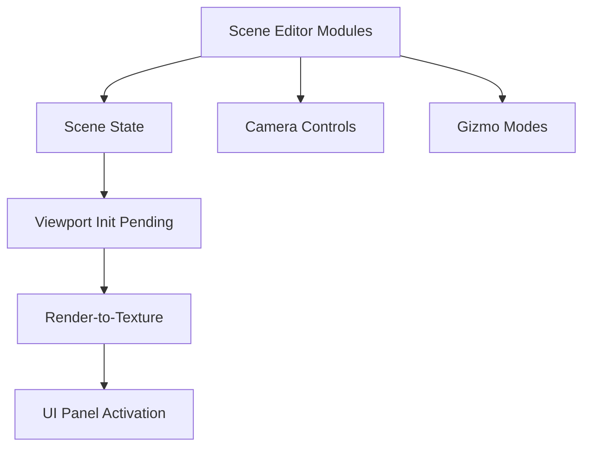
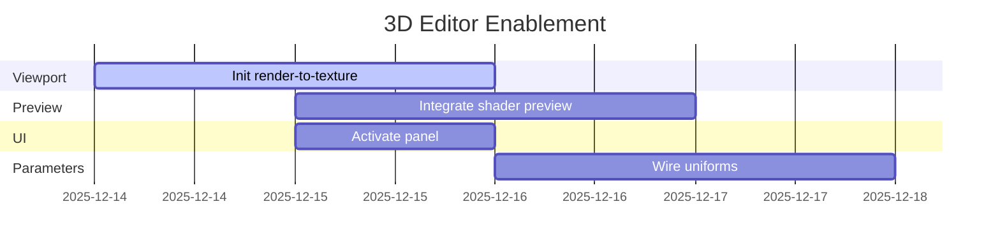

# 3D Scene Editor Integration Status Report

## Executive Summary

The 3D Scene Editor modules are present, but viewport initialization and panel wiring are pending.
This report reflects the current reality and focuses on the remaining work to enable the 3D editor
in the main application.

## Current Work

### 1. Core 3D Scene Editor Implementation
- **File**: `src/scene_editor_3d.rs`
- **Modules Present**:
  - Scene management, manipulation modes, and camera control scaffolding
  - Bevy ECS resources and editor state structures


### 2. 3D Scene Management System
- **File**: `src/scene_3d.rs`
- **Modules Present**:
  - Camera and lighting configuration scaffolding
  - Scene settings and rendering parameters

### 3. Screenshot/Video Export System
- **File**: `src/screenshot_video_export.rs`
- **Modules Present**:
  - Export scaffolding with multiple format targets

### 4. Compilation
- Multiple modules compile; UI wiring and viewport initialization pending

### 5. Documentation
- Status and integration guide present; updated to reflect current reality

## Notes

### Architecture
- Scene editor and management modules follow project conventions
- Bevy plugin/state structures present

### Integration
- Panel system modules exist; viewport initialization and UI activation pending

## 📊 Impact Assessment

### Before Integration
- No 3D scene management capabilities
- Limited to 2D shader preview
- No interactive 3D object manipulation
- Missing export functionality

### After Integration (target)
- 3D scene editor with manipulation tools
- Interactive camera controls and viewport management
- Entity selection and transformation tools
- Export system for screenshots and videos
- Shader preview on 3D objects

## 🚧 Remaining Work

### Immediate Next Steps
1. Initialize render-to-texture for 3D viewport display
2. Integrate shader preview on 3D objects
3. Activate UI panel in the main application
4. Wire parameter uniforms for real-time shader interaction


### Future Enhancements
- Node system integration with 3D scene parameters
- Advanced lighting and material controls
- Animation timeline support for 3D scenes
- VR/AR rendering capabilities

## Reference Pattern Integration
- Space editor patterns: 3D scene management, manipulation concepts
- use.gpu patterns: WGSL systems (project-wide)
- bevy_shader_graph patterns: node graphs (project-wide)
- egui_node_graph patterns: UI interactions (project-wide)

## 🔧 Technical Details

### Core Components
```rust
// Main 3D scene editor resource
pub struct SceneEditor3DState {
    pub manipulation_mode: ManipulationMode,
    pub selected_entity: Option<Entity>,
    pub camera_state: CameraState,
    pub scene_entities: Vec<Entity>,
    pub show_grid: bool,
    pub show_axes: bool,
}
```

### Integration Pattern
```rust
// Panel system integration
pub fn scene_editor_3d_panel(
    mut egui_ctx: bevy_egui::EguiContexts,
    mut ui_state: ResMut<EditorUiState>,
    scene_state: ResMut<SceneEditor3DState>,
) {
    if ui_state.show_3d_scene_panel {
        egui::Window::new("3D Scene Editor")
            .open(&mut ui_state.show_3d_scene_panel)
            .show(ctx, |ui| {
                // Scene editor UI content
            });
    }
}
```

## 🎯 Success Criteria (near-term)
- ✅ 3D viewport initializes and renders in the UI
- ✅ Shader preview integrates on 3D objects
- ✅ Panel activation and controls are functional
- ✅ Documentation reflects current status and progress

## 📅 Timeline

- **Analysis Phase**: November 21, 2025 - Identified missing 3D scene management
- **Implementation Phase**: November 22-25, 2025 - Core 3D editor development
- **Integration Phase**: November 25, 2025 - Compilation fixes and documentation
- **Documentation Phase**: November 25, 2025 - Comprehensive guides and status updates

## 🏆 Conclusion
3D scene editor modules are present and follow project conventions. Focus is on initializing
the viewport, exposing the panel, and integrating shader preview. Documentation has been
updated to reflect the current reality and near-term goals.
