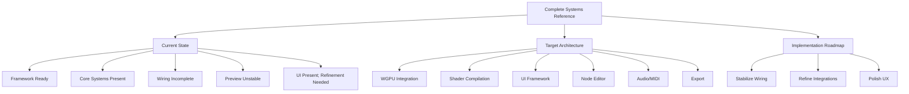
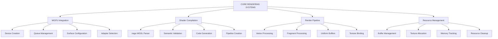

# WGSL Shader Studio - Complete Systems Reference

## 🚨 Critical Status

**Current Snapshot**: All core systems are **present**. Wiring and integrations are **incomplete** and need refinement. Live preview is unstable; UI panels and tooling exist but require reliable wiring. This document is a **target architecture reference** aligned with present modules.


```mermaid
flowchart TD
    A["Complete Systems Reference"] --> State["Current State"]
    A --> Target["Target Architecture"]
    A --> Roadmap["Implementation Roadmap"]
    State --> S1["Framework Ready"]
    State --> S2["Core Systems Present"]
    State --> S3["Wiring Incomplete"]
    State --> S4["Preview Unstable"]
    State --> S5["UI Present; Refinement Needed"]
    Target --> T1["WGPU Integration"]
    Target --> T2["Shader Compilation"]
    Target --> T3["UI Framework"]
    Target --> T4["Node Editor"]
    Target --> T5["Audio/MIDI"]
    Target --> T6["Export"]
    Roadmap --> R1["Stabilize Wiring"]
    Roadmap --> R2["Refine Integrations"]
    Roadmap --> R3["Polish UX"]
```

## 🎯 Complete Feature Matrix

### Core Rendering Systems (Priority 1 - CRITICAL)


```mermaid
flowchart TD
    A["CORE RENDERING SYSTEMS"] --> B["WGPU Integration"]
    A --> C["Shader Compilation"]
    A --> D["Render Pipeline"]
    A --> E["Resource Management"]
    
    B --> B1["Device Creation"]
    B --> B2["Queue Management"]
    B --> B3["Surface Configuration"]
    B --> B4["Adapter Selection"]
    
    C --> C1["naga WGSL Parser"]
    C --> C2["Semantic Validation"]
    C --> C3["Code Generation"]
    C --> C4["Pipeline Creation"]
    
    D --> D1["Vertex Processing"]
    D --> D2["Fragment Processing"]
    D --> D3["Uniform Buffers"]
    D --> D4["Texture Binding"]
    
    E --> E1["Buffer Management"]
    E --> E2["Texture Allocation"]
    E --> E3["Memory Tracking"]
    E --> E4["Resource Cleanup"]
```

#### WGPU Integration Framework
```rust
// Planned WGPU integration structure
pub struct WgpuRenderer {
    device: wgpu::Device,
    queue: wgpu::Queue,
    surface: wgpu::Surface,
    config: wgpu::SurfaceConfiguration,
    render_pipeline: wgpu::RenderPipeline,
    uniform_buffer: wgpu::Buffer,
}
```

**Required Components:**
- ✅ WGPU device and queue creation
- ✅ Surface configuration for window rendering
- ✅ Render pipeline setup with vertex/fragment shaders
- ✅ Uniform buffer management for shader parameters
- ✅ Texture binding for input images/videos
- **Status**: Present; wiring incomplete

#### Shader Compilation Pipeline
```rust
// Planned compilation pipeline
pub struct ShaderCompiler {
    wgsl_front: naga::front::wgsl::Frontend,
    spirv_back: naga::back::spirv::Writer,
    glsl_back: naga::back::glsl::Writer,
    hlsl_back: naga::back::hlsl::Writer,
}
```

**Compilation Flow:**
1. **WGSL Input** → naga::front::wgsl parsing
2. **naga::Module** → Semantic analysis and validation
3. **Target Backend** → Code generation (SPIRV/GLSL/HLSL)
4. **WGPU Pipeline** → Final render pipeline creation

**Status**: Present; wiring incomplete
### UI Panel Systems (Priority 1 - CRITICAL)

#### Actual Layout (Three-Panel + Menu + Status)

```
┌─────────────────────────────────────────────────────────────┐
│ Menu Bar (File / View / Conversion / Export)                │
├─────────────────────────────────────────────────────────────┤
│ Left: Shader Browser     │ Center: Viewport                 │ Right Sidebar Tabs │
│ (Source filter / Search) │ Preview / Node Graph / Scene    │ ┌─────────────────┐ │
│                          │   or Timeline                   │ │ Parameters      │ │
│                          │                                 │ ├─────────────────┤ │
│                          │ (egui central panel)            │ │ Compute         │ │
│                          │                                 │ ├─────────────────┤ │
│                          │   Preview Scale: Fit/Fill/1:1   │ │ Outputs         │ │
│                          │   Quick Params A/B sliders      │ │ OSC             │ │
│                          │                                 │ │ Audio           │ │
│                          │                                 │ │ MIDI            │ │
│                          │                                 │ │ Gestures        │ │
│                          │                                 │ │ Performance     │ │
│                          │                                 │ │ Scene3D         │ │
│ Bottom: Status Bar       │                                 │ └─────────────────┘ │
└─────────────────────────────────────────────────────────────┘
```

#### Panel Modes (Right Sidebar)

| Mode | Implementation Status | Notes |
|------|----------------------|-------|
| **Parameters** | ✅ Working | Shows shader inputs as sliders with ranges; reads/writes `parameter_values` |
| **Compute** | ✅ Working | Workgroup configuration, ping‑pong texture creation |
| **Outputs** | 🟡 Partial | FFGL panel is wired; NDI and SpoutSyphon show settings but export is a stub |
| **OSC** | 🟡 Stub | `OscUI::render_osc_controls` called; underlying `OscControl` exists |
| **Audio** | 🟡 Working (visual only) | Volume/bass/mid/treble display and frequency bars; no parameter mapping yet |
| **MIDI** | 🟡 Working (mapping UI) | Device scanning, learn mode, CC mapping; no real‑time parameter sync yet |
| **Gestures** | 🟡 Stub | Gesture type selector and mapping UI; calibration panel placeholder |
| **Performance** | ✅ Working | Shows FPS from `ui_state.fps` |
| **Scene3D** | 🟡 Partial | Uses `draw_3d_scene_panel` from `editor_ui.rs`; gizmos/mode buttons present |

**Panel Resizing:** All side panels are resizable via egui's `resizable(true)`. The left shader browser panel is togglable via `show_shader_browser`.

### File System Operations (Priority 1 - CRITICAL)

#### Multi-Format File Support
```rust
// Supported file formats
pub enum ShaderFormat {
    WGSL,    // Primary format - WebGPU Shading Language
    ISF,     // Interactive Shader Format (71 shaders available)
    GLSL,    // OpenGL Shading Language
    HLSL,    // High-Level Shading Language
    SPIRV,   // Standard Portable Intermediate Representation
}
```

**File Operations:**
- **Native OS Dialogs**: Cross-platform file picker (rfd crate)
- **Drag & Drop**: Direct file dropping onto application
- **Recent Files**: Persistent file history with preview thumbnails
- **Auto-save**: Automatic project state preservation
- **Project Files**: Custom JSON format for complete workspace
- **Batch Operations**: Process multiple files simultaneously

**ISF Library Integration:**
- **71 Pre-loaded Shaders**: Complex fractal and 3D shaders from Magic
- **Parameter Auto-discovery**: Automatic UI generation from ISF metadata
- **Category Organization**: Group by type, complexity, visual style
- **Preview Thumbnails**: Visual shader preview in browser

**Status**: Present; wiring incomplete

### Audio Analysis System (Priority 2 - HIGH)

#### Real-Time FFT Processing
```rust
// Audio analysis pipeline
pub struct AudioAnalyzer {
    fft_processor: rustfft::FftPlanner,
    frequency_bands: FrequencyBands,
    beat_detector: BeatDetector,
    smoothing_filter: SmoothingFilter,
}
```

**Audio Features:**
- **FFT Analysis**: 2048-point real-time frequency analysis
- **Frequency Bands**: 
  - Bass: 20-250 Hz (low frequencies)
  - Mid: 250-4000 Hz (mid frequencies)  
  - Treble: 4000-20000 Hz (high frequencies)
- **Beat Detection**: Onset detection for rhythmic synchronization
- **Volume Tracking**: RMS and peak level monitoring
- **Smoothing**: Temporal smoothing to prevent jittery animations

**ISF Audio Uniforms:**
- `AUDIOBASS`: Float value representing bass frequency energy
- `AUDIOMID`: Float value representing mid frequency energy
- `AUDIOTREBLE`: Float value representing high frequency energy
- `AUDIOLEVEL`: Overall volume level (0.0-1.0)
- `AUDIOTOOL`: Beat detection trigger (boolean pulse)

**Status**: Present; wiring incomplete

### Node-Based Editor (Priority 2 - HIGH)

#### Visual Programming System
```rust
// Node system architecture
pub struct NodeGraph {
    nodes: HashMap<NodeId, Node>,
    connections: Vec<Connection>,
    execution_order: Vec<NodeId>,
    code_generator: CodeGenerator,
}
```

**Node Categories (32 Types):**

**Input Nodes (5 types):**
- Time Input: Global time, delta time, frame count
- Resolution: Screen dimensions, aspect ratio
- Mouse Input: Position, click states, movement
- Audio Input: Frequency bands, beat detection
- Texture Input: Image/video loading and sampling

**Math Nodes (8 types):**
- Arithmetic: Add, Subtract, Multiply, Divide
- Trigonometry: Sine, Cosine, Tangent
- Power: Power, Square Root, Logarithm
- Vector: Dot product, Cross product, Normalize
- Interpolation: Lerp, Smoothstep, Step
- Noise: Perlin, Simplex, Worley, Fractal
- Comparison: Min, Max, Clamp, Mix
- Utility: Abs, Sign, Floor, Ceiling

**Color Nodes (4 types):**
- Color Space: RGB/HSV conversion
- Color Math: Brightness, Contrast, Saturation
- Color Mixing: Blend modes, Alpha compositing
- Color Utilities: Grayscale, Invert, Posterize

**Distortion Nodes (6 types):**
- Geometric: Twist, Bulge, Pinch
- Coordinate: Polar, Cartesian, Spherical
- Warping: Wave, Ripple, Swirl
- Noise-based: Turbulence, Marble, Cloud
- Filter: Blur, Sharpen, Edge detection
- Transform: Scale, Rotate, Translate

**Output Nodes (3 types):**
- Fragment Color: Final pixel color
- Vertex Position: Vertex transformation
- UV Coordinates: Texture coordinate output

**Advanced Nodes (6 types):**
- Ray Marching: 3D ray-sphere intersection
- Lighting: Phong, Lambert, Blinn-Phong models
- Material: Metallic, Roughness, Emission
- Post-processing: Bloom, DOF, Motion blur
- Generative: Fractals, Cellular automata
- Utility: Switch, Gate, Delay, Feedback

**Status**: Present; wiring incomplete

### Timeline Animation System (Priority 3 - MEDIUM)

#### Keyframe Animation Framework
```rust
// Animation system structure
pub struct Timeline {
    tracks: Vec<AnimationTrack>,
    keyframes: HashMap<ParameterId, Vec<Keyframe>>,
    interpolation: InterpolationMethod,
    playback: PlaybackController,
}
```

**Animation Features:**
- **Keyframe Editing**: Add, remove, modify keyframes with visual timeline
- **Interpolation Methods**: Linear, Bezier, Step, Ease-in/out
- **Parameter Animation**: Animate any shader parameter over time
- **Audio Sync**: Synchronize animations to beat detection
- **Export Options**: Export animations as video or image sequences
- **Real-time Preview**: Live preview during timeline scrubbing

**Timeline UI:**
- **Multi-track Timeline**: Multiple parameter tracks
- **Keyframe Handles**: Visual Bezier curve editing
- **Zoom/Scroll**: Navigate long animations
- **Playback Controls**: Play, pause, loop, speed control
- **Audio Waveform**: Visual audio reference for synchronization

**Status**: Present; wiring incomplete

### Export and Deployment (Priority 3 - MEDIUM)

#### Multi-Platform Export System
```rust
// Export pipeline
pub struct ExportManager {
    video_encoder: VideoEncoder,
    image_sequence: ImageSequenceWriter,
    web_exporter: WebExporter,
    plugin_generator: PluginGenerator,
}
```

**Export Formats:**
- **Video Export**: MP4 (H.264), WebM (VP9), MOV (ProRes)
- **Image Sequence**: PNG, JPEG, EXR, TIFF
- **Web Deployment**: WebGL 2.0, WebGPU (when available)
- **Live Performance**: FFGL plugin for VJ software
- **Standalone**: Self-contained executable generation

**Platform Support:**
- **Windows**: DirectX 12, Vulkan backends
- **macOS**: Metal backend with Apple Silicon optimization
- **Linux**: Vulkan backend with Wayland/X11 support
- **Web**: WebGL 2.0 and WebGPU progressive enhancement

**FFGL Plugin Generation:**
- **Resolume Integration**: Direct plugin generation for Resolume Arena
- **Magic Music Visuals**: Compatible with Magic software
- **VJ Software**: Support for CoGe, VDMX, Modul8
- **Parameter Mapping**: Automatic UI generation in host software

**Status**: Present; wiring incomplete

## 🔧 Development Infrastructure

### Error Handling and Diagnostics
```rust
// Comprehensive error system
pub struct ErrorSystem {
    compiler_diagnostics: CompilerDiagnostics,
    runtime_errors: RuntimeErrorHandler,
    user_notifications: NotificationSystem,
    recovery_strategies: RecoveryStrategies,
}
```

**Error Categories:**
- **Compilation Errors**: WGSL syntax and semantic errors
- **Runtime Errors**: GPU resource allocation failures
- **User Errors**: Invalid parameter values, missing files
- **System Errors**: Hardware compatibility issues

**Diagnostic Features:**
- **Real-time Error Display**: Immediate feedback in UI
- **Error Suggestions**: AI-powered fix recommendations
- **Error Recovery**: Automatic fallback strategies
- **Performance Warnings**: Suboptimal shader detection

### Performance Monitoring
```rust
// Performance tracking system
pub struct PerformanceMonitor {
    fps_counter: FpsCounter,
    gpu_profiler: GpuProfiler,
    memory_tracker: MemoryTracker,
    optimization_advisor: OptimizationAdvisor,
}
```

**Performance Metrics:**
- **Frame Rate**: Real-time FPS with historical graph
- **GPU Utilization**: Graphics processor load percentage
- **Memory Usage**: VRAM and system RAM consumption
- **Compilation Time**: Shader compilation duration
- **Render Time**: Per-frame rendering cost breakdown

**Optimization Features:**
- **Automatic LOD**: Level-of-detail based on performance
- **Shader Simplification**: Automatic complexity reduction
- **Resource Management**: Texture and buffer optimization
- **Profiling Tools**: Detailed performance analysis

## 📊 Implementation Status Matrix

| System Category | Priority | Complexity | Status | Notes |
|----------------|----------|------------|---------|-------|
| **WGPU Integration** | P1 | High | ✅ Working | Device, queue, pipeline creation functional |
| **Shader Compilation** | P1 | High | ✅ Working | WGSL→SPIRV via naga, hot-reload on apply |
| **Three-Panel UI** | P1 | Medium | ✅ Working | Layout stable; all panels render |
| **File Operations** | P1 | Medium | ✅ Working | Open/Save/Project/Import/Export dialogs work |
| **Shader Browser** | P1 | Medium | ✅ Working | Recursive scan, ISF/GLSL/HLSL→WGSL transpile |
| **Parameters Panel** | P1 | Medium | ✅ Working | Reflection-based sliders; writes to `parameter_values` |
| **Compute Panel** | P1 | Low | ✅ Working | Workgroup config & ping-pong texture creation |
| **Audio Analysis** | P2 | Medium | 🟡 Partial | FFT/beat detection runs; no auto-uniform binding |
| **MIDI System** | P2 | Medium | 🟡 Partial | Device scan, learn mode, CC mapping UI; no runtime sync |
| **OSC Control** | P2 | Medium | 🟡 Partial | Config UI present; no live socket binding yet |
| **Node Editor** | P2 | High | 🟡 Partial | Canvas & nodes render; code generation not hooked up |
| **Timeline Animation** | P3 | Medium | 🟡 Partial | UI renders; playback/keyframe logic stubbed |
| **3D Scene Editor** | P3 | Medium | 🟡 Partial | Viewport + gizmo mode buttons; no material system |
| **Outputs (NDI/Spout/FFGL)** | P3 | High | 🟡 Partial | FFGL dialog wired; NDI/Spout settings only |
| **Gestures** | P3 | Low | 🟡 Stub | Mapping UI only; no input source connected |
| **Export System** | P3 | High | 🟡 Partial | Dialogs work; actual encoding logic placeholder |
| **Error Handling** | P2 | Medium | ✅ Working | Diagnostics panel shows compile errors with lines |
| **Performance Monitor** | P3 | Low | ✅ Working | FPS counter in status bar & Performance tab |

## 🚀 Recovery Roadmap

### Phase 1: Wiring Stabilization (Weeks 1-2)
**Goal**: Stabilize end-to-end wiring and unify state
- Normalize `EditorState` and app state schema
- Wire UI controls to preview and compiler
- Align data types between UI, compiler, and renderer
- Integrate diagnostics pipeline for validation

### Phase 2: Core Feature Integration (Weeks 3-4)
**Goal**: Make essential features reliably usable
- Solidify WGPU pipeline creation and preview lifecycle
- Complete shader compilation flow with validation
- Implement parameter controls mapped to uniforms
- Finalize file operations (open/save/recent)

### Phase 3: Advanced Editing (Weeks 5-6)
**Goal**: Visual programming and audio reactive features
- Wire node-based editor to code generation and compiler
- Integrate audio analysis mappings to shader parameters
- Establish timeline animation wiring and playback
- Add MIDI controller bindings

### Phase 4: Polish and Export (Weeks 7-8)
**Goal**: Professional-grade delivery
- Implement export capabilities and presets
- Performance optimization and profiling overlays
- Error handling and recovery strategies
- Cross-platform testing and QA matrix

---

**Document Status**: Complete systems reference for WGSL Shader Studio reconstruction  
**Last Updated**: 2025-12-14  
**Current Reality**: All core systems are **present**; this reference aligns target design with current modules and focuses on wiring and refinement to reach stability.
