# WGSL Shader Studio - Complete Systems Reference

## 🚨 Critical Status

**⚠️ CURRENT REALITY**: This project is **BROKEN** with 33 compilation errors and **0 working features**. All systems described below represent the **TARGET ARCHITECTURE** that needs to be implemented during reconstruction.

```mermaid
graph TD
    A[COMPLETE SYSTEMS REFERENCE] --> B[🚨 CURRENT STATE]
    A --> C[🎯 TARGET ARCHITECTURE]
    A --> D[📋 IMPLEMENTATION ROADMAP]
    
    B --> B1[33 Compilation Errors]
    B --> B2[0 Working Features]
    B --> B3[Broken UI Layout]
    B --> B4[Missing Core Systems]
    
    C --> C1[WGPU Integration]
    C --> C2[Shader Compilation]
    C --> C3[UI Framework]
    C --> C4[Node Editor]
    C --> C5[Audio/MIDI]
    C --> C6[FFGL Export]
    
    D --> D1[Critical Fixes]
    D --> D2[Foundation Systems]
    D --> D3[Core Features]
    D --> D4[Advanced Systems]
    
    style A fill:#1a237e
    style B fill:#f44336
    style C fill:#2196f3
    style D fill:#4caf50
```



## 🎯 Complete Feature Matrix

### Core Rendering Systems (Priority 1 - CRITICAL)

```mermaid
graph TD
    A[CORE RENDERING SYSTEMS] --> B[WGPU Integration]
    A --> C[Shader Compilation]
    A --> D[Render Pipeline]
    A --> E[Resource Management]
    
    B --> B1[Device Creation]
    B --> B2[Queue Management]
    B --> B3[Surface Configuration]
    B --> B4[Adapter Selection]
    
    C --> C1[naga WGSL Parser]
    C --> C2[Semantic Validation]
    C --> C3[Code Generation]
    C --> C4[Pipeline Creation]
    
    D --> D1[Vertex Processing]
    D --> D2[Fragment Processing]
    D --> D3[Uniform Buffers]
    D --> D4[Texture Binding]
    
    E --> E1[Buffer Management]
    E --> E2[Texture Allocation]
    E --> E3[Memory Tracking]
    E --> E4[Resource Cleanup]
    
    style A fill:#f44336
    style B fill:#ffebee
    style C fill:#ffebee
    style D fill:#ffebee
    style E fill:#ffebee
```



#### WGPU Integration Framework
```rust
// Planned WGPU integration structure
pub struct WgpuRenderer {
    device: wgpu::Device,
    queue: wgpu::Queue,
    surface: wgpu::Surface,
    config: wgpu::SurfaceConfiguration,
    render_pipeline: wgpu::RenderPipeline,
    uniform_buffer: wgpu::Buffer,
}
```

**Required Components:**
- ✅ WGPU device and queue creation
- ✅ Surface configuration for window rendering
- ✅ Render pipeline setup with vertex/fragment shaders
- ✅ Uniform buffer management for shader parameters
- ✅ Texture binding for input images/videos
- ❌ **CURRENT STATUS**: Not implemented

#### Shader Compilation Pipeline
```rust
// Planned compilation pipeline
pub struct ShaderCompiler {
    wgsl_front: naga::front::wgsl::Frontend,
    spirv_back: naga::back::spirv::Writer,
    glsl_back: naga::back::glsl::Writer,
    hlsl_back: naga::back::hlsl::Writer,
}
```

**Compilation Flow:**
1. **WGSL Input** → naga::front::wgsl parsing
2. **naga::Module** → Semantic analysis and validation
3. **Target Backend** → Code generation (SPIRV/GLSL/HLSL)
4. **WGPU Pipeline** → Final render pipeline creation

**Status**: ❌ **NOT IMPLEMENTED**

### UI Panel Systems (Priority 1 - CRITICAL)

#### Three-Panel Layout Manager
```
┌─────────────────────────────────────────────────────────────┐
│                    Menu Bar (Fixed)                       │
├─────────────────┬────────────────────────┬──────────────────┤
│                 │                        │                  │
│  LEFT PANEL     │    CENTER PANEL        │   RIGHT PANEL    │
│  (25% width)    │    (50% width)       │   (25% width)    │
│                 │                        │                  │
│  • File Browser │  • Live Preview       │  • Parameters     │
│  • Shader Tree  │  • Code Editor        │  • Controls       │
│  • Recent Files │  • Node Editor        │  • Properties     │
│  • ISF Library  │  • Split View         │  • Settings       │
│                 │                        │                  │
├─────────────────┴────────────────────────┴──────────────────┤
│                  BOTTOM PANEL (Fixed Height)               │
│  • Timeline • Error Console • Performance • Audio Visual   │
└─────────────────────────────────────────────────────────────┘
```

**Panel Features:**
- **Resizable Dividers**: Drag to adjust panel sizes
- **Collapsible Panels**: Show/hide individual panels
- **Tabbed Interface**: Multiple tabs per panel
- **Floating Windows**: Detachable panel windows
- **Layout Presets**: Save/load workspace configurations

**Status**: ❌ **NOT IMPLEMENTED**

### File System Operations (Priority 1 - CRITICAL)

#### Multi-Format File Support
```rust
// Supported file formats
pub enum ShaderFormat {
    WGSL,    // Primary format - WebGPU Shading Language
    ISF,     // Interactive Shader Format (71 shaders available)
    GLSL,    // OpenGL Shading Language
    HLSL,    // High-Level Shading Language
    SPIRV,   // Standard Portable Intermediate Representation
}
```

**File Operations:**
- **Native OS Dialogs**: Cross-platform file picker (rfd crate)
- **Drag & Drop**: Direct file dropping onto application
- **Recent Files**: Persistent file history with preview thumbnails
- **Auto-save**: Automatic project state preservation
- **Project Files**: Custom JSON format for complete workspace
- **Batch Operations**: Process multiple files simultaneously

**ISF Library Integration:**
- **71 Pre-loaded Shaders**: Complex fractal and 3D shaders from Magic
- **Parameter Auto-discovery**: Automatic UI generation from ISF metadata
- **Category Organization**: Group by type, complexity, visual style
- **Preview Thumbnails**: Visual shader preview in browser

**Status**: ❌ **NOT IMPLEMENTED**

### Audio Analysis System (Priority 2 - HIGH)

#### Real-Time FFT Processing
```rust
// Audio analysis pipeline
pub struct AudioAnalyzer {
    fft_processor: rustfft::FftPlanner,
    frequency_bands: FrequencyBands,
    beat_detector: BeatDetector,
    smoothing_filter: SmoothingFilter,
}
```

**Audio Features:**
- **FFT Analysis**: 2048-point real-time frequency analysis
- **Frequency Bands**: 
  - Bass: 20-250 Hz (low frequencies)
  - Mid: 250-4000 Hz (mid frequencies)  
  - Treble: 4000-20000 Hz (high frequencies)
- **Beat Detection**: Onset detection for rhythmic synchronization
- **Volume Tracking**: RMS and peak level monitoring
- **Smoothing**: Temporal smoothing to prevent jittery animations

**ISF Audio Uniforms:**
- `AUDIOBASS`: Float value representing bass frequency energy
- `AUDIOMID`: Float value representing mid frequency energy
- `AUDIOTREBLE`: Float value representing high frequency energy
- `AUDIOLEVEL`: Overall volume level (0.0-1.0)
- `AUDIOTOOL`: Beat detection trigger (boolean pulse)

**Status**: ❌ **NOT IMPLEMENTED**

### Node-Based Editor (Priority 2 - HIGH)

#### Visual Programming System
```rust
// Node system architecture
pub struct NodeGraph {
    nodes: HashMap<NodeId, Node>,
    connections: Vec<Connection>,
    execution_order: Vec<NodeId>,
    code_generator: CodeGenerator,
}
```

**Node Categories (32 Types):**

**Input Nodes (5 types):**
- Time Input: Global time, delta time, frame count
- Resolution: Screen dimensions, aspect ratio
- Mouse Input: Position, click states, movement
- Audio Input: Frequency bands, beat detection
- Texture Input: Image/video loading and sampling

**Math Nodes (8 types):**
- Arithmetic: Add, Subtract, Multiply, Divide
- Trigonometry: Sine, Cosine, Tangent
- Power: Power, Square Root, Logarithm
- Vector: Dot product, Cross product, Normalize
- Interpolation: Lerp, Smoothstep, Step
- Noise: Perlin, Simplex, Worley, Fractal
- Comparison: Min, Max, Clamp, Mix
- Utility: Abs, Sign, Floor, Ceiling

**Color Nodes (4 types):**
- Color Space: RGB/HSV conversion
- Color Math: Brightness, Contrast, Saturation
- Color Mixing: Blend modes, Alpha compositing
- Color Utilities: Grayscale, Invert, Posterize

**Distortion Nodes (6 types):**
- Geometric: Twist, Bulge, Pinch
- Coordinate: Polar, Cartesian, Spherical
- Warping: Wave, Ripple, Swirl
- Noise-based: Turbulence, Marble, Cloud
- Filter: Blur, Sharpen, Edge detection
- Transform: Scale, Rotate, Translate

**Output Nodes (3 types):**
- Fragment Color: Final pixel color
- Vertex Position: Vertex transformation
- UV Coordinates: Texture coordinate output

**Advanced Nodes (6 types):**
- Ray Marching: 3D ray-sphere intersection
- Lighting: Phong, Lambert, Blinn-Phong models
- Material: Metallic, Roughness, Emission
- Post-processing: Bloom, DOF, Motion blur
- Generative: Fractals, Cellular automata
- Utility: Switch, Gate, Delay, Feedback

**Status**: ❌ **NOT IMPLEMENTED**

### Timeline Animation System (Priority 3 - MEDIUM)

#### Keyframe Animation Framework
```rust
// Animation system structure
pub struct Timeline {
    tracks: Vec<AnimationTrack>,
    keyframes: HashMap<ParameterId, Vec<Keyframe>>,
    interpolation: InterpolationMethod,
    playback: PlaybackController,
}
```

**Animation Features:**
- **Keyframe Editing**: Add, remove, modify keyframes with visual timeline
- **Interpolation Methods**: Linear, Bezier, Step, Ease-in/out
- **Parameter Animation**: Animate any shader parameter over time
- **Audio Sync**: Synchronize animations to beat detection
- **Export Options**: Export animations as video or image sequences
- **Real-time Preview**: Live preview during timeline scrubbing

**Timeline UI:**
- **Multi-track Timeline**: Multiple parameter tracks
- **Keyframe Handles**: Visual Bezier curve editing
- **Zoom/Scroll**: Navigate long animations
- **Playback Controls**: Play, pause, loop, speed control
- **Audio Waveform**: Visual audio reference for synchronization

**Status**: ❌ **NOT IMPLEMENTED**

### Export and Deployment (Priority 3 - MEDIUM)

#### Multi-Platform Export System
```rust
// Export pipeline
pub struct ExportManager {
    video_encoder: VideoEncoder,
    image_sequence: ImageSequenceWriter,
    web_exporter: WebExporter,
    plugin_generator: PluginGenerator,
}
```

**Export Formats:**
- **Video Export**: MP4 (H.264), WebM (VP9), MOV (ProRes)
- **Image Sequence**: PNG, JPEG, EXR, TIFF
- **Web Deployment**: WebGL 2.0, WebGPU (when available)
- **Live Performance**: FFGL plugin for VJ software
- **Standalone**: Self-contained executable generation

**Platform Support:**
- **Windows**: DirectX 12, Vulkan backends
- **macOS**: Metal backend with Apple Silicon optimization
- **Linux**: Vulkan backend with Wayland/X11 support
- **Web**: WebGL 2.0 and WebGPU progressive enhancement

**FFGL Plugin Generation:**
- **Resolume Integration**: Direct plugin generation for Resolume Arena
- **Magic Music Visuals**: Compatible with Magic software
- **VJ Software**: Support for CoGe, VDMX, Modul8
- **Parameter Mapping**: Automatic UI generation in host software

**Status**: ❌ **NOT IMPLEMENTED**

## 🔧 Development Infrastructure

### Error Handling and Diagnostics
```rust
// Comprehensive error system
pub struct ErrorSystem {
    compiler_diagnostics: CompilerDiagnostics,
    runtime_errors: RuntimeErrorHandler,
    user_notifications: NotificationSystem,
    recovery_strategies: RecoveryStrategies,
}
```

**Error Categories:**
- **Compilation Errors**: WGSL syntax and semantic errors
- **Runtime Errors**: GPU resource allocation failures
- **User Errors**: Invalid parameter values, missing files
- **System Errors**: Hardware compatibility issues

**Diagnostic Features:**
- **Real-time Error Display**: Immediate feedback in UI
- **Error Suggestions**: AI-powered fix recommendations
- **Error Recovery**: Automatic fallback strategies
- **Performance Warnings**: Suboptimal shader detection

### Performance Monitoring
```rust
// Performance tracking system
pub struct PerformanceMonitor {
    fps_counter: FpsCounter,
    gpu_profiler: GpuProfiler,
    memory_tracker: MemoryTracker,
    optimization_advisor: OptimizationAdvisor,
}
```

**Performance Metrics:**
- **Frame Rate**: Real-time FPS with historical graph
- **GPU Utilization**: Graphics processor load percentage
- **Memory Usage**: VRAM and system RAM consumption
- **Compilation Time**: Shader compilation duration
- **Render Time**: Per-frame rendering cost breakdown

**Optimization Features:**
- **Automatic LOD**: Level-of-detail based on performance
- **Shader Simplification**: Automatic complexity reduction
- **Resource Management**: Texture and buffer optimization
- **Profiling Tools**: Detailed performance analysis

## 📊 Implementation Status Matrix

| System Category | Priority | Complexity | Status | Est. Time |
|----------------|----------|------------|---------|-----------|
| **WGPU Integration** | P1 | High | ❌ Missing | 2-3 weeks |
| **Shader Compilation** | P1 | High | ❌ Missing | 1-2 weeks |
| **Three-Panel UI** | P1 | Medium | ❌ Missing | 1-2 weeks |
| **File Operations** | P1 | Medium | ❌ Missing | 1 week |
| **Audio Analysis** | P2 | Medium | ❌ Missing | 1-2 weeks |
| **Node Editor** | P2 | High | ❌ Missing | 3-4 weeks |
| **Timeline Animation** | P3 | Medium | ❌ Missing | 2-3 weeks |
| **Export System** | P3 | High | ❌ Missing | 2-3 weeks |
| **Error Handling** | P2 | Medium | ❌ Missing | 1 week |
| **Performance Monitor** | P3 | Low | ❌ Missing | 1 week |

## 🚀 Recovery Roadmap

### Phase 1: Foundation (Weeks 1-2)
**Goal**: Fix compilation errors and establish basic framework
- Fix 33 compilation errors in existing codebase
- Implement basic WGPU integration
- Create functional three-panel UI layout
- Add basic file loading/saving capabilities

### Phase 2: Core Features (Weeks 3-4)
**Goal**: Implement essential shader development features
- Complete shader compilation pipeline
- Add WGSL syntax highlighting and error reporting
- Implement live preview with basic rendering
- Create parameter control system

### Phase 3: Advanced Editing (Weeks 5-6)
**Goal**: Add visual programming and audio features
- Implement node-based shader editor
- Add audio analysis and reactive features
- Create timeline animation system
- Add MIDI controller support

### Phase 4: Polish and Export (Weeks 7-8)
**Goal**: Complete professional feature set
- Add comprehensive export capabilities
- Implement performance optimization
- Add error handling and diagnostics
- Complete cross-platform testing

---

**Document Status**: Complete systems reference for WGSL Shader Studio reconstruction  
**Last Updated**: 2025-11-17  
**Current Reality**: All systems are **NOT IMPLEMENTED** - this represents the target architecture for complete project reconstruction