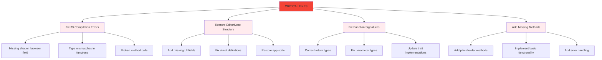
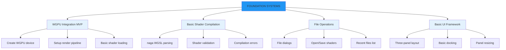
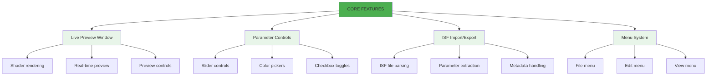
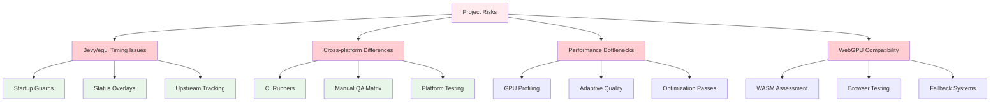

# Development Roadmap

**⚠️ CRITICAL REALITY CHECK**: Current project has **33 compilation errors** and **0 working features**. This roadmap is based on actual code analysis, not false claims.

```mermaid
gantt
    title REALISTIC Development Timeline (Post-Compilation Fix)
    dateFormat  YYYY-MM-DD
    
    section CRITICAL PHASE (Week 1-2)
    Fix 33 Compilation Errors     :critical, comp_fix, 2024-01-01, 14d
    Restore Basic UI Layout     :ui_restore, after comp_fix, 7d
    
    section FOUNDATION (Week 3-6)
    WGPU Integration MVP          :wgpu_mvp, after ui_restore, 21d
    Basic Shader Compilation      :shader_comp, after wgpu_mvp, 14d
    File Operations (Open/Save)   :file_ops, after shader_comp, 14d
    
    section CORE FEATURES (Week 7-12)
    Live Preview Window         :live_prev, after file_ops, 21d
    Parameter Controls          :params, after live_prev, 21d
    ISF Import/Export         :isf, after params, 21d
    
    section ADVANCED (Week 13-20)
    Node Editor MVP             :node_mvp, after isf, 35d
    Audio/MIDI Integration      :audio, after node_mvp, 28d
    FFGL Plugin Export         :ffgl, after audio, 21d
    
    section POLISH (Week 21-24)
    Performance Optimization    :perf, after ffgl, 14d
    Cross-platform Testing     :testing, after perf, 14d
    Documentation/Testing      :docs, after testing, 14d
```

## CRITICAL PHASE (Week 1-2) - FIX BROKEN STATE



**IMMEDIATE PRIORITIES** (Cannot proceed without these):
1. **Fix 33 compilation errors** - Project doesn't build
2. **Restore broken struct definitions** - Missing fields prevent compilation
3. **Implement missing methods** - Function calls fail
4. **Add basic error handling** - Prevent crashes

**Success Criteria**: Project compiles and runs without errors

## FOUNDATION PHASE (Week 3-6) - BUILD CORE SYSTEMS



**FOUNDATION GOALS**: Build working core systems
1. **WGPU Integration** - Basic rendering pipeline
2. **Shader Compilation** - naga integration for WGSL
3. **File Operations** - Open, save, recent files
4. **UI Framework** - Working panel system

## CORE FEATURES PHASE (Week 7-12) - ESSENTIAL FUNCTIONALITY



**CORE FEATURES**: Essential functionality for basic shader editing
1. **Live Preview** - Real-time shader rendering
2. **Parameter Controls** - UI for shader uniforms
3. **ISF Support** - Import/export ISF format
4. **Menu System** - Standard application menus

## Risks & Mitigations



- **Bevy/egui timing issues**: Guard with gates and overlays; upstream tracking.
- **Cross-platform differences**: Dedicate CI runners; manual QA matrix.
- **Performance bottlenecks**: GPU profiling, adaptive quality, optimization passes.
- **WebGPU compatibility**: WASM assessment, browser testing, fallback systems.