# Development Roadmap - Wiring Reality (Phase 1)

**🎯 PHASE 1 STATUS - DECEMBER 2025**: 
- ⚙️ **All core systems present** — wiring and refinement in progress
- 🧩 **UI panels, node editor, file ops, audio/MIDI** — present; integration pending
- ✅ **No compilation errors reported** — focus on stabilizing integration points
- ✅ **Reference patterns present** — `use.gpu`, `bevy_shader_graph`, `egui_node_graph2` wiring ongoing

## CRITICAL PHASE (Week 1-2) - STABILIZE WIRING

```mermaid
graph TD
    A[CRITICAL TASKS] --> B[Stabilize Wiring Across Modules]
    A --> C[Normalize EditorState Structure]
    A --> D[Verify Function Signatures]
    A --> E[Implement Missing Glue Code]
    
    B --> B1[End-to-end data flow]
    B --> B2[UI ↔ Engine integration]
    B --> B3[Preview control wiring]
    
    C --> C1[Consistent UI state fields]
    C --> C2[Struct definitions aligned]
    C --> C3[Unified app state schema]
    
    D --> D1[Return types verified]
    D --> D2[Parameter types consistent]
    D --> D3[Trait implementations aligned]
    
    E --> E1[UI→Engine handlers]
    E --> E2[Repo code integration]
    E --> E3[Diagnostics wiring]
    
```

## 🎯 Current Implementation Reality

- **All core systems present** — WGPU scaffolding, shader compile path, panel UI, node editor UI, file ops, audio/MIDI input layer
- **Wiring incomplete** — end-to-end connections between UI, compiler, and preview need stabilization
- **Preview unstable** — rendering path present; refine pipeline creation and state transitions
- **Reference patterns integrated** — `use.gpu`, `bevy_shader_graph`, `egui_node_graph2` used; continue aligning types and data flow
- **Focus** — remove brittle edges, unify state, wire controls to preview, and stabilize diagnostics

## FOUNDATION PHASE (Week 3-6) - BUILD CORE SYSTEMS

**FOUNDATION GOALS**: Build working core systems
1. **WGPU Integration** - Basic rendering pipeline
2. **Shader Compilation** - naga integration for WGSL
3. **File Operations** - Open, save, recent files
4. **UI Framework** - Working panel system

## CORE FEATURES PHASE (Week 7-12) - ESSENTIAL FUNCTIONALITY

**CORE FEATURES**: Essential functionality for basic shader editing
1. **Live Preview** - Real-time shader rendering
2. **Parameter Controls** - UI for shader uniforms
3. **ISF Support** - Import/export ISF format
4. **Menu System** - Standard application menus

## Risks & Mitigations

- **Bevy/egui timing issues**: Guard with gates and overlays; upstream tracking.
- **Cross-platform differences**: Dedicate CI runners; manual QA matrix.
- **Performance bottlenecks**: GPU profiling, adaptive quality, optimization passes.
- **WebGPU compatibility**: WASM assessment, browser testing, fallback systems.
