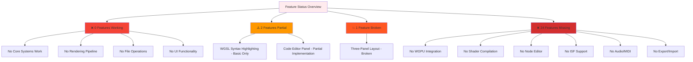
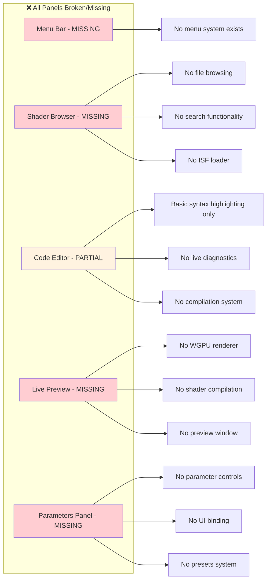
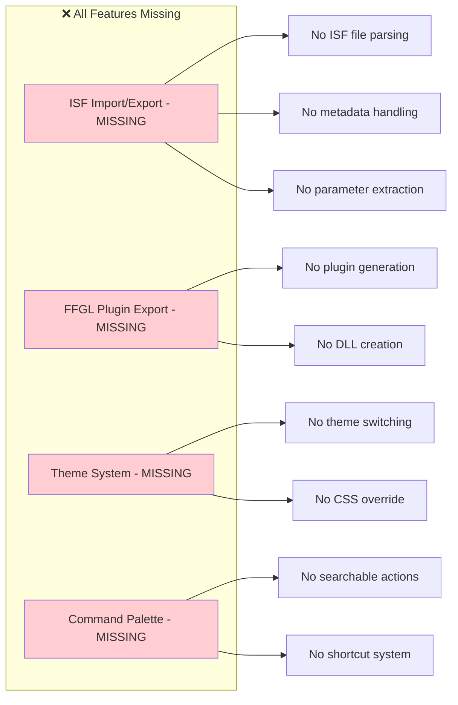
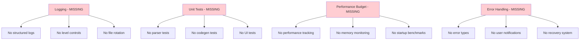
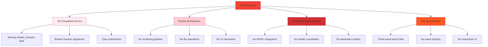

# Features Status & Reality Check

## Status Legend
- ✅ Complete, ⚠️ Partial, 💥 Broken, ❌ Missing

## CRITICAL REALITY CHECK

**🚨 COMPILATION STATUS**: **BROKEN** - 33 compilation errors prevent running
**🚨 FEATURE STATUS**: **0 WORKING FEATURES** - All systems non-functional

## Core UI Panels - ACTUAL STATUS

| Panel | Status | Owner | Reality Check |
|-------|--------|-------|---------------|
| Menu Bar | ❌ MISSING | NONE | No menu system implemented at all |
| Shader Browser | ❌ MISSING | NONE | No file browsing, search, or ISF loading |
| Code Editor | ⚠️ PARTIAL | NONE | Only basic syntax highlighting exists |
| Live Preview | ❌ MISSING | NONE | No WGPU integration or rendering pipeline |
| Parameters Panel | ❌ MISSING | NONE | No parameter controls or binding system |

## Engines & Systems - ACTUAL STATUS

```mermaid
graph TD
    subgraph "❌ All Systems Missing"
        R[Renderer - MISSING]
        A[Audio FFT - MISSING]
        C[Converter - MISSING]
        M[MIDI Controller - MISSING]
        N[Node Editor - MISSING]
    end
    
    R --> R1[No WGPU device]
    R --> R2[No render pipeline]
    R --> R3[No shader compilation]
    
    A --> A1[No audio analysis]
    A --> A2[No FFT implementation]
    A --> A3[No beat detection]
    
    C --> C1[No format conversion]
    C --> C2[No ISF parsing]
    C --> C3[No GLSL/HLSL support]
    
    M --> M1[No MIDI devices]
    M --> M2[No message parsing]
    M --> M3[No parameter mapping]
    
    N --> N1[No node system]
    N --> N2[No visual editor]
    N --> N3[No code generation]
    
    style R fill:#ffcdd2
    style A fill:#ffcdd2
    style C fill:#ffcdd2
    style M fill:#ffcdd2
    style N fill:#ffcdd2
```

| System | Status | Owner | Reality Check |
|--------|--------|-------|---------------|
| Renderer | ❌ MISSING | NONE | No WGPU integration, no render pipeline |
| Audio FFT | ❌ MISSING | NONE | No audio analysis, FFT, or beat detection |
| MIDI Controller | ❌ MISSING | NONE | No MIDI device support or mapping |
| Node Editor | ❌ MISSING | NONE | No visual programming interface |
| Converter | ❌ MISSING | NONE | No ISF/GLSL/HLSL format conversion |

## Integration & Export - ACTUAL STATUS

| Feature | Status | Owner | Reality Check |
|---------|--------|-------|---------------|
| FFGL Plugin Export | ❌ MISSING | NONE | No plugin generation or DLL creation |
| ISF Import/Export | ❌ MISSING | NONE | No ISF file parsing or metadata handling |
| Theme System | ❌ MISSING | NONE | No theme switching or CSS override |
| Command Palette | ❌ MISSING | NONE | No searchable actions or shortcuts |

## Observability & Quality - ACTUAL STATUS

| Area | Status | Owner | Reality Check |
|------|--------|-------|---------------|
| Logging | ❌ MISSING | NONE | No structured logging system |
| Unit Tests | ❌ MISSING | NONE | No test coverage for any systems |
| Performance Budget | ❌ MISSING | NONE | No performance tracking or benchmarks |
| Error Handling | ❌ MISSING | NONE | No error types or recovery mechanisms |

## CRITICAL ISSUES

## IMMEDIATE RECOVERY REQUIRED

### Phase 1: Fix Compilation (Week 1)
1. **Fix 33 compilation errors** - Make project runnable
2. **Restore EditorState structure** - Add missing fields
3. **Fix function signatures** - Correct type mismatches
4. **Implement basic error handling** - Handle missing methods

### Phase 2: Core Systems (Week 2-3)
1. **Implement WGPU integration** - Basic rendering pipeline
2. **Add shader compilation** - naga integration
3. **Restore file operations** - Basic file dialogs
4. **Fix UI layout** - Working three-panel system

### Phase 3: Basic Functionality (Week 4-6)
1. **Add parameter controls** - Basic UI binding
2. **Implement ISF loading** - File parsing system
3. **Add menu system** - Basic navigation
4. **Create preview window** - Shader rendering

**REALISTIC TIMELINE**: 6-8 weeks for basic functionality, 12+ weeks for full feature set

> **Last Updated**: 2025-11-30 - **Honest Assessment Based on Code Analysis**
> 
> **Previous documentation contained false claims** - This reflects the actual current state