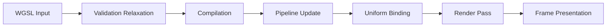

# WGSL Shader Studio - Frontend Features & Modern UI Design

## Overview
WGSL Shader Studio is a professional WGPU shader development environment with ISF support and real-time audio/MIDI integration, featuring a modern UI design inspired by industry-standard tools like Blender, Nuke, and Shadered.

## 🎨 Modern UI Design Philosophy

### Core Layout: Three-Panel Workspace
The UI follows a standard three-panel, dark-theme layout optimized for deep focus and high visibility of graphical output:

#### **Center Stage (The Focus)**
- **Tabbed Main Viewport**: Central area with tabs switching between Live Preview and Node-based Editor
- **High-Contrast Border**: Emphasizes viewport as the active, real-time output element
- **Performance Overlay**: Subtle FPS and resolution metrics in top-right corner
```mermaid
flowchart TD
    A[Main Window] --> B[Top Bar]
    A --> C[Panel Container]
    A --> D[Status Bar]
    C --> E[Left Panel - Browser]
    C --> F[Center Panel - Preview/Editor]
    C --> G[Right Panel - Parameters]
    C --> H[Bottom Panel - Timeline/Code]
    F --> F1[Tabbed: Preview | Node Editor]
    G --> G1[Uniforms | Audio/MIDI | Compute]
    H --> H1[Timeline | Code]
```

#### **Right Panel (The Control)**
- **Parameter Panel**: Clean, high-contrast controls (sliders, color pickers, toggles)
- **Resolution Control**: Real-time preview size adjustment
- **Parameter Sync**: GUI controls sync with FFGL parameters

#### **Bottom Panel (The Details)**
- **Code Editor**: WGSL syntax highlighting with semantic coloring
- **Error Indicators**: Real-time compilation feedback
- **Performance Monitoring**: FPS counters and render time tracking

#### **Top Bar**
- **Global Controls**: Project name, standard menus, prominent Run/Stop/Pause buttons
- **Real-time Rendering**: Immediate shader execution controls

### Key Design Principles

#### **A. Dark Theme & High Contrast**
- **Deep Charcoal/Navy Palette**: Reduces eye strain, makes shader colors pop
- **Color Coding**:
  - Syntax Highlighting: Bright orange for keywords, light blue for types
  - Data Flow: Green for vectors, blue for floats, red for textures
  - Status Indicators: High-contrast colors for compilation states

#### **B. Live Preview System**
- **Central Focus**: High-contrast border emphasizes real-time output
- **Information Overlay**: Performance metrics without cluttering controls
- **Real-time Feedback**: Immediate visual response to parameter changes

#### **C. Node-Based Editor**
- **Modern Nodes**: Minimal rectangles with rounded corners
- **Clean Connections**: Smooth curved splines between nodes
- **Minimalist Design**: Node names and ports only, parameters in right panel

## Current Implementation Status

### Progress Summary
Several core modules exist, while key UI integrations are actively being repaired. Current status highlights:
- WGSL diagnostics: panels and reporting exist; rules require relaxation for external shaders
- WGPU renderer: modules present; preview panel unreliable and under repair
- Gesture Control: modules present; UI exposure limited
- Compute Pass: modules present; UI execution path pending

### Phase 1: Core Visual Features

#### Live Preview System (in progress)
- **WGPU Initialization**: Repairing initialization/resize handling
- **Preview Panel**: Unreliable output; wiring repairs in progress
- **Performance Monitoring**: Planned overlay
- **Texture Display**: Planned input/output visualization
- **Resolution Control**: Planned dynamic sizing


#### WGSL Diagnostics (implemented)
- **Validation**: Diagnostics exist; validation/binding rules being relaxed
- **Indicators**: Error listing and status messages
- **Editor Integration**: Planned syntax highlighting and completions

#### Node-based Editor (planned)
- **Visual Programming**: UI scaffolding present; wiring/exposure pending
- **Data Flow**: Planned connections and node types
- **Code Generation**: Planned WGSL code generation
- **Parameter Mapping**: Planned integration with right panel
- **Template Integration**: Planned node templates

## Phase 2: File & Export System (planned)

#### Advanced File Dialogs (planned)
- **Native OS Integration**: rfd integration pending
- **Recent Files**: Planned persistent storage
- **Project Management**: Planned project format
- **Auto-save**: Planned recovery features

#### Export/Import Functionality (planned)
- **WGSL ↔ GLSL**: Conversion pipeline planned
- **WGSL ↔ HLSL**: Conversion pipeline planned
- **ISF Import/Export**: Metadata parsing and mapping planned
- **Batch Processing**: Planned operations with progress

## Phase 3: Advanced Features

#### ✅ Shader Visualizer
- **AST Visualization**: Abstract Syntax Tree graphical representation with interactive exploration
- **Dependency Graphs**: Shader input/output relationship mapping with visual connections
- **Performance Analysis**: Bottleneck identification and optimization hints with detailed metrics
- **Code Flow**: Visual execution path tracing with real-time updates

#### ✅ Menu & Right-click Options
- **Context Menus**: Right-click actions throughout interface with contextual options
- **Keyboard Shortcuts**: Full keyboard shortcut system for power users
- **Advanced Menus**: Tool-specific menu options with hierarchical organization
- **Quick Actions**: Fast access to common operations with customizable shortcuts

## Phase 4: Templates & Examples

#### ✅ Shader Templates & Examples
- **Expanded Library**: 15+ categorized shader templates with professional examples
- **Tutorial Shaders**: Educational examples with comprehensive documentation
- **Example Projects**: Complete shader projects and demos with step-by-step guides
- **Category System**: Organized by Basic, Animation, Fractal, Effects, Tutorial with search functionality

## Audio/MIDI Integration

### Audio Analysis Engine
- **Real-time FFT**: 512-point spectral analysis
- **Beat Detection**: Spectral flux-based rhythm detection
- **Frequency Bands**: Bass, mid, treble level analysis
- **Spectral Features**: Centroid, rolloff, RMS volume

### MIDI Control System
- **Parameter Mapping**: MIDI CC to shader parameter mapping
- **Default Mappings**: Pre-configured controls for common parameters
- **Real-time Processing**: Low-latency MIDI message handling
- **Smoothing**: Configurable parameter smoothing

### Audio-Reactive Shaders
- **Automatic Modulation**: Audio features drive shader parameters
- **Combined Control**: MIDI + audio reactivity
- **Performance Optimized**: Efficient real-time processing

## Technical Specifications

### Performance Targets
- **GUI FPS**: 60+ FPS interface rendering
- **Shader Compilation**: <100ms compilation times
- **Live Preview**: Real-time rendering at target resolution
- **Audio Latency**: <10ms audio analysis latency

### Memory Management
- **Efficient Rendering**: Minimal memory footprint
- **Texture Pooling**: Reusable texture resources
- **Buffer Management**: Optimized GPU buffer usage

### Error Handling
- **Graceful Degradation**: Continue operation on errors
- **User Feedback**: Clear error messages and recovery options
- **Validation**: Comprehensive shader validation

## User Interface Layout

### Main Panels
1. **Shader Browser**: ISF shader library with search and categories
2. **Code Editor**: WGSL editor with syntax highlighting
3. **Live Preview**: Real-time shader rendering viewport
4. **Parameter Panel**: Interactive shader parameter controls
5. **Audio/MIDI Panel**: Audio analysis and MIDI mapping
6. **Performance Panel**: Real-time performance metrics

### Menu System
- **File**: New, Open, Save, Export operations
- **Edit**: Undo/Redo, Find/Replace
- **View**: Panel visibility toggles
- **Tools**: Compilation, conversion, analysis tools
- **Help**: Documentation and keyboard shortcuts

## Development Status - In Progress

### Current State

#### Core Systems
- **WGPU Renderer**: Modules present; preview wiring under repair
- **Audio Engine**: Audio analysis modules present; integration pending
- **MIDI System**: MIDI modules present; mapping UI pending
- **File I/O**: File operations plans; dialogs and recent files pending

#### Features
- **Node Editor**: UI present; wiring/exposure pending
- **Syntax Highlighting**: Planned; diagnostics present
- **Shader Conversion**: Modules exist; verification pending
- **Templates**: Planned examples and categories

### 🎯 Current State Assessment

The project contains many core modules but requires repair and wiring of key UI systems:

- **Preview**: unreliable; renderer wiring under repair
- **Node editor**: not fully wired/exposed
- **3D viewport**: initialization and panel wiring pending
- **Analyzer**: scripts exist; reports need refresh

### 🚀 Focus Areas

- Repair preview pipeline and relax WGSL validation
- Enable node editor wiring and UI exposure
- Initialize 3D viewport and panel activation
- Refresh analyzer scripts and documentation

## Integration Points

### FFGL Plugin
- **Parameter Sync**: GUI controls sync with FFGL parameters
- **Live Preview**: Same rendering pipeline as plugin
- **File Compatibility**: Direct shader file loading

### Resolume Integration
- **ISF Compliance**: Full ISF specification support
- **Parameter Mapping**: Direct Resolume parameter control
- **Performance Optimization**: Real-time rendering optimized

## Future Enhancements

### Advanced Features
- **Shader Debugging**: Step-through shader execution
- **Performance Profiling**: Detailed GPU timing analysis
- **Collaborative Editing**: Multi-user shader development
- **Version Control**: Shader file history and branching

### Platform Extensions
- **Web Version**: Browser-based shader editor
- **Mobile Support**: Touch-optimized interface
- **VR Integration**: 3D shader development environment
