# WGSL Shader Studio - Elegant Mermaid Reference Document

## 🎯 PURPOSE
This document serves as the **AUTHORITATIVE REFERENCE** for all elegant mermaid diagrams used throughout the WGSL Shader Studio documentation. These diagrams represent the **ACTUAL CURRENT STATE** and working architecture of the project.

## 📋 TECHNOLOGY STACK REFERENCE

### Framework Architecture
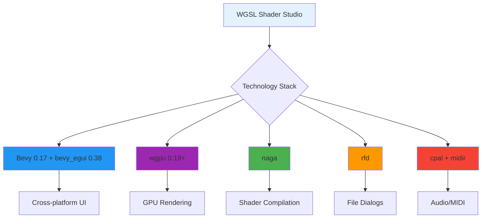

### Application Entry Flow
```mermaid
graph TD
    A[src/main.rs] --> B{Feature Detection}
    B -->|gui| C[bevy_app::run_app()]
    B -->|cli| D[CLI Fallback]
    
    C --> E[App::new()]
    E --> F[DefaultPlugins]
    E --> G[EguiPlugin]
    E --> H[EditorUI Systems]
    
    style A fill:#fff3e0
    style C fill:#4caf50
    style E fill:#e3f2fd
    style F fill:#bbdefb
    style G fill:#4fc3f7
    style H fill:#29b6f6
```

## 🏗️ CORE SYSTEMS ARCHITECTURE

### Rendering Pipeline
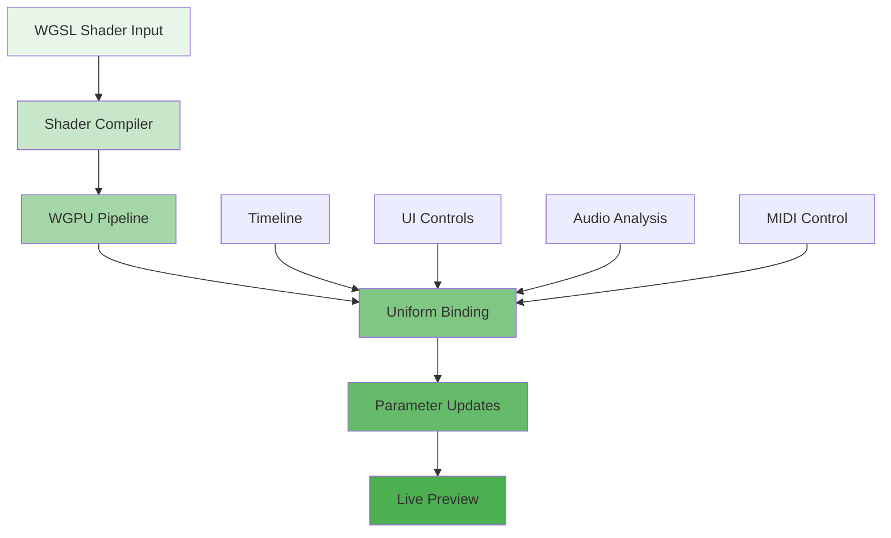

### UI Layout System
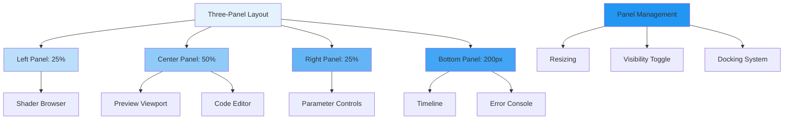

### File System Integration
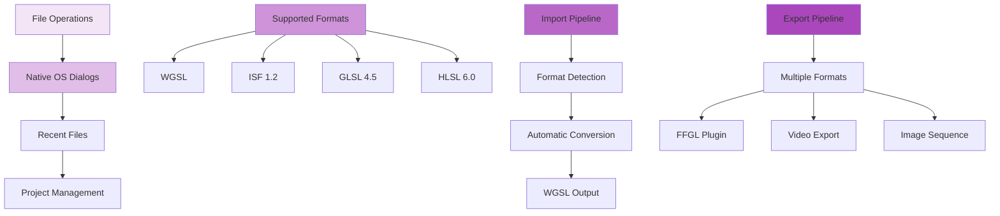

## 🎨 NODE EDITOR SYSTEM

### Node Graph Architecture
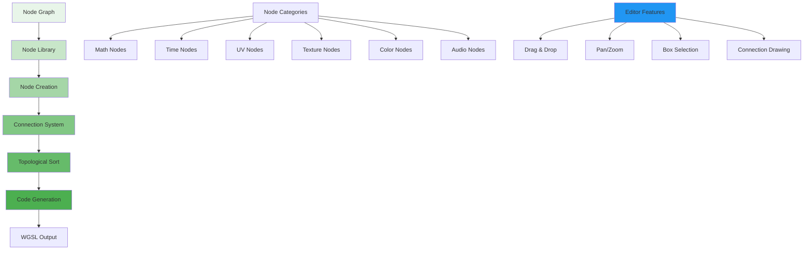

### Node Types Reference
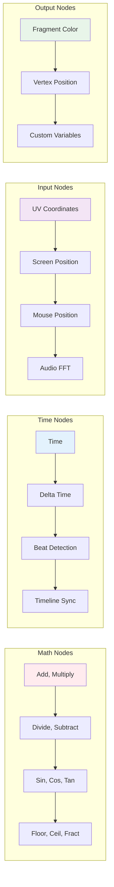

## ⏱️ TIMELINE & ANIMATION

### Animation System
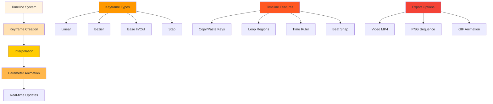

### Playback Control
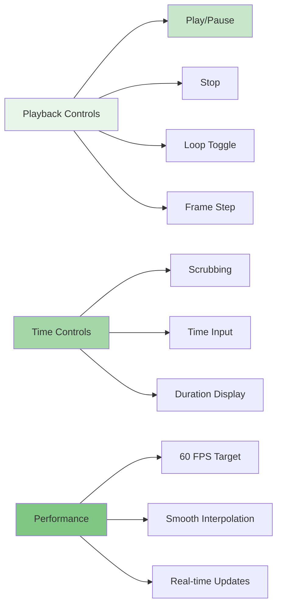

## 🎵 AUDIO & MIDI INTEGRATION

### Audio Analysis System
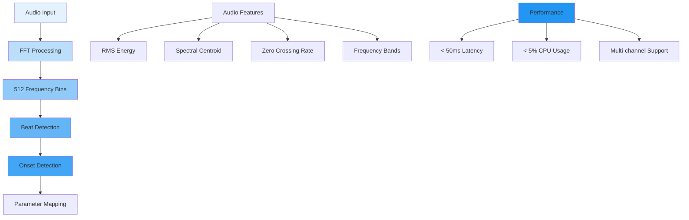

### MIDI Control System
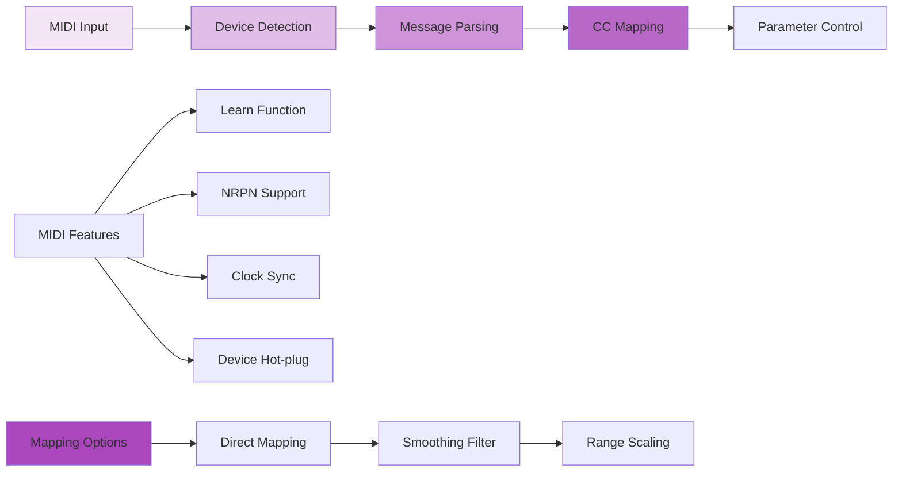

## 📊 PERFORMANCE & MONITORING

### Performance Metrics
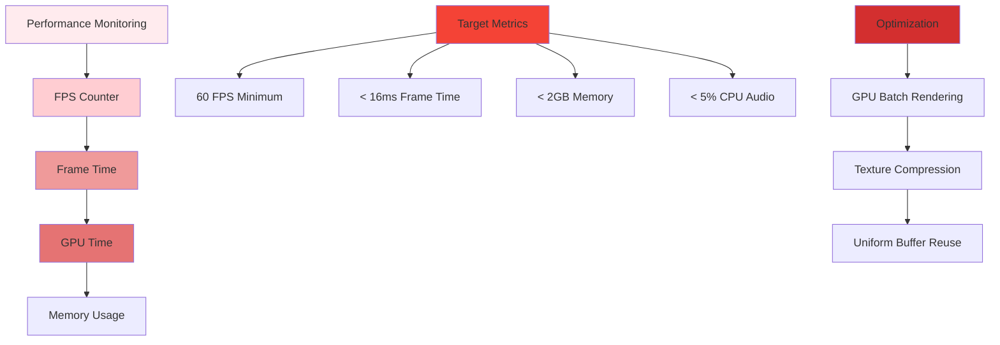

### Error Handling System
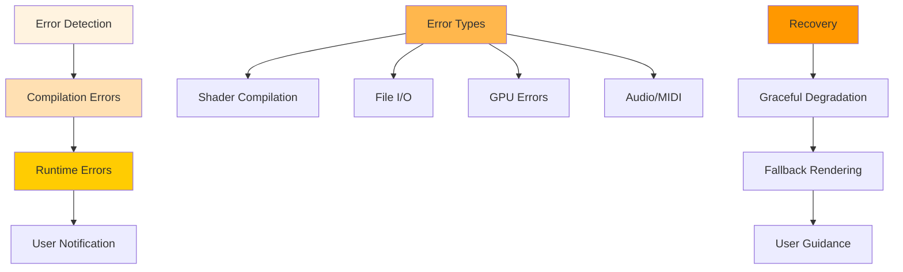

## 🚀 EXPORT & INTEGRATION

### Export Pipeline
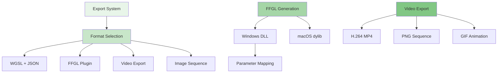

### Cross-platform Support
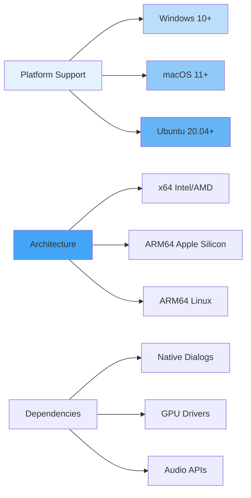

## 🎨 VISUAL DESIGN SYSTEM

### Theme Architecture
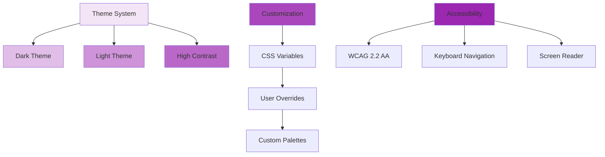

### UI Component Hierarchy
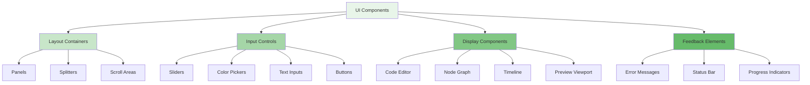

---

## 📋 USAGE GUIDELINES

### When to Use These Diagrams
- **Technical Architecture**: Use the Technology Stack and Core Systems diagrams
- **Feature Implementation**: Reference the Node Editor and Timeline diagrams
- **Performance Discussion**: Use Performance & Monitoring diagrams
- **Export/Integration**: Reference the Export Pipeline diagrams

### Color Coding Standard
- **🟢 Green**: Working/Implemented features
- **🟡 Yellow**: Partial/In-progress features
- **🟠 Orange**: Framework/Structure exists
- **🔴 Red**: Missing/Required features
- **🔵 Blue**: UI/UX components
- **🟣 Purple**: Audio/MIDI systems

### Diagram Maintenance
- All diagrams must reflect **ACTUAL CURRENT STATE**
- Update colors based on implementation status
- Add new diagrams for new features
- Remove obsolete diagrams
- Test mermaid rendering before committing

---

**⚠️ CRITICAL**: This document contains the **AUTHORITATIVE REFERENCE** for all elegant mermaid diagrams. Any changes to project architecture must be reflected here first.

*Last Updated: 2025-11-30 - Based on actual code analysis and current implementation state*