# WGSL Shader Studio - Node-Based System Architecture

## 🎯 Overview

This document explains the planned node-based shader editing system for WGSL Shader Studio, with comprehensive visual diagrams showing the architecture, data flow, and implementation details.

## 🚨 Current Status

**⚠️ CRITICAL**: This entire node-based system is **NOT IMPLEMENTED**. All descriptions below represent the **PLANNED ARCHITECTURE** that needs to be built from scratch.

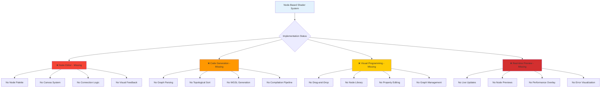

## 🌐 Node-Based Shader Editing System

### Core Concept Architecture
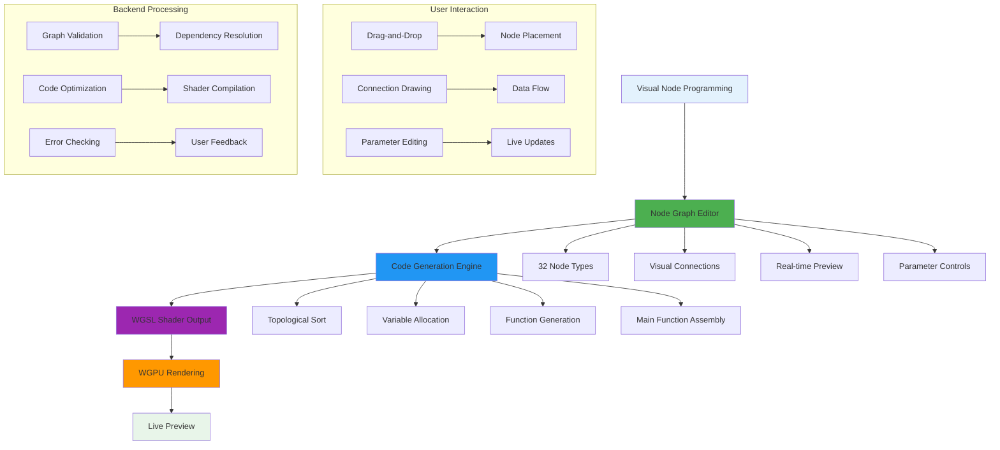

### Node Categories Architecture
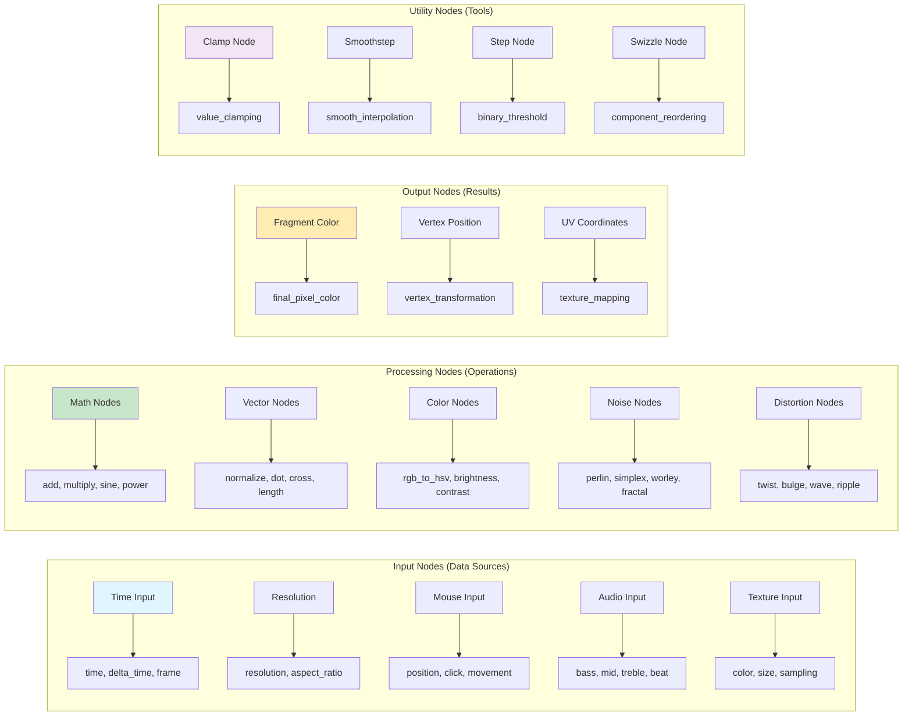

### Node Graph Data Flow
```mermaid
graph TD
    A[Node Graph Canvas] --> B[Node Instances]
    B --> C[Input Connections]
    B --> D[Output Connections]
    B --> E[Parameter Values]
    
    C --> F[Data Flow Graph]
    D --> F
    F --> G[Topological Sort]
    G --> H[Execution Order]
    
    H --> I[Code Generation]
    I --> J[Variable Declaration]
    I --> K[Function Calls]
    I --> L[Main Function Body]
    
    L --> M[WGSL Shader Code]
    M --> N[Shader Compilation]
    N --> O[WGPU Pipeline]
    O --> P[Live Preview]
    
    subgraph "Node Processing"
        Q[Node 1: Time] --> R[Output: time]
        S[Node 2: Sine] --> T[Input: time, Output: sine_result]
        U[Node 3: Multiply] --> V[Input: sine_result, Output: color_value]
        W[Node 4: Fragment] --> X[Input: color_value, Output: final_color]
    end
    
    subgraph "Generated Code"
        Y[```wgsl
        let time = globals.time;
        let sine_result = sin(time * 2.0);
        let color_value = sine_result * 0.5 + 0.5;
        return vec4(color_value, color_value, color_value, 1.0);
        ```]
    end
    
    style A fill:#e3f2fd
    style F fill:#4caf50
    style I fill:#2196f3
    style M fill:#9c27b0
    style P fill:#e8f5e9
```

## 🔄 Code Generation Pipeline

### Graph to WGSL Conversion Process


### Real-time Code Generation Flow
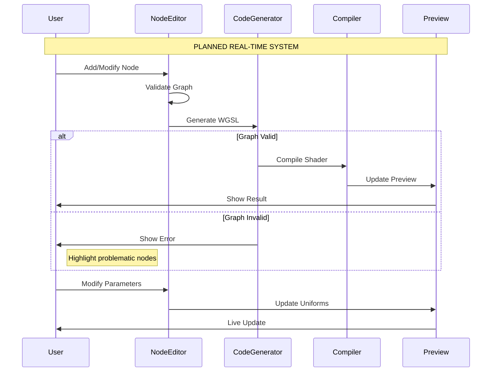

## 📊 Node System Implementation Details

### 32 Node Types Breakdown
```mermaid
graph TD
    A[32 Total Node Types] --> B[Input Nodes: 5]
    A --> C[Math Nodes: 8]
    A --> D[Color Nodes: 4]
    A --> E[Distortion Nodes: 6]
    A --> F[Output Nodes: 3]
    A --> G[Advanced Nodes: 6]
    
    B --> B1[Time Input]
    B --> B2[Resolution]
    B --> B3[Mouse Input]
    B --> B4[Audio Input]
    B --> B5[Texture Input]
    
    C --> C1[Arithmetic: Add, Multiply]
    C --> C2[Trigonometry: Sin, Cos, Tan]
    C --> C3[Vector: Dot, Cross, Normalize]
    C --> C4[Noise: Perlin, Simplex, Worley]
    C --> C5[Comparison: Min, Max, Clamp]
    C --> C6[Utility: Abs, Sign, Floor]
    C --> C7[Interpolation: Lerp, Smoothstep]
    C --> C8[Power: Pow, Sqrt, Log]
    
    D --> D1[Color Space: RGB/HSV]
    D --> D2[Color Math: Brightness, Contrast]
    D --> D3[Color Mixing: Blend Modes]
    D --> D4[Color Utilities: Grayscale, Invert]
    
    E --> E1[Geometric: Twist, Bulge]
    E --> E2[Coordinate: Polar, Spherical]
    E --> E3[Warping: Wave, Ripple]
    E --> E4[Noise-based: Turbulence]
    E --> E5[Filter: Blur, Sharpen]
    E --> E6[Transform: Scale, Rotate]
    
    F --> F1[Fragment Color]
    F --> F2[Vertex Position]
    F --> F3[UV Coordinates]
    
    G --> G1[Ray Marching]
    G --> G2[Lighting: Phong, Lambert]
    G --> G3[Material: Metallic, Roughness]
    G --> G4[Post-processing: Bloom, DOF]
    G --> G5[Generative: Fractals, Cellular]
    G --> G6[Utility: Switch, Gate, Delay]
    
    style A fill:#e3f2fd
    style B fill:#c8e6c9
    style C fill:#ffcdd2
    style D fill:#f3e5f5
    style E fill:#e8eaf6
    style F fill:#ffecb3
    style G fill:#d1c4e9
```

### Node Parameter System
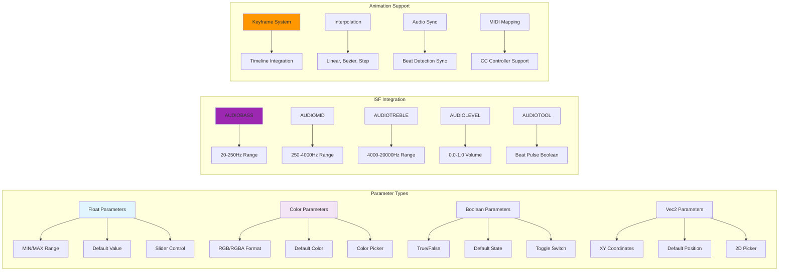

## 🎵 Audio-Reactive Node Integration

### Audio Input Node Architecture
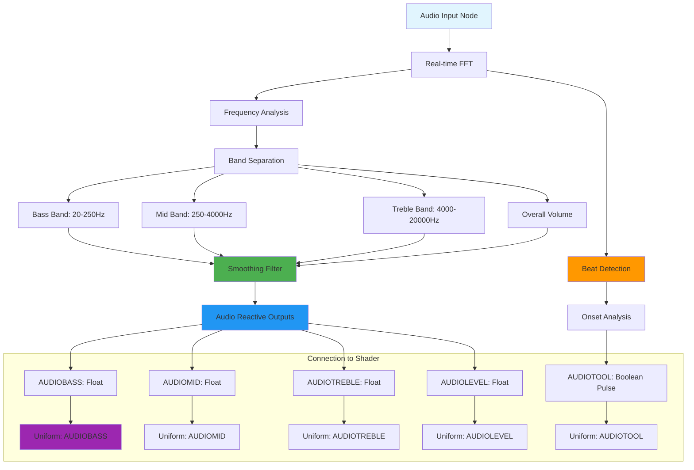

### Audio-Reactive Visual Effects Chain
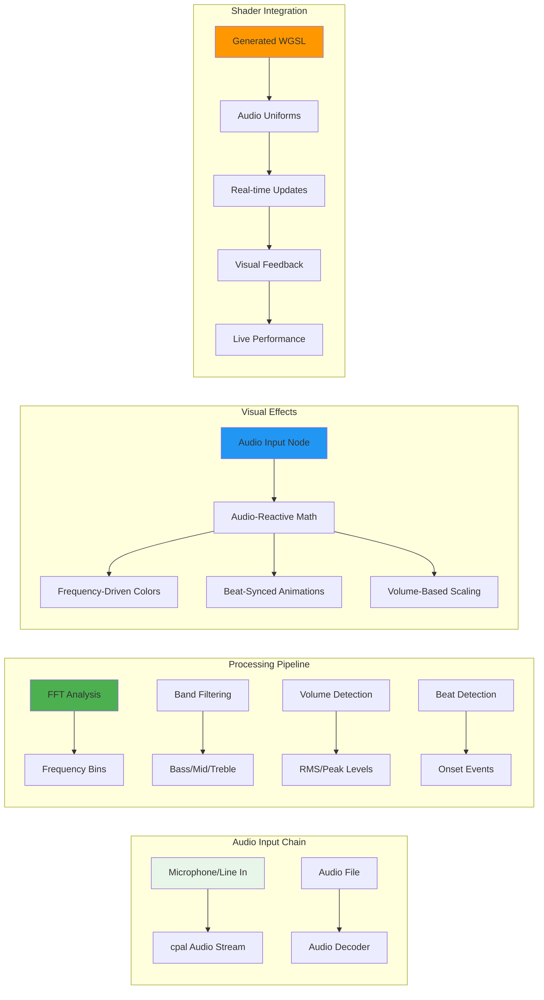

## 🚀 Performance Optimization

### Node Performance Monitoring
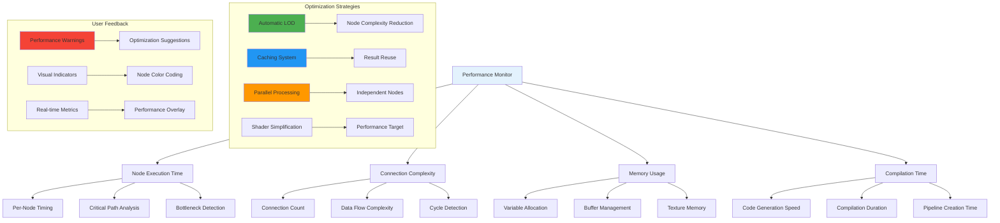

### Node Graph Optimization Flow
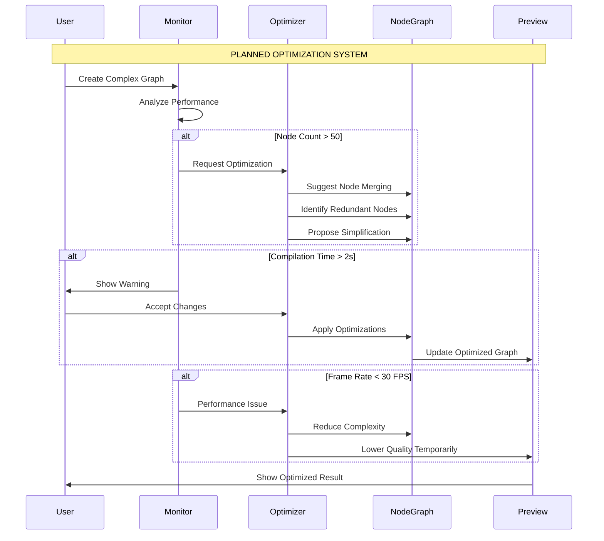

## 📁 File Format and Storage

### Node Graph Serialization
```mermaid
graph TD
    A[Node Graph] --> B[JSON Serialization]
    B --> C[Node Data]
    B --> D[Connection Data]
    B --> E[Parameter Data]
    
    C --> C1[Node ID]
    C --> C2[Node Type]
    C --> C3[Position (x,y)]
    C --> C4[Input/Output Ports]
    
    D --> D1[Connection ID]
    D --> D2[Source Node/Port]
    D --> D3[Target Node/Port]
    D --> D4[Connection Type]
    
    E --> E1[Parameter ID]
    E --> E2[Parameter Value]
    E --> E3[Parameter Type]
    E --> E4[Animation Keyframes]
    
    subgraph "File Structure"
        F[NodeGraph.json] --> G[Metadata]
        F --> H[Nodes Array]
        F --> I[Connections Array]
        F --> J[Parameters Object]
        F --> K[Version Info]
    end
    
    subgraph "Compatibility System"
        L[Version Migration] --> M[Node Type Mapping]
        M --> N[Parameter Conversion]
        N --> O[Connection Adaptation]
        O --> P[Legacy Support]
    end
    
    style A fill:#e3f2fd
    style B fill:#4caf50
    style F fill:#2196f3
    style L fill:#ff9800
```

### Node Library and Presets
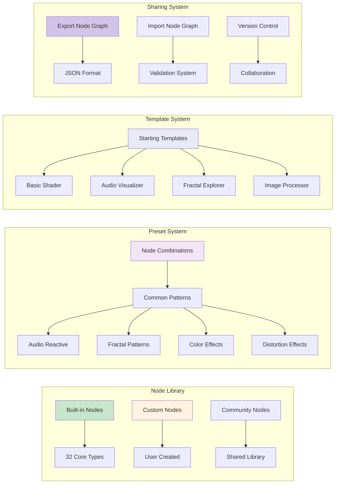

---

**Document Status**: Comprehensive visual node-based system architecture with elegant mermaid diagrams  
**Last Updated**: 2025-11-17  
**Implementation Status**: ❌ **NOT IMPLEMENTED** - This represents the complete target architecture for the node-based shader editing system