# WGSL Shader Studio - Node-Based System Architecture

## 🎯 Overview

This document explains the planned node-based shader editing system for WGSL Shader Studio, with comprehensive visual diagrams showing the architecture, data flow, and implementation details.

## 🚨 Current Status

**⚠️ CRITICAL**: This entire node-based system is **NOT IMPLEMENTED**. All descriptions below represent the **PLANNED ARCHITECTURE** that needs to be built from scratch.

```mermaid
flowchart TD
    A[Node-Based Shader System] --> B{Implementation Status}
    B --> C[❌ Node Editor - Missing]
    B --> D[❌ Code Generation - Missing]
    B --> E[❌ Visual Programming - Missing]
    B --> F[❌ Real-time Preview - Missing]
    
    C --> C1[No Node Palette]
    C --> C2[No Canvas System]
    C --> C3[No Connection Logic]
    C --> C4[No Visual Feedback]
    
    D --> D1[No Graph Parsing]
    D --> D2[No Topological Sort]
    D --> D3[No WGSL Generation]
    D --> D4[No Compilation Pipeline]
    
    E --> E1[No Drag-and-Drop]
    E --> E2[No Node Library]
    E --> E3[No Property Editing]
    E --> E4[No Graph Management]
    
    F --> F1[No Live Updates]
    F --> F2[No Node Previews]
    F --> F3[No Performance Overlay]
    F --> F4[No Error Visualization]
    
```



## 🌐 Node-Based Shader Editing System

### Core Concept Architecture


### Node Categories Architecture


### Node Graph Data Flow


## 🔄 Code Generation Pipeline

### Graph to WGSL Conversion Process


### Real-time Code Generation Flow


## 📊 Node System Implementation Details

### 32 Node Types Breakdown


### Node Parameter System

```mermaid
flowchart LR
    Types[Parameter Types] --> A[Float: Min/Max, Default, Slider]
    Types --> B[Color: RGBA, Default, Picker]
    Types --> C[Boolean: Default, Toggle]
    Types --> D[Vec2: XY, Default, Picker]
    ISF[ISF Integration] --> E[AUDIOBASS 20–250Hz]
    ISF --> F[AUDIOMID 250–4000Hz]
    ISF --> G[AUDIOTREBLE 4k–20kHz]
    ISF --> H[AUDIOLEVEL 0.0–1.0]
    ISF --> I[AUDIOTOOL Beat Pulse]
    Animation[Animation Support] --> J[Keyframes + Timeline]
    Animation --> K[Interpolation Modes]
    Animation --> L[Audio Sync]
    Animation --> M[MIDI Mapping]
```


## 🎵 Audio-Reactive Node Integration

### Audio Input Node Architecture

```mermaid
flowchart TD
    A[Audio Input Node] --> B[Real-time FFT]
    B --> C[Frequency Analysis]
    C --> D[Band Separation]
    D --> E[Bass 20–250Hz]
    D --> F[Mid 250–4000Hz]
    D --> G[Treble 4k–20kHz]
    D --> H[Overall Volume]
    E --> I[Smoothing]
    F --> I
    G --> I
    H --> I
    I --> J[Reactive Outputs]
    J --> K[AUDIOBASS]
    J --> L[AUDIOMID]
    J --> M[AUDIOTREBLE]
    J --> N[AUDIOLEVEL]
    B --> O[Beat Detection]
    O --> P[Onset Analysis]
    P --> Q[AUDIOTOOL Pulse]
    K --> R[Uniform AUDIOBASS]
    L --> S[Uniform AUDIOMID]
    M --> T[Uniform AUDIOTREBLE]
    N --> U[Uniform AUDIOLEVEL]
    Q --> V[Uniform AUDIOTOOL]
```


### Audio-Reactive Visual Effects Chain


## 🚀 Performance Optimization

### Node Performance Monitoring


### Node Graph Optimization Flow


## 📁 File Format and Storage

### Node Graph Serialization
```mermaid
flowchart TD
    A[Node Graph] --> B[JSON Serialization]
    B --> C[Node Data]
    B --> D[Connection Data]
    B --> E[Parameter Data]
    C --> C1[Node ID]
    C --> C2[Node Type]
    C --> C3[Position (x,y)]
    C --> C4[Ports]
    D --> D1[Connection ID]
    D --> D2[Source Port]
    D --> D3[Target Port]
    D --> D4[Connection Type]
    E --> E1[Parameter ID]
    E --> E2[Parameter Value]
    E --> E3[Parameter Type]
    E --> E4[Keyframes]
    File[File Structure] --> F[NodeGraph.json]
    File --> G[Metadata]
    File --> H[Nodes Array]
    File --> I[Connections Array]
    File --> J[Parameters Object]
    File --> K[Version Info]
    Compat[Compatibility] --> L[Version Migration]
    Compat --> M[Node Type Mapping]
    Compat --> N[Parameter Conversion]
    Compat --> O[Connection Adaptation]
    Compat --> P[Legacy Support]
```

### Node Library and Presets


---

**Document Status**: Comprehensive visual node-based system architecture with elegant mermaid diagrams  
**Last Updated**: 2025-11-17  
**Implementation Status**: ❌ **NOT IMPLEMENTED** - This represents the complete target architecture for the node-based shader editing system
