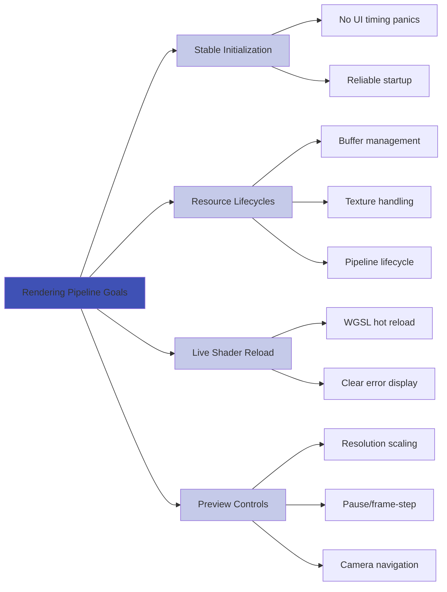

# Project Goals

**⚠️ REALITY CHECK**: Current project has **33 compilation errors** and **0 working features**. These goals represent the planned vision, not current state.

```mermaid
graph TD
    A[WGSL Shader Studio Vision] --> B[Rendering & Engine]
    A --> C[Authoring & UX]
    A --> D[Conversion & Interop]
    A --> E[Audio/MIDI & Live]
    A --> F[Node Editor]
    A --> G[Plugins & Export]
    A --> H[Quality & Reliability]
    
    B --> B1[Real-time GPU rendering]
    B --> B2[Robust pipeline]
    B --> B3[Stability focus]
    
    C --> C1[Shader browsing]
    C --> C2[Efficient editing]
    C --> C3[Live preview]
    C --> C4[Parameter control]
    
    D --> D1[WGSL↔GLSL↔HLSL]
    D --> D2[Strong validation]
    D --> D3[Round-trip conversion]
    
    E --> E1[Real-time audio analysis]
    E --> E2[MIDI mapping]
    E --> E3[Parameter modulation]
    
    F --> F1[Visual graph authoring]
    F --> F2[Type-safe connections]
    F --> F3[WGSL generation]
    
    G --> G1[FFGL plugin parity]
    G --> G2[ISF compatibility]
    G --> G3[Asset export]
    
    H --> H1[Logging system]
    H --> H2[Error reporting]
    H --> H3[Test coverage]
    H --> H4[Performance baselines]
    
    style A fill:#1a237e
    style B fill:#e8eaf6
    style C fill:#e8eaf6
    style D fill:#e8eaf6
    style E fill:#e8eaf6
    style F fill:#e8eaf6
    style G fill:#e8eaf6
    style H fill:#e8eaf6
```

## Product Pillars

## Cross-Cutting Goals
- Cross-Platform: Windows/macOS/Linux; WASM/WebGPU where feasible.
- Performance: Consistent interactive framerate; adaptive quality; profiling tools.
- Documentation: Docs-first workflow with acceptance checklists per feature.
- Accessibility: Keyboard navigation, high-contrast theme option, screen-reader friendly labels.
- Extensibility: Plugin architecture for nodes, importers, render passes.

## Feature Areas & Goals

### Rendering Pipeline

- Stable initialization without UI timing panics.
- Deterministic resource lifecycles (buffers, textures, pipelines).
- Live reload of WGSL shaders with clear error display.
- Preview controls: resolution scale, pause, frame-step, camera navigation.

### UI/UX
- Panels: Menu, Shader Browser, Code Editor, Live Preview, Parameters.
- Dockable/resizable panels with workspace presets.
- Keyboard shortcuts for common actions; searchable command palette.
- Non-blocking operations (load/compile) with progress & error feedback.

### Code Editor
- Syntax highlighting, auto-indent, bracket matching.
- Compile/run command, error squiggles with diagnostics.
- Templates and snippets; recent files; search/replace.

### Shader Library
- ISF import with parameter schema mapping.
- Built-in templates categorized (basic, noise, color, post).
- Tagging, favorites, search, and metadata.

### Parameters & Automation
- UI controls bound to shader uniforms with validation.
- Presets: save/load parameter sets with metadata.
- Automation: LFOs, envelopes, and audio/MIDI-driven modulation.

### Node Editor
- MVP: 20+ node types (math, color, noise, uv, time).
- Type-safe connections; code generation to WGSL modules.
- Mini-previews per node; graph-level preview.

### Conversion & Validation
- WGSL↔GLSL↔HLSL round-trip where feasible.
- Validator with clear diagnostics and suggestions.

### Plugins & Export
- FFGL plugin parity: parameters, preview, performance.
- ISF exporter/importer; asset export.

### Observability & Quality
- Structured logs (levels), crash reports, recovery flow.
- Snapshot tests for UI; integration tests for conversions.
- Performance tests with minimum framerate thresholds.

## Acceptance Principles
- Each feature ships with acceptance checklist, docs, tests (where appropriate).
- No feature marks “done” without reliability and UX criteria met.
- Maintainers approve against documented criteria.