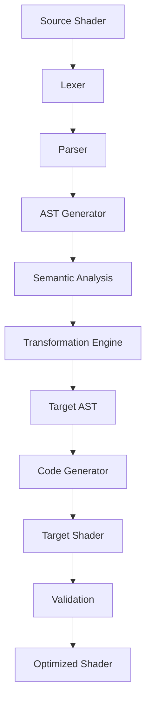

# Shader Conversion Framework

## Table of Contents

1. [Introduction](#introduction)
2. [Conversion Architecture](#conversion-architecture)
3. [WGSL ↔ GLSL Conversion](#wgsl--glsl-conversion)
4. [WGSL ↔ HLSL Conversion](#wgsl--hlsl-conversion)
5. [GLSL ↔ HLSL Conversion](#glsl--hlsl-conversion)
6. [ISF Conversion](#isf-conversion)
7. [AST-Based Conversion](#ast-based-conversion)
8. [Syntax Mapping](#syntax-mapping)
9. [Type System Conversion](#type-system-conversion)
10. [Built-in Function Mapping](#built-in-function-mapping)
11. [Resource Binding Conversion](#resource-binding-conversion)
12. [Semantic Mapping](#semantic-mapping)
13. [Conversion Validation](#conversion-validation)
14. [Error Handling](#error-handling)
15. [Performance Considerations](#performance-considerations)
16. [Extensibility](#extensibility)

## Introduction

The Shader Conversion Framework is a comprehensive system designed to convert shaders between different shading languages while preserving functionality and optimizing for target platform capabilities. This framework enables seamless interoperability between WGSL, GLSL, HLSL, and ISF shaders.

The framework addresses several key challenges:
- Syntax differences between shading languages
- Semantic variations in variable declarations and usage
- Different resource binding models
- Platform-specific optimizations
- Error handling and validation

## Conversion Architecture

The conversion framework follows a modular architecture with the following components:

### Core Components

1. **Parser Layer**: Tokenizes and parses source shaders
2. **AST Generator**: Creates abstract syntax trees
3. **Transformation Engine**: Applies language-specific transformations
4. **Code Generator**: Produces target language output
5. **Validation System**: Ensures correctness of converted shaders
6. **Optimization Passes**: Improves performance of converted shaders

### Data Flow



### Conversion Pipeline

1. **Lexical Analysis**: Tokenize source shader
2. **Syntactic Analysis**: Parse tokens into AST
3. **Semantic Analysis**: Validate source semantics
4. **Transformation**: Apply language mappings
5. **Code Generation**: Produce target code
6. **Validation**: Verify correctness
7. **Optimization**: Apply platform-specific optimizations

## WGSL ↔ GLSL Conversion

### WGSL to GLSL Conversion

#### Variable Declarations

```wgsl
// WGSL
@group(0) @binding(0) var<uniform> time: f32;
@group(0) @binding(1) var myTexture: texture_2d<f32>;
var<private> counter: i32 = 0;
```

```glsl
// GLSL Equivalent
layout(binding = 0) uniform float time;
layout(binding = 1) uniform sampler2D myTexture;
int counter = 0;
```

#### Function Definitions

```wgsl
// WGSL
fn calculateLighting(normal: vec3<f32>, lightDir: vec3<f32>) -> f32 {
    return max(dot(normalize(normal), normalize(lightDir)), 0.0);
}
```

```glsl
// GLSL Equivalent
float calculateLighting(vec3 normal, vec3 lightDir) {
    return max(dot(normalize(normal), normalize(lightDir)), 0.0);
}
```

#### Built-in Variables

```wgsl
// WGSL
@builtin(position) position: vec4<f32>;
@builtin(vertex_index) vertexIndex: u32;
```

```glsl
// GLSL Equivalent
gl_Position;  // Built-in output
gl_VertexID;  // Built-in input
```

### GLSL to WGSL Conversion

#### Uniform Blocks

```glsl
// GLSL
layout(std140) uniform CameraBlock {
    mat4 viewProjection;
    vec3 cameraPosition;
} camera;
```

```wgsl
// WGSL Equivalent
struct CameraBlock {
    viewProjection: mat4x4<f32>,
    cameraPosition: vec3<f32>,
}

@group(0) @binding(0) var<uniform> camera: CameraBlock;
```

#### Texture Sampling

```glsl
// GLSL
vec4 color = texture(myTexture, texCoord);
```

```wgsl
// WGSL Equivalent
let color = textureSample(myTexture, mySampler, texCoord);
```

## WGSL ↔ HLSL Conversion

### WGSL to HLSL Conversion

#### Resource Bindings

```wgsl
// WGSL
@group(0) @binding(0) var<uniform> cameraBuffer: CameraBuffer;
@group(0) @binding(1) var diffuseTexture: texture_2d<f32>;
@group(0) @binding(2) var linearSampler: sampler;
```

```hlsl
// HLSL Equivalent
cbuffer CameraBuffer : register(b0) {
    // Buffer contents
}
Texture2D<float4> diffuseTexture : register(t0);
SamplerState linearSampler : register(s0);
```

#### Vector and Matrix Types

```wgsl
// WGSL
let position: vec3<f32> = vec3(1.0, 2.0, 3.0);
let matrix: mat4x4<f32> = mat4x4(1.0);
```

```hlsl
// HLSL Equivalent
float3 position = float3(1.0, 2.0, 3.0);
float4x4 matrix = float4x4(1.0);
```

### HLSL to WGSL Conversion

#### Constant Buffers

```hlsl
// HLSL
cbuffer LightingConstants : register(b1) {
    float3 lightDirection;
    float lightIntensity;
}
```

```wgsl
// WGSL Equivalent
struct LightingConstants {
    lightDirection: vec3<f32>,
    lightIntensity: f32,
}

@group(0) @binding(1) var<uniform> lightingConstants: LightingConstants;
```

#### Texture Objects

```hlsl
// HLSL
Texture2D<float4> diffuseTexture : register(t0);
SamplerState linearSampler : register(s0);
```

```wgsl
// WGSL Equivalent
@group(0) @binding(0) var diffuseTexture: texture_2d<f32>;
@group(0) @binding(1) var linearSampler: sampler;
```

## GLSL ↔ HLSL Conversion

### GLSL to HLSL Conversion

#### Shader Entry Points

```glsl
// GLSL Vertex Shader
#version 330 core
layout(location = 0) in vec3 position;
layout(location = 1) in vec3 normal;

out vec3 fragNormal;

void main() {
    gl_Position = vec4(position, 1.0);
    fragNormal = normal;
}
```

```hlsl
// HLSL Vertex Shader
struct VSInput {
    float3 position : POSITION;
    float3 normal : NORMAL;
};

struct VSOutput {
    float4 position : SV_POSITION;
    float3 normal : NORMAL;
};

VSOutput VSMain(VSInput input) {
    VSOutput output;
    output.position = float4(input.position, 1.0);
    output.normal = input.normal;
    return output;
}
```

#### Uniforms and Samplers

```glsl
// GLSL
uniform mat4 modelViewProjection;
uniform sampler2D diffuseTexture;
```

```hlsl
// HLSL Equivalent
cbuffer TransformBuffer : register(b0) {
    float4x4 modelViewProjection;
}
Texture2D<float4> diffuseTexture : register(t0);
SamplerState linearSampler : register(s0);
```

### HLSL to GLSL Conversion

#### Structured Buffers

```hlsl
// HLSL
StructuredBuffer<float4> particleBuffer : register(t0);
RWStructuredBuffer<float4> rwParticleBuffer : register(u0);
```

```glsl
// GLSL Equivalent
layout(binding = 0) buffer ParticleBuffer {
    uint particleCount;
    vec4 particles[];
};

layout(binding = 1, rgba32f) uniform restrict writeonly imageBuffer outputBuffer;
```

#### Compute Shaders

```hlsl
// HLSL Compute Shader
[numthreads(256, 1, 1)]
void CSMain(uint3 dispatchThreadID : SV_DispatchThreadID) {
    // Compute logic
}
```

```glsl
// GLSL Compute Shader
#version 430
layout(local_size_x = 256, local_size_y = 1, local_size_z = 1) in;

void main() {
    uvec3 dispatchThreadID = gl_GlobalInvocationID;
    // Compute logic
}
```

## ISF Conversion

### ISF to GLSL Conversion

#### Metadata Processing

```json
// ISF JSON Metadata
{
    "CATEGORIES": ["Stylize"],
    "DESCRIPTION": "Simple color tint effect",
    "INPUTS": [
        {
            "NAME": "inputImage",
            "TYPE": "image"
        },
        {
            "NAME": "tintColor",
            "TYPE": "color",
            "DEFAULT": [1.0, 0.0, 0.0, 1.0]
        }
    ]
}
```

```glsl
// Converted GLSL
uniform sampler2D inputImage;
uniform vec4 tintColor;

varying vec2 isf_FragNormCoord;

void main() {
    vec4 color = texture2D(inputImage, isf_FragNormCoord);
    gl_FragColor = color * tintColor;
}
```

### ISF to WGSL Conversion

#### Special Variable Mapping

```glsl
// ISF GLSL Special Variables
vec2 isf_FragNormCoord;
float TIME;
vec2 RENDERSIZE;
```

```wgsl
// WGSL Equivalent
@group(0) @binding(0) var<uniform> isfUniforms: ISFUniforms;

struct ISFUniforms {
    fragNormCoord: vec2<f32>,
    time: f32,
    renderSize: vec2<f32>,
}
```

## AST-Based Conversion

### Abstract Syntax Tree Structure

The conversion framework uses ASTs to represent shader code:

```rust
// Simplified AST node structure
enum ShaderNode {
    VariableDeclaration {
        name: String,
        type_spec: TypeSpec,
        qualifiers: Vec<Qualifier>,
        initializer: Option<Box<ShaderNode>>,
    },
    FunctionDefinition {
        name: String,
        parameters: Vec<Parameter>,
        return_type: TypeSpec,
        body: Box<ShaderNode>,
    },
    Expression {
        kind: ExpressionKind,
        operands: Vec<ShaderNode>,
    },
    Statement {
        kind: StatementKind,
        children: Vec<ShaderNode>,
    },
}
```

### Transformation Rules

```rust
// Example transformation rule
fn transform_texture_sample(node: &ShaderNode) -> ShaderNode {
    match node {
        ShaderNode::Expression { kind: ExpressionKind::FunctionCall, operands } => {
            if operands[0].as_identifier() == "texture" {
                // Transform GLSL texture() to WGSL textureSample()
                return ShaderNode::Expression {
                    kind: ExpressionKind::FunctionCall,
                    operands: vec![
                        ShaderNode::Identifier("textureSample".to_string()),
                        operands[1].clone(), // texture
                        operands[2].clone(), // sampler
                        operands[3].clone(), // coordinates
                    ],
                };
            }
        }
        _ => node.clone(),
    }
}
```

## Syntax Mapping

### Language Syntax Comparison

| Feature | WGSL | GLSL | HLSL |
|---------|------|------|------|
| Variable Declaration | `var name: type` | `type name` | `type name` |
| Function Definition | `fn name() -> type` | `type name()` | `type name()` |
| Vector Creation | `vec3(1.0, 2.0, 3.0)` | `vec3(1.0, 2.0, 3.0)` | `float3(1.0, 2.0, 3.0)` |
| Matrix Creation | `mat4x4(1.0)` | `mat4(1.0)` | `float4x4(1.0)` |
| Texture Sampling | `textureSample(t, s, uv)` | `texture(t, uv)` | `t.Sample(s, uv)` |

### Keyword Mappings

```yaml
# WGSL to GLSL keyword mapping
keywords:
  fn: ""
  var: ""
  let: ""
  const: ""
  vec2: vec2
  vec3: vec3
  vec4: vec4
  mat2x2: mat2
  mat3x3: mat3
  mat4x4: mat4
  texture_2d: sampler2D
  texture_cube: samplerCube
  sampler: ""
```

## Type System Conversion

### Scalar Type Mapping

| WGSL | GLSL | HLSL |
|------|------|------|
| f32 | float | float |
| f16 | N/A | half/min16float |
| i32 | int | int |
| u32 | uint | uint |
| bool | bool | bool |

### Vector Type Mapping

| WGSL | GLSL | HLSL |
|------|------|------|
| vec2<f32> | vec2 | float2 |
| vec3<i32> | ivec3 | int3 |
| vec4<u32> | uvec4 | uint4 |
| vec2<bool> | bvec2 | bool2 |

### Matrix Type Mapping

| WGSL | GLSL | HLSL |
|------|------|------|
| mat2x2<f32> | mat2 | float2x2 |
| mat3x3<f32> | mat3 | float3x3 |
| mat4x4<f32> | mat4 | float4x4 |

## Built-in Function Mapping

### Mathematical Functions

| WGSL | GLSL | HLSL |
|------|------|------|
| abs(x) | abs(x) | abs(x) |
| ceil(x) | ceil(x) | ceil(x) |
| floor(x) | floor(x) | floor(x) |
| round(x) | round(x) | round(x) |
| sin(x) | sin(x) | sin(x) |
| cos(x) | cos(x) | cos(x) |
| tan(x) | tan(x) | tan(x) |
| pow(x, y) | pow(x, y) | pow(x, y) |
| exp(x) | exp(x) | exp(x) |
| log(x) | log(x) | log(x) |

### Geometric Functions

| WGSL | GLSL | HLSL |
|------|------|------|
| length(v) | length(v) | length(v) |
| distance(a, b) | distance(a, b) | distance(a, b) |
| dot(a, b) | dot(a, b) | dot(a, b) |
| cross(a, b) | cross(a, b) | cross(a, b) |
| normalize(v) | normalize(v) | normalize(v) |
| reflect(i, n) | reflect(i, n) | reflect(i, n) |
| refract(i, n, eta) | refract(i, n, eta) | refract(i, n, eta) |

### Texture Functions

| WGSL | GLSL | HLSL |
|------|------|------|
| textureSample(t, s, uv) | texture(t, uv) | t.Sample(s, uv) |
| textureSampleLevel(t, s, uv, l) | textureLod(t, uv, l) | t.SampleLevel(s, uv, l) |
| textureSampleGrad(t, s, uv, dx, dy) | textureGrad(t, uv, dx, dy) | t.SampleGrad(s, uv, dx, dy) |

## Resource Binding Conversion

### Binding Model Mapping

```mermaid
graph TD
    A[WGSL @group/@binding] --> B[GLSL layout(binding=N)]
    A --> C[HLSL register(spaceN, register(M))]
    D[ISF JSON Metadata] --> E[GLSL Uniform/Sampler]
    D --> F[HLSL cbuffer/Texture]
```

### WGSL Binding Conversion

```wgsl
// WGSL
@group(0) @binding(0) var<uniform> camera: CameraBuffer;
@group(0) @binding(1) var texture: texture_2d<f32>;
@group(0) @binding(2) var sampler: sampler;
```

```glsl
// GLSL Equivalent
layout(binding = 0) uniform CameraBuffer { /* ... */ } camera;
layout(binding = 1) uniform sampler2D texture;
```

```hlsl
// HLSL Equivalent
cbuffer CameraBuffer : register(b0) { /* ... */ }
Texture2D<float4> texture : register(t0);
SamplerState sampler : register(s0);
```

## Semantic Mapping

### Vertex Shader Semantics

| WGSL | GLSL | HLSL |
|------|------|------|
| @location(N) position | layout(location = N) in vec3 position | float3 position : POSITIONN |
| @builtin(position) | gl_Position | SV_POSITION |
| @builtin(vertex_index) | gl_VertexID | SV_VertexID |

### Fragment Shader Semantics

| WGSL | GLSL | HLSL |
|------|------|------|
| @location(N) color | layout(location = N) out vec4 color | float4 color : SV_TARGETN |
| @builtin(position) | gl_FragCoord | SV_POSITION |
| @builtin(front_facing) | gl_FrontFacing | SV_IsFrontFace |

## Conversion Validation

### Semantic Validation

The conversion framework validates semantic correctness:

```rust
// Example validation rules
fn validate_conversion(source_ast: &Ast, target_ast: &Ast) -> Result<(), ValidationError> {
    // Check variable usage
    validate_variable_scoping(source_ast, target_ast)?;
    
    // Check function signatures
    validate_function_signatures(source_ast, target_ast)?;
    
    // Check resource bindings
    validate_resource_bindings(source_ast, target_ast)?;
    
    // Check built-in variable usage
    validate_builtin_variables(source_ast, target_ast)?;
    
    Ok(())
}
```

### Type Compatibility Checking

```rust
// Type compatibility validation
fn check_type_compatibility(source_type: &Type, target_type: &Type) -> bool {
    match (source_type, target_type) {
        (Type::Vector { size: s1, .. }, Type::Vector { size: s2, .. }) => s1 == s2,
        (Type::Matrix { rows: r1, cols: c1, .. }, Type::Matrix { rows: r2, cols: c2, .. }) => {
            r1 == r2 && c1 == c2
        }
        _ => source_type == target_type,
    }
}
```

## Error Handling

### Conversion Errors

The framework handles various conversion errors:

```rust
#[derive(Debug)]
enum ConversionError {
    SyntaxError { message: String, location: SourceLocation },
    SemanticError { message: String, node: AstNode },
    TypeError { expected: Type, actual: Type },
    UnsupportedFeature { feature: String },
    ResourceBindingError { message: String },
    ValidationFailed { errors: Vec<ValidationError> },
}

impl Display for ConversionError {
    fn fmt(&self, f: &mut Formatter<'_>) -> fmt::Result {
        match self {
            ConversionError::SyntaxError { message, location } => {
                write!(f, "Syntax error at {}: {}", location, message)
            }
            ConversionError::SemanticError { message, .. } => {
                write!(f, "Semantic error: {}", message)
            }
            // ... other variants
        }
    }
}
```

### Recovery Strategies

```rust
// Error recovery mechanisms
fn recover_from_error(error: &ConversionError, ast: &mut Ast) -> RecoveryAction {
    match error {
        ConversionError::UnsupportedFeature { feature } => {
            // Comment out unsupported features
            RecoveryAction::CommentOutFeature(feature.clone())
        }
        ConversionError::TypeError { .. } => {
            // Insert type casts
            RecoveryAction::InsertTypeCast
        }
        _ => RecoveryAction::Abort,
    }
}
```

## Performance Considerations

### Optimization Passes

The conversion framework applies optimization passes:

```rust
// Optimization pipeline
fn optimize_shader(ast: &mut Ast) -> Result<(), OptimizationError> {
    // Dead code elimination
    eliminate_dead_code(ast)?;
    
    // Constant folding
    fold_constants(ast)?;
    
    // Common subexpression elimination
    eliminate_common_subexpressions(ast)?;
    
    // Loop optimization
    optimize_loops(ast)?;
    
    // Platform-specific optimizations
    apply_platform_optimizations(ast)?;
    
    Ok(())
}
```

### Target-Specific Optimizations

```rust
// Platform-specific optimization strategies
trait PlatformOptimizer {
    fn optimize_texture_access(&self, ast: &mut Ast);
    fn optimize_branching(&self, ast: &mut Ast);
    fn optimize_memory_access(&self, ast: &mut Ast);
}

struct MobileOptimizer;
struct DesktopOptimizer;
struct WebGPUOptimizer;
```

## Extensibility

### Plugin Architecture

The framework supports extensibility through plugins:

```rust
// Plugin trait
trait ConversionPlugin {
    fn name(&self) -> &str;
    fn supported_conversions(&self) -> &[ConversionPair];
    fn transform(&self, ast: &mut Ast) -> Result<(), PluginError>;
    fn validate(&self, ast: &Ast) -> Result<(), ValidationError>;
}

// Example plugin registration
fn register_plugins(converter: &mut ShaderConverter) {
    converter.register_plugin(Box::new(TextureCompressionPlugin));
    converter.register_plugin(Box::new(HalfPrecisionPlugin));
    converter.register_plugin(Box::new(MobileOptimizationPlugin));
}
```

### Custom Conversion Rules

```rust
// Custom rule definition
struct CustomConversionRule {
    source_pattern: Pattern,
    target_template: Template,
    conditions: Vec<Condition>,
    priority: u32,
}

// Rule application
fn apply_custom_rules(ast: &mut Ast, rules: &[CustomConversionRule]) {
    for rule in rules.iter().sorted_by_key(|r| r.priority) {
        if rule.conditions.iter().all(|c| c.evaluate(ast)) {
            rule.apply(ast);
        }
    }
}
```

---
*End of Shader Conversion Framework*

*Next steps:*
*- Application Usage Guide*
*- WGSL Shader Studio Architecture*
*- Advanced Features Documentation*