# WGSL Shader Studio - Technical Architecture Reference

## 🏗️ Complete System Architecture Overview

This document provides the comprehensive technical architecture for the WGSL Shader Studio, including all planned systems, data flows, and integration points.

## 🚨 Current Reality Check

**⚠️ CRITICAL**: This project is currently **BROKEN** with 33 compilation errors and **0 working features**. All architecture described below represents the **PLANNED SYSTEMS** that need to be implemented.


## 🎯 Core Application Architecture

### Framework Foundation
```mermaid
graph LR
    subgraph "Available Framework"
        A[Bevy 0.17] --> B[ECS Architecture]
        C[bevy_egui 0.38] --> D[Immediate Mode GUI]
        E[WGPU Backend] --> F[Cross-platform Graphics]
    end
    
    subgraph "Application Structure"
        G[main.rs] --> H{Feature Flag}
        H -->|gui| I[bevy_app::run_app()]
        H -->|cli| J[CLI Fallback]
    end
    
    subgraph "Current Issues"
        K[33 Compilation Errors] --> L[Broken UI System]
        M[Missing WGPU] --> N[No Rendering]
        O[No File System] --> P[Isolated Experience]
    end
    
    style A fill:#2196f3
    style C fill:#2196f3
    style G fill:#4caf50
    style K fill:#f44336
    style M fill:#f44336
    style O fill:#f44336
```

### Application Entry Flow

```mermaid
sequenceDiagram
    participant User
    participant App
    participant Bevy
    participant UI
    participant Renderer
    
    Note over User,Renderer: CURRENTLY BROKEN - NONE OF THIS WORKS
    
    User->>App: Launch Application
    App->>App: Check feature flag
    App->>Bevy: Initialize Bevy App
    Bevy->>UI: Setup bevy_egui context
    Note right of UI: ❌ UI systems broken
    UI->>Renderer: Request WGPU setup
    Note right of Renderer: ❌ No WGPU integration
    Renderer->>User: Show broken interface
    Note right of User: ❌ Nothing functional
```


## 🎨 UI Panel Architecture (PLANNED)

### Three-Panel Layout System


### Panel Component Architecture


## 🔄 Data Flow Architecture

### Shader Processing Pipeline


### Audio Analysis Flow


## 🗃️ File System Integration

### Multi-Format Support Architecture


### File Operation Workflow

```mermaid
sequenceDiagram
    participant User
    participant Dialog
    participant Parser
    participant Compiler
    participant UI
    
    Note over User,UI: CURRENTLY BROKEN - NO FILE SYSTEM
    
    User->>Dialog: Open File Dialog
    Note right of Dialog: ❌ rfd not integrated
    Dialog->>Parser: Load Selected File
    Note right of Parser: ❌ No file parsing
    Parser->>Compiler: Compile Shader Code
    Note right of Compiler: ❌ No compilation
    Compiler->>UI: Update Interface
    Note right of UI: ❌ No UI updates
    UI->>User: Show Result
    Note right of User: ❌ Nothing happens
```


## 🌐 Node-Based Shader Editing

### Node System Architecture


### Node Execution Flow


### 32 Node Types Breakdown


## 🎵 Audio/MIDI Integration

### Audio-Reactive Node System


### MIDI Control Surface


## 📊 Performance Monitoring

### Real-time Metrics System


### Performance Optimization Flow


## 🚀 Export and Deployment

### Multi-Platform Export System


### Deployment Pipeline


## 🔧 Development Infrastructure

### Error Handling and Diagnostics


### Development Tools Integration


---

**Document Status**: Comprehensive visual architecture reference with elegant mermaid diagrams  
**Last Updated**: 2025-11-17  
**Current Reality**: All systems described are **NOT IMPLEMENTED** - this represents the target visual architecture for reconstruction