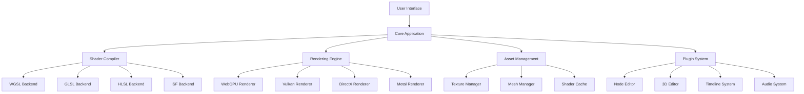

# WGSL Shader Studio Technical Architecture

## Table of Contents

- [WGSL Shader Studio Technical Architecture](#wgsl-shader-studio-technical-architecture)
  - [Table of Contents](#table-of-contents)
  - [Introduction](#introduction)
  - [System Overview](#system-overview)
    - [High-Level Architecture](#high-level-architecture)
    - [Technology Stack](#technology-stack)
  - [Core Components](#core-components)
    - [Application Core](#application-core)
    - [Event System](#event-system)
  - [Rendering Architecture](#rendering-architecture)
    - [Renderer Design](#renderer-design)
    - [Resource Management](#resource-management)
  - [Shader Compilation Pipeline](#shader-compilation-pipeline)
    - [Compiler Architecture](#compiler-architecture)
    - [AST Representation](#ast-representation)
  - [UI Framework](#ui-framework)
    - [EGUI Integration](#egui-integration)
    - [Custom Widgets](#custom-widgets)
  - [Node-Based System](#node-based-system)
    - [Node Graph Architecture](#node-graph-architecture)
    - [Node Types](#node-types)
  - [3D Scene Editor](#3d-scene-editor)
    - [Scene Graph](#scene-graph)
    - [Component System](#component-system)
  - [Audio Integration System](#audio-integration-system)
    - [Audio Engine](#audio-engine)
    - [FFT Analysis](#fft-analysis)
  - [MIDI/OSC Systems](#midiosc-systems)
    - [MIDI Processing](#midi-processing)
    - [OSC Protocol](#osc-protocol)
  - [Timeline Animation System](#timeline-animation-system)
    - [Timeline Architecture](#timeline-architecture)
  - [Conversion Framework](#conversion-framework)
    - [Language Converter](#language-converter)
    - [Semantic Preservation](#semantic-preservation)
  - [Plugin Architecture](#plugin-architecture)
    - [Plugin System](#plugin-system)
  - [Data Management](#data-management)
    - [Asset Pipeline](#asset-pipeline)
  - [Performance Optimization](#performance-optimization)
    - [Rendering Optimizations](#rendering-optimizations)
    - [Memory Management](#memory-management)
  - [Security Considerations](#security-considerations)
    - [Sandbox System](#sandbox-system)
  - [Cross-Platform Support](#cross-platform-support)
    - [Platform Abstraction](#platform-abstraction)
  - [Future Architecture Plans](#future-architecture-plans)
    - [Roadmap](#roadmap)
    - [Scalability Improvements](#scalability-improvements)

## Introduction

WGSL Shader Studio is built on a modular, extensible architecture designed to support multiple shading languages, real-time rendering, and professional shader development workflows. This document provides a comprehensive overview of the system's technical architecture.

The architecture emphasizes:
- Modularity and extensibility
- Real-time performance
- Cross-platform compatibility
- Developer productivity
- Industry standard compliance

## System Overview

### High-Level Architecture



### Technology Stack

- **Primary Language**: Rust
- **UI Framework**: Bevy Engine with EGUI
- **Rendering Backend**: WebGPU (primary), with Vulkan/DirectX/Metal fallbacks
- **Shader Compilation**: Naga (WGSL), custom parsers for other languages
- **Audio Processing**: CPAL/Cubeb
- **Networking**: Quinn (QUIC), Socket2
- **Serialization**: Serde
- **Build System**: Cargo

## Core Components

### Application Core

The application core manages the main event loop, system initialization, and coordination between components:

```rust
// Simplified application structure
pub struct WgslShaderStudio {
    pub renderer: Renderer,
    pub compiler: ShaderCompiler,
    pub asset_manager: AssetManager,
    pub plugin_manager: PluginManager,
    pub ui_system: UiSystem,
    pub event_loop: EventLoop,
}

impl WgslShaderStudio {
    pub fn new() -> Result<Self, InitializationError> {
        // Initialize subsystems
        let renderer = Renderer::new()?;
        let compiler = ShaderCompiler::new()?;
        let asset_manager = AssetManager::new()?;
        let plugin_manager = PluginManager::new()?;
        let ui_system = UiSystem::new()?;
        let event_loop = EventLoop::new();
        
        Ok(Self {
            renderer,
            compiler,
            asset_manager,
            plugin_manager,
            ui_system,
            event_loop,
        })
    }
    
    pub fn run(&mut self) -> Result<(), RuntimeError> {
        // Main application loop
        self.event_loop.run(move |event, _, control_flow| {
            match event {
                Event::RedrawRequested(_) => {
                    self.renderer.render_frame();
                }
                Event::MainEventsCleared => {
                    self.ui_system.update();
                    self.plugin_manager.update();
                }
                _ => {}
            }
        })
    }
}
```

### Event System

The event system provides decoupled communication between components:

```rust
// Event system architecture
pub enum AppEvent {
    ShaderCompiled { shader_id: ShaderId, result: CompilationResult },
    AssetLoaded { asset_id: AssetId, data: AssetData },
    UiInteraction { widget_id: WidgetId, action: UiAction },
    PluginMessage { plugin_id: PluginId, message: PluginMessage },
}

pub trait EventHandler {
    fn handle_event(&mut self, event: &AppEvent);
}

pub struct EventBus {
    handlers: HashMap<EventType, Vec<Box<dyn EventHandler>>>,
}

impl EventBus {
    pub fn publish(&self, event: AppEvent) {
        if let Some(handlers) = self.handlers.get(&event.type_id()) {
            for handler in handlers {
                handler.handle_event(&event);
            }
        }
    }
    
    pub fn subscribe<T: EventHandler + 'static>(&mut self, handler: T) {
        let event_type = TypeId::of::<T::EventType>();
        self.handlers.entry(event_type).or_insert_with(Vec::new).push(Box::new(handler));
    }
}
```

## Rendering Architecture

### Renderer Design

The renderer uses a data-driven approach with render graphs:

```rust
// Renderer architecture
pub struct Renderer {
    pub device: wgpu::Device,
    pub queue: wgpu::Queue,
    pub surface: wgpu::Surface,
    pub swap_chain: wgpu::SwapChain,
    pub render_graph: RenderGraph,
    pub resource_cache: ResourceCache,
}

pub struct RenderGraph {
    pub passes: Vec<RenderPass>,
    pub resources: HashMap<ResourceId, RenderResource>,
    pub dependencies: DependencyGraph,
}

pub struct RenderPass {
    pub name: String,
    pub inputs: Vec<ResourceId>,
    pub outputs: Vec<ResourceId>,
    pub pipeline: RenderPipeline,
    pub execute_fn: Box<dyn Fn(&mut RenderContext)>,
}

impl Renderer {
    pub fn render_frame(&mut self) {
        let mut encoder = self.device.create_command_encoder(&wgpu::CommandEncoderDescriptor {
            label: Some("Frame Encoder"),
        });
        
        // Execute render passes in dependency order
        for pass in self.render_graph.execute_order() {
            self.execute_render_pass(&mut encoder, pass);
        }
        
        self.queue.submit(Some(encoder.finish()));
    }
}
```

### Resource Management

Efficient resource management is critical for performance:

```rust
// Resource management system
pub struct ResourceCache {
    textures: HashMap<TextureId, CachedTexture>,
    buffers: HashMap<BufferId, CachedBuffer>,
    pipelines: HashMap<PipelineId, CachedPipeline>,
    shaders: HashMap<ShaderId, CachedShader>,
}

pub struct CachedTexture {
    pub texture: wgpu::Texture,
    pub view: wgpu::TextureView,
    pub sampler: wgpu::Sampler,
    pub last_used: Instant,
    pub ref_count: AtomicUsize,
}

impl ResourceCache {
    pub fn get_or_create_texture(&mut self, desc: &TextureDescriptor) -> TextureId {
        // Check if texture already exists
        if let Some(id) = self.find_matching_texture(desc) {
            self.increment_ref_count(id);
            return id;
        }
        
        // Create new texture
        let texture = self.device.create_texture(desc);
        let view = texture.create_view(&wgpu::TextureViewDescriptor::default());
        let sampler = self.device.create_sampler(&desc.sampler_descriptor);
        
        let id = TextureId::new();
        self.textures.insert(id, CachedTexture {
            texture,
            view,
            sampler,
            last_used: Instant::now(),
            ref_count: AtomicUsize::new(1),
        });
        
        id
    }
}
```

## Shader Compilation Pipeline

### Compiler Architecture

The shader compiler supports multiple languages through a unified interface:

```rust
// Shader compiler system
pub struct ShaderCompiler {
    parsers: HashMap<Language, Box<dyn Parser>>,
    validators: HashMap<Language, Box<dyn Validator>>,
    generators: HashMap<Target, Box<dyn CodeGenerator>>,
    optimizer: Optimizer,
}

pub enum Language {
    Wgsl,
    Glsl,
    Hlsl,
    Isf,
}

pub enum Target {
    Spirv,
    Dxil,
    Msl,
    Wgsl,
    Glsl,
    Hlsl,
}

impl ShaderCompiler {
    pub fn compile_shader(&self, source: &str, language: Language, target: Target) -> Result<CompiledShader, CompilationError> {
        // Parse source code
        let ast = self.parsers[&language].parse(source)?;
        
        // Validate AST
        self.validators[&language].validate(&ast)?;
        
        // Optimize AST
        let optimized_ast = self.optimizer.optimize(ast);
        
        // Generate target code
        let compiled = self.generators[&target].generate(optimized_ast)?;
        
        Ok(compiled)
    }
}
```

### AST Representation

Unified AST for all supported languages:

```rust
// Unified AST representation
pub enum AstNode {
    VariableDeclaration {
        name: String,
        type_spec: TypeSpec,
        qualifiers: Vec<Qualifier>,
        initializer: Option<Box<AstNode>>,
    },
    FunctionDefinition {
        name: String,
        parameters: Vec<Parameter>,
        return_type: TypeSpec,
        body: Box<AstNode>,
    },
    Expression {
        kind: ExpressionKind,
        operands: Vec<AstNode>,
    },
    Statement {
        kind: StatementKind,
        children: Vec<AstNode>,
    },
}

pub enum ExpressionKind {
    BinaryOperation { operator: BinaryOperator },
    UnaryOperation { operator: UnaryOperator },
    FunctionCall,
    MemberAccess,
    IndexAccess,
    Literal,
    Identifier,
}

pub enum StatementKind {
    Block,
    If,
    While,
    For,
    Return,
    Assignment,
    Declaration,
}
```

## UI Framework

### EGUI Integration

The UI system is built on EGUI with Bevy integration:

```rust
// UI system architecture
pub struct UiSystem {
    egui_context: egui::Context,
    bevy_egui_plugin: BevyEguiPlugin,
    panels: HashMap<PanelId, Box<dyn Panel>>,
    menus: Vec<Menu>,
}

pub trait Panel {
    fn name(&self) -> &str;
    fn show(&mut self, ctx: &egui::Context, ui_state: &mut UiState);
    fn update(&mut self, delta_time: f32);
}

pub struct EditorPanel {
    code_editor: CodeEditor,
    syntax_highlighter: SyntaxHighlighter,
    error_reporter: ErrorReporter,
}

impl Panel for EditorPanel {
    fn show(&mut self, ctx: &egui::Context, ui_state: &mut UiState) {
        egui::CentralPanel::default().show(ctx, |ui| {
            // Show code editor
            self.code_editor.show(ui);
            
            // Show error panel
            if !ui_state.errors.is_empty() {
                self.error_reporter.show(ui, &ui_state.errors);
            }
        });
    }
}
```

### Custom Widgets

Specialized widgets for shader development:

```rust
// Custom UI widgets
pub struct ShaderParameterWidget {
    name: String,
    parameter_type: ParameterType,
    value: ParameterValue,
    min_value: f32,
    max_value: f32,
}

impl ShaderParameterWidget {
    pub fn show(&mut self, ui: &mut egui::Ui) {
        ui.horizontal(|ui| {
            ui.label(&self.name);
            
            match self.parameter_type {
                ParameterType::Float => {
                    ui.add(egui::Slider::new(&mut self.value.float_val, self.min_value..=self.max_value));
                }
                ParameterType::Color => {
                    ui.color_edit_button_rgba_unmultiplied(&mut self.value.color_val);
                }
                ParameterType::Texture => {
                    if ui.button("Browse...").clicked() {
                        // Open file dialog
                    }
                }
            }
        });
    }
}
```

## Node-Based System

### Node Graph Architecture

The node-based system provides visual shader composition:

```rust
// Node graph system
pub struct NodeGraph {
    nodes: HashMap<NodeId, Node>,
    connections: Vec<Connection>,
    node_library: NodeLibrary,
}

pub struct Node {
    pub id: NodeId,
    pub node_type: NodeType,
    pub position: egui::Pos2,
    pub inputs: Vec<NodeInput>,
    pub outputs: Vec<NodeOutput>,
    pub parameters: HashMap<String, Parameter>,
}

pub struct Connection {
    pub source_node: NodeId,
    pub source_output: OutputId,
    pub target_node: NodeId,
    pub target_input: InputId,
}

impl NodeGraph {
    pub fn evaluate(&self) -> Result<ShaderCode, EvaluationError> {
        // Topological sort of nodes
        let sorted_nodes = self.topological_sort();
        
        // Generate code for each node
        let mut code_generator = CodeGenerator::new();
        for node_id in sorted_nodes {
            let node = &self.nodes[&node_id];
            code_generator.add_node(node);
        }
        
        // Generate final shader code
        let shader_code = code_generator.generate();
        Ok(shader_code)
    }
}
```

### Node Types

Various node types for different operations:

```rust
// Node type definitions
pub enum NodeType {
    // Math operations
    Add,
    Subtract,
    Multiply,
    Divide,
    Power,
    Sqrt,
    
    // Vector operations
    VectorConstruct,
    VectorSplit,
    DotProduct,
    CrossProduct,
    Normalize,
    
    // Texture operations
    TextureSample,
    TextureCoordinate,
    TextureProperty,
    
    // Lighting models
    PhongLighting,
    PbrLighting,
    NormalMap,
    
    // Custom nodes
    CustomFunction,
    Parameter,
    Output,
}

pub struct NodeDefinition {
    pub name: String,
    pub category: String,
    pub inputs: Vec<InputDefinition>,
    pub outputs: Vec<OutputDefinition>,
    pub parameters: Vec<ParameterDefinition>,
    pub generator: Box<dyn NodeCodeGenerator>,
}
```

## 3D Scene Editor

### Scene Graph

The 3D editor uses a hierarchical scene graph:

```rust
// Scene graph implementation
pub struct Scene {
    root: Entity,
    entities: HashMap<EntityId, Entity>,
    components: ComponentManager,
    hierarchy: HierarchyTree,
}

pub struct Entity {
    pub id: EntityId,
    pub name: String,
    pub transform: Transform,
    pub children: Vec<EntityId>,
    pub parent: Option<EntityId>,
}

pub struct Transform {
    pub position: Vec3,
    pub rotation: Quat,
    pub scale: Vec3,
}

impl Scene {
    pub fn update_transforms(&mut self) {
        // Update transforms in hierarchical order
        self.update_transform_recursive(self.root.id, Mat4::IDENTITY);
    }
    
    fn update_transform_recursive(&mut self, entity_id: EntityId, parent_matrix: Mat4) {
        let entity = &mut self.entities[&entity_id];
        let local_matrix = entity.transform.to_matrix();
        let world_matrix = parent_matrix * local_matrix;
        
        // Update entity's world transform
        entity.world_matrix = world_matrix;
        
        // Update children
        for child_id in &entity.children {
            self.update_transform_recursive(*child_id, world_matrix);
        }
    }
}
```

### Component System

Flexible component-based architecture:

```rust
// Component system
pub trait Component: Any + Send + Sync {
    fn type_id(&self) -> TypeId {
        TypeId::of::<Self>()
    }
}

pub struct ComponentManager {
    components: HashMap<TypeId, HashMap<EntityId, Box<dyn Component>>>,
}

impl ComponentManager {
    pub fn add_component<T: Component>(&mut self, entity_id: EntityId, component: T) {
        let type_id = TypeId::of::<T>();
        self.components
            .entry(type_id)
            .or_insert_with(HashMap::new)
            .insert(entity_id, Box::new(component));
    }
    
    pub fn get_component<T: Component>(&self, entity_id: EntityId) -> Option<&T> {
        let type_id = TypeId::of::<T>();
        self.components
            .get(&type_id)?
            .get(&entity_id)?
            .downcast_ref::<T>()
    }
}

// Example components
pub struct MeshRenderer {
    pub mesh: MeshId,
    pub material: MaterialId,
    pub cast_shadows: bool,
    pub receive_shadows: bool,
}

pub struct Camera {
    pub projection: Projection,
    pub fov: f32,
    pub near_plane: f32,
    pub far_plane: f32,
}

pub struct Light {
    pub light_type: LightType,
    pub color: Vec3,
    pub intensity: f32,
    pub range: f32,
    pub shadows: bool,
}
```

## Audio Integration System

### Audio Engine

The audio system provides real-time processing:

```rust
// Audio engine architecture
pub struct AudioEngine {
    device: cpal::Device,
    stream: cpal::Stream,
    audio_graph: AudioGraph,
    processors: HashMap<ProcessorId, Box<dyn AudioProcessor>>,
}

pub trait AudioProcessor {
    fn process(&mut self, input: &AudioBuffer, output: &mut AudioBuffer);
    fn set_parameter(&mut self, name: &str, value: f32);
}

pub struct AudioGraph {
    nodes: HashMap<NodeId, AudioNode>,
    connections: Vec<AudioConnection>,
}

pub struct AudioBuffer {
    pub channels: Vec<Vec<f32>>,
    pub sample_rate: u32,
    pub frame_count: usize,
}

impl AudioEngine {
    pub fn process_audio(&mut self, output_buffer: &mut AudioBuffer) {
        // Process audio graph
        for node_id in self.audio_graph.processing_order() {
            let node = &mut self.audio_graph.nodes[&node_id];
            node.process(output_buffer);
        }
    }
}
```

### FFT Analysis

Real-time spectral analysis:

```rust
// FFT analysis system
pub struct FftAnalyzer {
    fft_size: usize,
    window_function: WindowFunction,
    fft_plan: FftPlan,
    input_buffer: Vec<f32>,
    output_buffer: Vec<Complex<f32>>,
}

pub enum WindowFunction {
    Hann,
    Hamming,
    Blackman,
    Rectangular,
}

impl FftAnalyzer {
    pub fn analyze(&mut self, samples: &[f32]) -> Vec<f32> {
        // Apply window function
        self.apply_window(samples);
        
        // Perform FFT
        self.fft_plan.process(&mut self.input_buffer, &mut self.output_buffer);
        
        // Convert to magnitude spectrum
        let spectrum: Vec<f32> = self.output_buffer
            .iter()
            .map(|c| c.norm())
            .collect();
            
        spectrum
    }
    
    pub fn get_frequency_bands(&self, spectrum: &[f32], band_count: usize) -> Vec<f32> {
        let bin_size = spectrum.len() / band_count;
        let mut bands = Vec::with_capacity(band_count);
        
        for i in 0..band_count {
            let start = i * bin_size;
            let end = (i + 1) * bin_size;
            let sum: f32 = spectrum[start..end].iter().sum();
            let average = sum / bin_size as f32;
            bands.push(average);
        }
        
        bands
    }
}
```

## MIDI/OSC Systems

### MIDI Processing

MIDI input/output handling:

```rust
// MIDI system architecture
pub struct MidiSystem {
    input_devices: HashMap<DeviceId, MidiInputDevice>,
    output_devices: HashMap<DeviceId, MidiOutputDevice>,
    message_router: MidiRouter,
}

pub struct MidiMessage {
    pub timestamp: u64,
    pub channel: u8,
    pub message_type: MidiMessageType,
    pub data: Vec<u8>,
}

pub enum MidiMessageType {
    NoteOn { note: u8, velocity: u8 },
    NoteOff { note: u8, velocity: u8 },
    ControlChange { controller: u8, value: u8 },
    ProgramChange { program: u8 },
    PitchBend { value: u16 },
    SystemExclusive,
}

pub struct MidiRouter {
    mappings: HashMap<MidiMappingId, MidiMapping>,
    targets: HashMap<ParameterId, ParameterTarget>,
}

impl MidiRouter {
    pub fn process_message(&mut self, message: &MidiMessage) {
        // Find matching mappings
        for mapping in self.mappings.values() {
            if mapping.matches(message) {
                // Apply mapping to target parameter
                if let Some(target) = self.targets.get_mut(&mapping.target_parameter) {
                    let normalized_value = mapping.map_value(message);
                    target.set_value(normalized_value);
                }
            }
        }
    }
}
```

### OSC Protocol

Open Sound Control implementation:

```rust
// OSC system
pub struct OscSystem {
    udp_socket: UdpSocket,
    message_handlers: HashMap<String, Box<dyn OscMessageHandler>>,
    clients: HashMap<ClientId, OscClient>,
}

pub struct OscMessage {
    pub address: String,
    pub arguments: Vec<OscArgument>,
    pub timestamp: Option<u64>,
}

pub enum OscArgument {
    Int32(i32),
    Float32(f32),
    String(String),
    Blob(Vec<u8>),
    Time(u64, u32),
}

pub trait OscMessageHandler {
    fn handle_message(&mut self, message: &OscMessage) -> Result<(), OscError>;
}

impl OscSystem {
    pub fn send_message(&self, address: &str, args: &[OscArgument], target: &SocketAddr) -> Result<(), OscError> {
        let message = OscMessage {
            address: address.to_string(),
            arguments: args.to_vec(),
            timestamp: None,
        };
        
        let packet = OscPacket::Message(message);
        let encoded = rosc::encoder::encode(&packet)?;
        self.udp_socket.send_to(&encoded, target)?;
        
        Ok(())
    }
    
    pub fn process_incoming_messages(&mut self) -> Result<(), OscError> {
        let mut buf = [0u8; 1024];
        loop {
            match self.udp_socket.recv_from(&mut buf) {
                Ok((size, addr)) => {
                    let packet = rosc::decoder::decode(&buf[..size])?;
                    self.handle_packet(packet, addr);
                }
                Err(ref e) if e.kind() == std::io::ErrorKind::WouldBlock => {
                    break; // No more messages
                }
                Err(e) => return Err(OscError::Io(e)),
            }
        }
        Ok(())
    }
}
```

## Timeline Animation System

### Timeline Architecture

Non-linear animation timeline:

```rust
// Timeline system
pub struct Timeline {
    tracks: HashMap<TrackId, Track>,
    markers: Vec<Marker>,
    current_time: f64,
    duration: f64,
    playing: bool,
    loop_mode: LoopMode,
}

pub struct Track {
    pub name: String,
    pub track_type: TrackType,
    pub keyframes: BTreeMap<Time, Keyframe>,
    pub enabled: bool,
}

pub enum TrackType {
    ParameterAnimation { parameter: ParameterId },
    ShaderSwitch,
    TextureSequence,
    AudioTrigger,
}

pub struct Keyframe {
    pub value: PropertyValue,
    pub interpolation: InterpolationMode,
    pub easing: EasingFunction,
}

pub enum InterpolationMode {
    Step,
    Linear,
    CubicBezier { handle_in: Vec2, handle_out: Vec2 },
}

impl Timeline {
    pub fn evaluate_at_time(&self, time: f64) -> Vec<(ParameterId, PropertyValue)> {
        let mut results = Vec::new();
        
        for track in self.tracks.values() {
            if !track.enabled {
                continue;
            }
            
            match &track.track_type {
                TrackType::ParameterAnimation { parameter } => {
                    if let Some(value) = self.interpolate_parameter_track(track, time) {
                        results.push((*parameter, value));
                    }
                }
                // Handle other track types...
            }
        }
        
        results
    }
    
    fn interpolate_parameter_track(&self, track: &Track, time: f64) -> Option<PropertyValue> {
        let keyframes: Vec<_> = track.keyframes.iter().collect();
        
        // Find surrounding keyframes
        let (prev_idx, next_idx) = self.find_surrounding_keyframes(&keyframes, time)?;
        
        let (prev_time, prev_keyframe) = keyframes[prev_idx];
        let (next_time, next_keyframe) = keyframes[next_idx];
        
        // Interpolate based on mode
        let t = ((time - prev_time) / (next_time - prev_time)) as f32;
        let interpolated = self.interpolate_values(
            &prev_keyframe.value,
            &next_keyframe.value,
            t,
            &next_keyframe.interpolation,
            &next_keyframe.easing,
        );
        
        Some(interpolated)
    }
}
```

## Conversion Framework

### Language Converter

Cross-language shader conversion:

```rust
// Conversion framework
pub struct LanguageConverter {
    parsers: HashMap<Language, Box<dyn Parser>>,
    generators: HashMap<Language, Box<dyn CodeGenerator>>,
    transformers: HashMap<(Language, Language), Vec<Box<dyn AstTransformer>>>,
}

pub trait AstTransformer {
    fn transform(&self, ast: &mut AstNode) -> Result<(), TransformationError>;
    fn can_transform(&self, node: &AstNode) -> bool;
}

pub struct ConversionPipeline {
    pub source_language: Language,
    pub target_language: Language,
    pub transformers: Vec<Box<dyn AstTransformer>>,
    pub validator: Box<dyn Validator>,
}

impl LanguageConverter {
    pub fn convert(&self, source_code: &str, pipeline: &ConversionPipeline) -> Result<String, ConversionError> {
        // Parse source code
        let mut ast = self.parsers[&pipeline.source_language].parse(source_code)?;
        
        // Apply transformations
        for transformer in &pipeline.transformers {
            transformer.transform(&mut ast)?;
        }
        
        // Validate result
        pipeline.validator.validate(&ast)?;
        
        // Generate target code
        let target_code = self.generators[&pipeline.target_language].generate(&ast)?;
        
        Ok(target_code)
    }
}
```

### Semantic Preservation

Ensuring semantic equivalence during conversion:

```rust
// Semantic preservation system
pub struct SemanticValidator {
    rules: Vec<SemanticRule>,
}

pub struct SemanticRule {
    pub name: String,
    pub check_fn: Box<dyn Fn(&AstNode) -> bool>,
    pub error_message: String,
}

impl SemanticValidator {
    pub fn validate_semantic_equivalence(&self, original: &AstNode, converted: &AstNode) -> Result<(), SemanticError> {
        // Check structural similarity
        if !self.structurally_similar(original, converted) {
            return Err(SemanticError::StructureMismatch);
        }
        
        // Check value ranges
        if !self.value_ranges_preserved(original, converted) {
            return Err(SemanticError::ValueRangeViolation);
        }
        
        // Check function semantics
        if !self.function_semantics_preserved(original, converted) {
            return Err(SemanticError::FunctionSemanticsViolation);
        }
        
        Ok(())
    }
    
    fn structurally_similar(&self, a: &AstNode, b: &AstNode) -> bool {
        // Implementation for structural comparison
        // ...
        true
    }
}
```

## Plugin Architecture

### Plugin System

Extensible plugin architecture:

```rust
// Plugin system
pub struct PluginManager {
    plugins: HashMap<PluginId, Box<dyn Plugin>>,
    event_handlers: HashMap<EventType, Vec<PluginId>>,
    commands: HashMap<String, PluginId>,
}

pub trait Plugin: Send + Sync {
    fn name(&self) -> &str;
    fn version(&self) -> &str;
    fn initialize(&mut self, context: &PluginContext) -> Result<(), PluginError>;
    fn shutdown(&mut self);
    fn update(&mut self, delta_time: f32);
    fn handle_event(&mut self, event: &AppEvent) -> Result<(), PluginError>;
    fn get_commands(&self) -> Vec<PluginCommand>;
}

pub struct PluginContext {
    pub renderer: Arc<Renderer>,
    pub compiler: Arc<ShaderCompiler>,
    pub asset_manager: Arc<AssetManager>,
    pub event_bus: Arc<EventBus>,
    pub ui_system: Arc<UiSystem>,
}

pub struct PluginCommand {
    pub name: String,
    pub description: String,
    pub execute_fn: Box<dyn Fn(&PluginContext, &CommandArgs) -> Result<CommandResult, CommandError>>,
}

impl PluginManager {
    pub fn load_plugin<P: Plugin + 'static>(&mut self, plugin: P) -> Result<PluginId, PluginError> {
        let plugin_id = PluginId::new();
        
        // Initialize plugin
        let mut boxed_plugin = Box::new(plugin);
        boxed_plugin.initialize(&self.create_context())?;
        
        // Register plugin
        self.plugins.insert(plugin_id, boxed_plugin);
        
        // Register commands
        for command in self.plugins[&plugin_id].get_commands() {
            self.commands.insert(command.name.clone(), plugin_id);
        }
        
        Ok(plugin_id)
    }
    
    pub fn execute_command(&mut self, command_name: &str, args: &CommandArgs) -> Result<CommandResult, CommandError> {
        if let Some(plugin_id) = self.commands.get(command_name) {
            let plugin = self.plugins.get_mut(plugin_id).unwrap();
            let context = self.create_context();
            return plugin.get_commands().iter()
                .find(|cmd| cmd.name == command_name)
                .ok_or(CommandError::NotFound)?
                .execute_fn(&context, args);
        }
        Err(CommandError::NotFound)
    }
}
```

## Data Management

### Asset Pipeline

Efficient asset management system:

```rust
// Asset management system
pub struct AssetManager {
    loaders: HashMap<AssetType, Box<dyn AssetLoader>>,
    processors: HashMap<AssetType, Vec<Box<dyn AssetProcessor>>>,
    cache: AssetCache,
    watcher: AssetWatcher,
}

pub trait AssetLoader {
    fn load(&self, path: &Path) -> Result<Box<dyn Asset>, AssetError>;
    fn supported_extensions(&self) -> &[&str];
}

pub trait AssetProcessor {
    fn process(&self, asset: &mut dyn Asset) -> Result<(), ProcessingError>;
    fn input_types(&self) -> &[AssetType];
    fn output_types(&self) -> &[AssetType];
}

pub struct AssetCache {
    assets: HashMap<AssetId, CachedAsset>,
    dependencies: HashMap<AssetId, Vec<AssetId>>,
}

pub struct CachedAsset {
    pub asset: Box<dyn Asset>,
    pub last_accessed: Instant,
    pub ref_count: AtomicUsize,
    pub metadata: AssetMetadata,
}

impl AssetManager {
    pub fn load_asset<T: Asset>(&mut self, path: &Path) -> Result<Handle<T>, AssetError> {
        // Check cache first
        if let Some(asset_id) = self.cache.find_asset(path) {
            if let Some(cached) = self.cache.get_asset(asset_id) {
                if let Some(asset) = cached.asset.as_any().downcast_ref::<T>() {
                    return Ok(Handle::new(asset_id, asset));
                }
            }
        }
        
        // Load asset
        let asset_type = self.determine_asset_type(path)?;
        let loader = self.loaders.get(&asset_type)
            .ok_or(AssetError::UnsupportedType)?;
            
        let mut asset = loader.load(path)?;
        
        // Process asset
        if let Some(processors) = self.processors.get(&asset_type) {
            for processor in processors {
                processor.process(asset.as_mut())?;
            }
        }
        
        // Cache asset
        let asset_id = self.cache.store_asset(asset, path)?;
        
        Ok(Handle::new(asset_id, asset.as_any().downcast_ref().unwrap()))
    }
}
```

## Performance Optimization

### Rendering Optimizations

Performance-critical rendering optimizations:

```rust
// Performance optimization systems
pub struct PerformanceOptimizer {
    pub batching: DrawCallBatcher,
    pub culling: FrustumCuller,
    pub instancing: InstancingManager,
    pub occlusion: OcclusionCulling,
}

pub struct DrawCallBatcher {
    batches: Vec<RenderBatch>,
    batch_criteria: Vec<BatchCriterion>,
}

pub struct RenderBatch {
    pub pipeline: PipelineId,
    pub vertex_buffer: BufferId,
    pub index_buffer: BufferId,
    pub instances: Vec<InstanceData>,
    pub material: MaterialId,
}

impl DrawCallBatcher {
    pub fn batch_draw_calls(&mut self, draw_calls: &[DrawCall]) -> Vec<RenderBatch> {
        let mut batches: HashMap<BatchKey, RenderBatch> = HashMap::new();
        
        for draw_call in draw_calls {
            // Determine batch key
            let batch_key = self.compute_batch_key(draw_call);
            
            // Add to existing batch or create new one
            match batches.get_mut(&batch_key) {
                Some(batch) => {
                    batch.instances.push(draw_call.instance_data.clone());
                }
                None => {
                    let new_batch = RenderBatch {
                        pipeline: draw_call.pipeline,
                        vertex_buffer: draw_call.vertex_buffer,
                        index_buffer: draw_call.index_buffer,
                        instances: vec![draw_call.instance_data.clone()],
                        material: draw_call.material,
                    };
                    batches.insert(batch_key, new_batch);
                }
            }
        }
        
        batches.into_values().collect()
    }
}
```

### Memory Management

Efficient memory usage patterns:

```rust
// Memory management system
pub struct MemoryManager {
    pub allocator: GpuAllocator,
    pub pools: HashMap<PoolId, MemoryPool>,
    pub tracking: MemoryTracker,
}

pub struct GpuAllocator {
    pub device: wgpu::Device,
    pub buffers: Slab<BufferAllocation>,
    pub textures: Slab<TextureAllocation>,
}

pub struct MemoryPool {
    pub block_size: usize,
    pub alignment: usize,
    pub free_blocks: Vec<BlockId>,
    pub allocated_blocks: HashSet<BlockId>,
}

pub struct MemoryTracker {
    pub allocations: HashMap<AllocationId, AllocationInfo>,
    pub peak_usage: usize,
    pub current_usage: usize,
}

impl MemoryManager {
    pub fn allocate_buffer(&mut self, size: usize, usage: BufferUsage) -> Result<BufferAllocation, AllocationError> {
        // Try to allocate from existing pools
        for pool in self.pools.values_mut() {
            if pool.can_allocate(size, usage) {
                return pool.allocate(size);
            }
        }
        
        // Create new allocation
        let buffer = self.device.create_buffer(&wgpu::BufferDescriptor {
            size: size as u64,
            usage: usage.into(),
            mapped_at_creation: false,
            label: None,
        });
        
        let allocation = BufferAllocation {
            buffer,
            size,
            offset: 0,
        };
        
        self.tracking.record_allocation(AllocationId::new(), AllocationInfo {
            size,
            usage: AllocationUsage::Buffer,
            timestamp: Instant::now(),
        });
        
        Ok(allocation)
    }
}
```

## Security Considerations

### Sandbox System

Secure shader execution environment:

```rust
// Security sandbox for shader execution
pub struct ShaderSandbox {
    pub limits: ExecutionLimits,
    pub validator: ShaderValidator,
    pub monitor: ResourceMonitor,
    pub isolation: ProcessIsolation,
}

pub struct ExecutionLimits {
    pub max_instructions: u32,
    pub max_texture_reads: u32,
    pub max_buffer_accesses: u32,
    pub max_execution_time: Duration,
    pub max_memory_usage: usize,
}

pub struct ShaderValidator {
    pub forbidden_functions: HashSet<String>,
    pub restricted_resources: HashSet<ResourceId>,
    pub allowed_extensions: HashSet<String>,
}

impl ShaderSandbox {
    pub fn validate_and_execute(&self, shader: &ShaderCode) -> Result<ExecutionResult, SecurityError> {
        // Static analysis
        self.validator.validate(shader)?;
        
        // Runtime monitoring
        let guard = self.monitor.start_monitoring();
        
        // Execute with limits
        let result = self.execute_with_limits(shader, &guard)?;
        
        Ok(result)
    }
    
    fn execute_with_limits(&self, shader: &ShaderCode, monitor: &ResourceMonitorGuard) -> Result<ExecutionResult, ExecutionError> {
        // Set up timeout
        let timeout = std::time::Instant::now() + self.limits.max_execution_time;
        
        // Execute shader in controlled environment
        let result = self.isolation.execute_shader(shader, |ctx| {
            // Check limits periodically
            if std::time::Instant::now() > timeout {
                return Err(ExecutionError::Timeout);
            }
            
            if monitor.current_memory_usage() > self.limits.max_memory_usage {
                return Err(ExecutionError::MemoryLimitExceeded);
            }
            
            Ok(())
        })?;
        
        Ok(result)
    }
}
```

## Cross-Platform Support

### Platform Abstraction

Unified interface for different platforms:

```rust
// Platform abstraction layer
pub trait PlatformAbstraction {
    fn create_window(&self, config: &WindowConfig) -> Result<Box<dyn Window>, PlatformError>;
    fn create_gpu_context(&self, config: &GpuConfig) -> Result<GpuContext, PlatformError>;
    fn get_system_info(&self) -> SystemInfo;
    fn create_file_watcher(&self) -> Result<Box<dyn FileWatcher>, PlatformError>;
}

pub struct WindowsPlatform;
pub struct MacOSPlatform;
pub struct LinuxPlatform;

impl PlatformAbstraction for WindowsPlatform {
    fn create_window(&self, config: &WindowConfig) -> Result<Box<dyn Window>, PlatformError> {
        // Windows-specific window creation
        let hwnd = unsafe {
            CreateWindowExW(/* parameters */)
        };
        
        Ok(Box::new(WindowsWindow::new(hwnd)))
    }
    
    fn create_gpu_context(&self, config: &GpuConfig) -> Result<GpuContext, PlatformError> {
        // DirectX 12 or Vulkan context
        if config.prefer_directx {
            Ok(GpuContext::DirectX(DirectXContext::new()?))
        } else {
            Ok(GpuContext::Vulkan(VulkanContext::new()?))
        }
    }
}

impl PlatformAbstraction for MacOSPlatform {
    fn create_window(&self, config: &WindowConfig) -> Result<Box<dyn Window>, PlatformError> {
        // Metal-based window creation
        Ok(Box::new(MacOSWindow::new()))
    }
    
    fn create_gpu_context(&self, config: &GpuConfig) -> Result<GpuContext, PlatformError> {
        // Metal context
        Ok(GpuContext::Metal(MetalContext::new()?))
    }
}
```

## Future Architecture Plans

### Roadmap

Planned architectural improvements:

1. **Ray Tracing Support**
   - DXR/VKRT integration
   - Hybrid rasterization/ray tracing
   - Real-time global illumination

2. **Machine Learning Integration**
   - Neural network inference
   - AI-assisted shader generation
   - Style transfer effects

3. **Cloud Collaboration**
   - Real-time collaborative editing
   - Version control integration
   - Remote rendering

4. **Mobile Support**
   - iOS/Android ports
   - Touch-friendly UI
   - Mobile GPU optimization

5. **Extended Reality**
   - VR/AR support
   - Spatial computing
   - HMD integration

### Scalability Improvements

Future scalability enhancements:

```rust
// Distributed rendering architecture
pub struct DistributedRenderer {
    pub master_node: RenderMaster,
    pub worker_nodes: Vec<RenderWorker>,
    pub load_balancer: LoadBalancer,
    pub network_layer: NetworkLayer,
}

pub struct RenderMaster {
    pub scene_database: DistributedScene,
    pub job_scheduler: JobScheduler,
    pub result_aggregator: ResultAggregator,
}

pub struct RenderWorker {
    pub capabilities: WorkerCapabilities,
    pub task_processor: TaskProcessor,
    pub resource_cache: ResourceCache,
}

impl DistributedRenderer {
    pub async fn render_distributed(&self, scene: &Scene, camera: &Camera) -> Result<RenderedImage, RenderError> {
        // Split scene into chunks
        let chunks = self.split_scene(scene);
        
        // Distribute rendering tasks
        let mut futures = Vec::new();
        for chunk in chunks {
            let worker = self.load_balancer.select_worker(&chunk);
            let future = worker.render_chunk(chunk, camera.clone());
            futures.push(future);
        }
        
        // Collect results
        let rendered_chunks = futures::future::join_all(futures).await;
        
        // Composite results
        let final_image = self.composite_results(rendered_chunks);
        
        Ok(final_image)
    }
}
```

---
*End of Technical Architecture Documentation*