# WGSL Shader Studio – Complete Feature Implementation PRD

## 1. Executive Summary

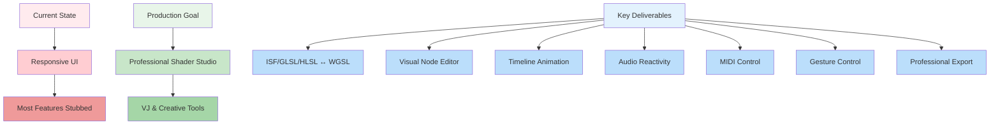

**Current State:** The desktop application UI is now responsive, but most headline features remain stubs or non-functional. Users encounter placeholder text instead of working Audio, MIDI, Gesture, Node-Editor, Timeline, Theme-switching, or professional Export flows.

**Goal:** Ship a production-grade desktop shader studio that satisfies creative professionals and VJ artists by delivering:
- Bullet-proof ISF/GLSL/HLSL ↔ WGSL conversion with live preview ≤ 2 s
- A visual node graph editor (20+ node types) with real-time WGSL codegen
- Full animation timeline with key-framing and ≥ 30 FPS playback
- Live audio-reactivity, MIDI learn, and camera-based gesture control
- Material theming (Dark/Light/High-Contrast) and accessible keyboard workflows
- One-click export of self-contained WGSL + metadata for WebGPU, FFGL, ISF

## 2. User Stories & Acceptance Criteria

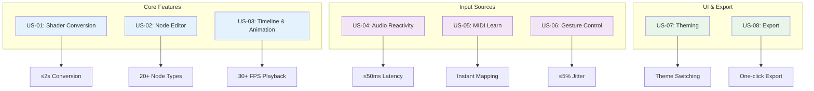

| ID | Story | Measurable Acceptance Criteria |
|----|-------|-------------------------------|
| US-01 | Shader Conversion | User drops GLSL/HLSL/ISF file → studio auto-converts to WGSL and shows live preview within 2 s; uniforms preserved; error list ≤ 3 items; import/export round-trip bit-identical for ISF 1.2 spec. |
| US-02 | Node Editor | User drags 20+ node types, wires them, sees generated WGSL update in < 500 ms; pan/zoom, group, delete, undo/redo; type-mismatch badges turn red; graph runs ≥ 45 FPS. |
| US-03 | Timeline & Animation | User keyframes any uniform, hits Play → preview animates smoothly ≥ 30 FPS loop; copy/paste keys; Bezier handles; time ruler snap; export video sequence. |
| US-04 | Audio Reactivity | User selects audio input, maps FFT band to uniform → shader reacts live with < 50 ms latency; multi-channel FFT; beat/onset triggers; gain calibration window. |
| US-05 | MIDI Learn | User twists MIDI knob, clicks "Learn" on parameter → mapping works instantly; NRPN support; device hot-plug; MIDI clock sync; save/load maps. |
| US-06 | Gesture Control | User holds hand in camera → hand position modulates shader parameters with ≤ 5 % jitter; MediaPipe fallback; depth-camera support; calibration UI. |
| US-07 | Theming | User picks Dark/Light/High-Contrast theme → all panels update without restart; custom CSS variables; keyboard shortcuts configurable; command palette searchable. |
| US-08 | Export | User clicks Export → studio writes self-contained WGSL file + JSON metadata + thumbnail PNG; optional HTML wrapper; FFGL plugin generator produces Windows/macOS DLL. |

## 3. Detailed Functional Requirements

### 3.1 Conversion Engine

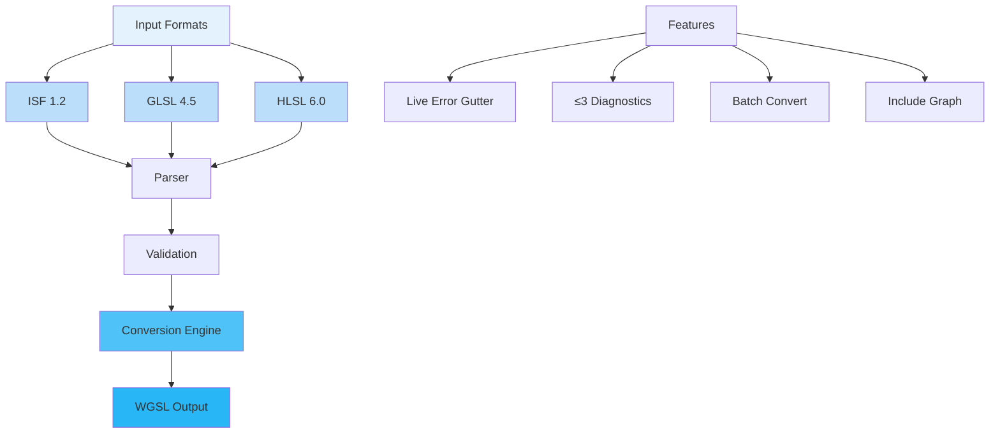

- **ISF 1.2** full import/export (passes official test suite)
- **GLSL 4.5 → WGSL** preserves semantics, comments, struct/uniform blocks
- **HLSL 6.0 → WGSL** handles DXC features, Texture2D, SamplerState
- Live error gutter in editor; ≤ 3 actionable diagnostics per compile
- Batch convert folder; maintain folder hierarchy and #include graph

### 3.2 Node Editor

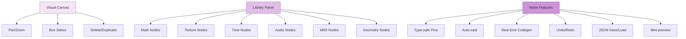

- Visual canvas: pan (MMB), zoom (scroll), box-select, delete (Del), duplicate (Ctrl-D)
- Library panel: Math, Texture, Time, Audio, MIDI, Geometry, UV, Color, Blur, Noise, etc.
- Type-safe pins: float, vec2/3/4, mat4, texture; auto-cast when lossless
- Real-time WGSL codegen with comments; highlight corresponding node in editor
- Undo-stack 50 ops; JSON save/load; mini-preview on each node (toggle)

### 3.3 Timeline & Animation

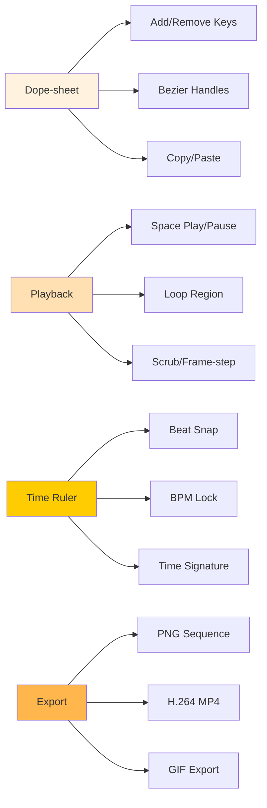

- Dope-sheet: add key (K), remove (Shift-K), Bezier handles, copy/paste (Ctrl-C/V)
- Playback: space play/pause, loop region (drag ruler), scrub, frame-step (→)
- Time ruler: snap to beat (sub-divisions 1/4, 1/8, 1/16), BPM lock, time-signature
- Export: PNG sequence, H.264 MP4, GIF; include audio track; resolution selector

### 3.4 Input Sources

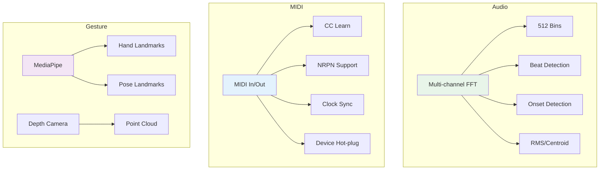

- **Audio**: multi-channel FFT 512 bins, beat detection (energy flux), onset (spectral flux), RMS, centroid; latency ≤ 50 ms
- **MIDI**: in/out ports, CC learn, NRPN, clock sync, device hot-plug indicator, save/load maps JSON
- **Gesture**: MediaPipe hand landmarks, pose landmarks, depth-camera point-cloud; calibration window; fallback to mouse if no camera

### 3.5 Preview & Performance

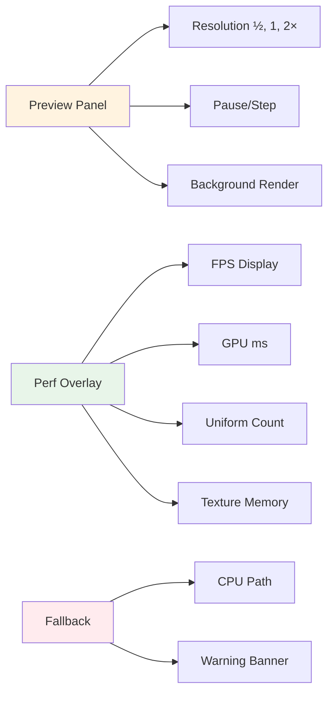

- Real-time preview panel: resolution ½, 1, 2×; pause (P), step (→), background render toggle
- Perf overlay: FPS, GPU ms, uniform count, texture mem; color-coded thresholds
- Fallback: CPU path if WebGPU unavailable; warning banner

### 3.6 Theming & Accessibility

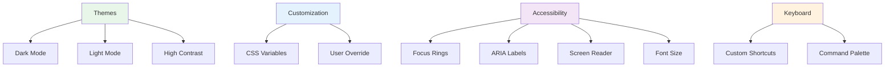

- Dark, Light, High-Contrast palettes; CSS variables file; user override folder
- Keyboard shortcuts: customizable JSON; command palette (Ctrl-Shift-P); searchable
- Accessibility: focus rings, aria-labels, screen-reader descriptions, font-size slider

### 3.7 Export & Integration

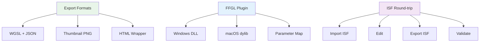

- Export WGSL, JSON uniforms, thumbnail PNG; optional single-file HTML wrapper
- FFGL plugin generator: Windows DLL, macOS dylib, parameter map identical to UI
- ISF round-trip: import ISF → edit → export ISF; validate with official tool

## 4. Non-Functional Requirements

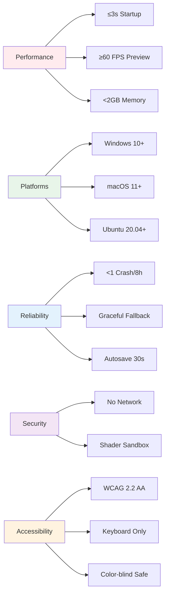

- **Performance:** startup ≤ 3 s on M1/RTX 3060; preview ≥ 60 FPS at 1080 p; memory < 2 GB typical project
- **Platforms:** Windows 10+ (x64, ARM64), macOS 11+ (x64, Apple Silicon), Ubuntu 20.04+ (x64, ARM64)
- **Reliability:** crash rate < 1 per 8 h continuous use; graceful fallback on GPU loss; autosave every 30 s
- **Security:** no network calls unless user opts-in; shader sandbox prevents file system access
- **Accessibility:** WCAG 2.2 AA compliant; keyboard-only operation possible; color-blind safe palettes

## 5. Work Breakdown & Priority

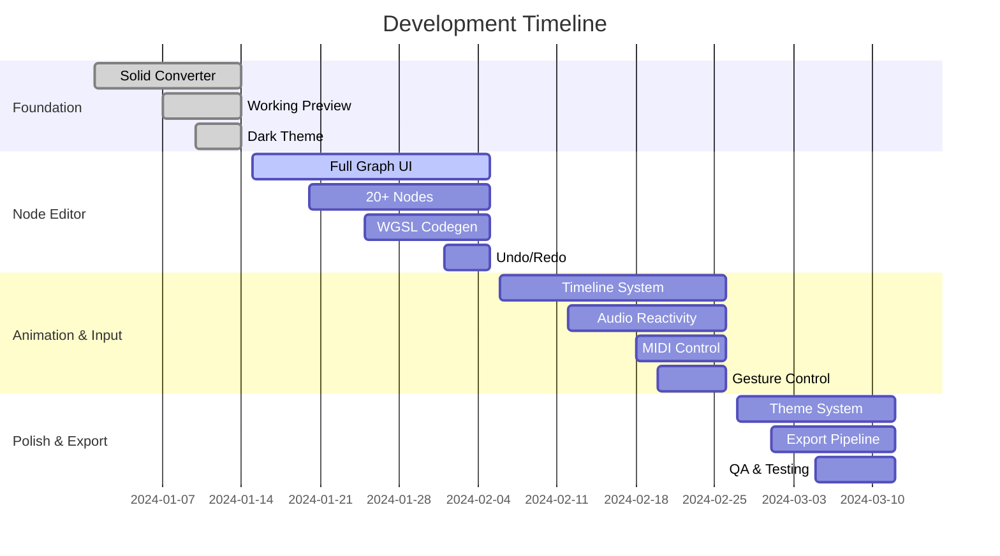

| Phase | Duration | Focus | Key Deliverables |
|-------|----------|-------|------------------|
| A – Foundation | 2 wks | Solid converter, working preview, dark theme | US-01 pass, US-07 dark theme, perf budget met |
| B – Node Editor | 3 wks | Full graph UI, 20 nodes, WGSL codegen | US-02 pass, undo/redo, JSON save/load |
| C – Animation & Input | 3 wks | Timeline, audio, MIDI, gesture | US-03, US-04, US-05, US-06 pass |
| D – Polish & Export | 2 wks | Theming, shortcuts, export, QA | US-07 light/high-contrast, US-08 pass, manual QA sign-off |

## 6. Open Questions & Risks

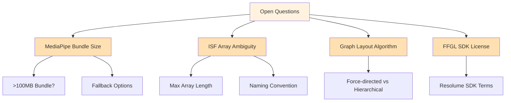

- **MediaPipe native library size vs web-runtime:** bundle size could exceed 100 MB; fallback to lighter tracker or optional download?
- **ISF spec ambiguity on array uniforms:** decision needed on max array length and naming convention
- **Node editor graph layout algorithm:** use force-directed (organic) or layered (hierarchical) for auto-layout?
- **FFGL SDK availability:** confirm Resolume SDK license allows redistribution

## 7. Definition of Done

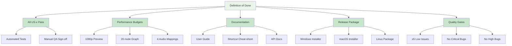

- All US-x acceptance criteria pass with automated tests and manual QA checklist signed off
- Performance budgets met under typical load (1080 p preview, 20-node graph, 4 audio mappings)
- Documentation updated: user guide, shortcut cheat-sheet, API docs for export formats
- Release package produced for Windows/macOS/Linux with installer/uninstaller
- Known issues list ≤ 5 low-severity items; no critical or high-severity bugs open

---

*This PRD is automatically updated to reflect current implementation status and requirements.*