# WGSL Shader Studio - Feature Implementation PRD (CURRENT REALITY)

## 🚨 EXECUTIVE SUMMARY - PROJECT IN CRISIS

```mermaid
graph TD
    A[Current State] --> B[❌ 0 Working Features]
    A --> C[💥 33 Compilation Errors]
    A --> D[❌ No Rendering Pipeline]
    A --> E[💥 Broken UI Architecture]
    
    F[Target Goal] --> G[Professional Shader Studio]
    G --> H[WGSL/ISF/GLSL/HLSL Support]
    G --> I[Visual Node Editor]
    G --> J[Timeline Animation]
    G --> K[Audio/MIDI Integration]
    G --> L[Professional Export]
    
    M[Recovery Timeline] --> N[3-4 Weeks: Basic Functionality]
    M --> O[6-8 Weeks: Full Features]
    
    style A fill:#ffebee
    style B fill:#f44336
    style C fill:#f44336
    style D fill:#f44336
    style E fill:#f44336
    style F fill:#e8f5e9
    style G fill:#c8e6c9
    style M fill:#fff3e0
    style N fill:#ffb74d
    style O fill:#ffb74d
```



**CURRENT REALITY**: The application is **COMPLETELY BROKEN** with 33 compilation errors and zero working features. All previous claims of working functionality were false.

**RECOVERY REQUIREMENT**: Complete reconstruction of all core systems from foundation up.

## Phase 1: Critical Foundation (Week 1-2)

### 1.1 Fix Compilation Errors


**Acceptance Criteria**:
- `cargo check --features gui` passes with 0 errors
- `cargo run` starts without compilation failures
- Basic window appears with empty UI

### 1.2 Implement WGPU Core Integration


**Acceptance Criteria**:
- WGPU device initialization successful
- Surface creation for viewport
- Basic render pipeline setup
- Uniform buffer allocation for parameters

### 1.3 Restore Basic UI Layout


**Acceptance Criteria**:
- Three-panel layout renders correctly
- Panels can be resized via drag handles
- Panel visibility can be toggled
- Responsive design with minimum sizes

## Phase 2: Core Functionality (Week 3-4)

### 2.1 Shader Compilation System


**Acceptance Criteria**:
- WGSL compilation via naga successful
- Error reporting with line numbers
- Compilation time < 500ms
- Hot reload on file changes

### 2.2 File Operations


**Acceptance Criteria**:
- Native OS file dialogs via rfd
- Support for WGSL, ISF, GLSL, HLSL
- Recent files tracking
- Auto-save every 30 seconds

## 🎯 COMPREHENSIVE ACTION PLAN - REFERENCE REPOSITORY INCORPORATION

### Phase 1: Critical Error Resolution (IMMEDIATE - Priority 1)

#### Visual Node Editor Error Research (URGENT)
```
error: this file contains an unclosed delimiter
   --> src\visual_node_editor.rs:166:32
```

**Research Requirements:**
1. **Online Research**: Search for "Bevy egui unclosed delimiter error" 
2. **Rust Community**: Check Rust forums for similar syntax errors
3. **Bevy Issues**: Review Bevy GitHub issues for egui compilation problems
4. **Build Artifacts**: Clear target directory and test clean builds
5. **Minimal Reproduction**: Create minimal test case to isolate error

**Research Sources:**
- Bevy Discord community
- Rust users forum
- GitHub Bevy issues
- Stack Overflow Bevy/egui tags
- Bevy egui documentation

#### Compilation Error Systematic Fix
**33 Total Errors Breakdown:**
- 8 Field missing errors (add missing struct fields)
- 12 Function signature errors (fix parameter mismatches)
- 7 Type mismatch errors (correct type annotations)
- 6 Import issues (resolve module dependencies)

### Phase 2: Reference Repository Integration (Priority 2)

#### use.gpu Framework Integration
**Available Components:**
```typescript
// From packages/shader/src/wgsl/ast.ts
- WGSL AST parsing and manipulation
- Shader module system
- Code generation utilities

// From packages/core/src/
- WebGPU buffer management
- Texture handling
- Pipeline creation
- Resource binding

// From packages/scene/src/
- 3D scene management
- Mesh processing
- Material systems
```

**Integration Plan:**
1. Port WGSL AST parser to Rust using naga
2. Adapt buffer management for Bevy resources
3. Integrate pipeline creation systems
4. Convert TypeScript interfaces to Rust traits

#### wgsl-analyzer Integration
**Available Components:**
```rust
// From crates/hir/src/
- WGSL semantic analysis
- Type inference system
- Definition resolution
- Diagnostics generation

// From crates/ide/src/
- Code completion
- Hover information
- Go-to-definition
- Syntax highlighting

// From crates/parser/src/
- WGSL parsing
- Syntax validation
- Error recovery
```

**Integration Plan:**
1. Extract WGSL parser for shader validation
2. Port semantic analysis for error checking
3. Integrate code completion for editor
4. Adapt diagnostics for real-time feedback

#### wgsl-bindgen Integration
**Available Components:**
```rust
// From wgsl_bindgen/src/
- WGSL to Rust binding generation
- Struct layout validation
- Uniform buffer creation
- Vertex attribute mapping
```

**Integration Plan:**
1. Implement automatic binding generation
2. Create uniform buffer management
3. Add vertex attribute validation
4. Generate Rust structs from WGSL

### Phase 3: Lost Feature Restoration (Priority 3)

#### Previously Implemented Features (Now Missing)
**ISF Conversion System:**
- JSON parsing for ISF format
- Parameter extraction and validation
- WGSL code generation from ISF
- Real-time parameter binding

**Multi-Format Shader Support:**
- GLSL to WGSL conversion
- HLSL to WGSL conversion
- SPIR-V intermediate representation
- Cross-platform compatibility

**Audio/MIDI Integration:**
- FFT analysis for audio visualization
- BPM detection and beat matching
- MIDI parameter control
- Real-time audio reactive shaders

**Timeline System:**
- Keyframe animation for parameters
- Timeline scrubbing and playback
- Animation curve editing
- Export to video formats

**Complete Node Editor:**
- Visual node creation and connection
- Real-time WGSL code generation
- Node library with common operations
- Custom node creation tools

**Gesture Control System:**
- Touch/mouse gesture recognition
- Parameter control via gestures
- Multi-touch support
- Custom gesture mapping

### Phase 4: Advanced System Implementation (Priority 4)

#### Professional Export Systems
- **FFGL Plugin Export**: Resolume, Magic Music Visuals compatibility
- **VST Plugin Generation**: Audio plugin format support
- **Video Export**: MP4, MOV, AVI with shader effects
- **Image Sequence**: PNG, JPG sequence export
- **Web Format**: WebGL, WebGPU web deployment

#### Advanced UI Components
- **Multi-window Support**: Detachable panels
- **Custom Themes**: Dark/light/high contrast modes
- **Layout Presets**: Save/restore workspace configurations
- **Performance Monitoring**: FPS, memory usage, GPU load
- **Advanced Code Editor**: Syntax highlighting, auto-completion, error checking

### Implementation Timeline

**Week 1: Foundation**
- Day 1-2: Fix visual node editor compilation error
- Day 3-4: Resolve all 33 compilation errors
- Day 5-7: Basic reference repository integration

**Week 2: Core Restoration**
- Day 8-10: Restore ISF conversion system
- Day 11-12: Implement multi-format shader support
- Day 13-14: Basic audio/MIDI integration

**Week 3: Advanced Features**
- Day 15-17: Complete node editor restoration
- Day 18-19: Timeline system implementation
- Day 20-21: Gesture control restoration

**Week 4: Polish and Integration**
- Day 22-24: Professional export systems
- Day 25-26: Advanced UI components
- Day 27-28: Performance optimization and testing

### Success Metrics
- ✅ Zero compilation errors
- ✅ All reference repositories integrated
- ✅ Lost features fully restored
- ✅ Professional-grade export capabilities
- ✅ Advanced UI with multi-window support
- ✅ Real-time shader compilation and preview
- ✅ Complete node editor with code generation
- ✅ Audio/MIDI integration with FFT analysis

**Final Goal**: Professional-grade shader studio matching reference repository capabilities

### 2.3 Live Preview System

```mermaid
graph TD
    subgraph "Preview Pipeline"
        A[Shader Compilation] --> B[Pipeline Update]
        B --> C[Uniform Binding]
        C --> D[Render Pass]
        D --> E[Frame Presentation]
        E --> F[60 FPS Target]
    end
    
    subgraph "Parameter Updates"
        G[UI Controls] --> H[Uniform Buffers]
        H --> I[GPU Upload]
        I --> J[Real-time Update]
        J --> K[< 16ms latency]
    end
    
    subgraph "Viewport Features"
        L[Resolution Options] --> M[½x, 1x, 2x]
        N[Pause/Play] --> O[Frame Stepping]
        P[Background Render] --> Q[Performance Mode]
    end
    
    style A fill:#4caf50
    style B fill:#4caf50
    style G fill:#2196f3
    style L fill:#ff9800
    style N fill:#ff9800
    style P fill:#ff9800
```



**Acceptance Criteria**:
- Live preview at 60 FPS
- Parameter updates < 16ms latency
- Multiple resolution options
- Pause/play with frame stepping

## Phase 3: Advanced Features (Week 5-8)

### 3.1 Node-Based Editor


**Acceptance Criteria**:
- 20+ node types implemented
- Visual drag-and-drop creation
- Automatic WGSL code generation
- Topological sorting for execution order

### 3.2 Timeline & Animation


**Acceptance Criteria**:
- Keyframe animation with interpolation
- Timeline ruler with beat snap
- Copy/paste keyframes
- Export to video, PNG sequence, GIF

### 3.3 Audio & MIDI Integration


**Acceptance Criteria**:
- FFT analysis with 512 bins
- Beat and onset detection
- MIDI CC parameter mapping
- Latency < 50ms

## Quality Assurance & Testing

### Performance Metrics


### Testing Strategy


## Risk Assessment & Mitigation


---

## Definition of Done

### Phase 1 Complete When:
- ✅ Zero compilation errors
- ✅ Basic window with empty UI
- ✅ WGPU device initialized
- ✅ Three-panel layout functional

### Phase 2 Complete When:
- ✅ WGSL compilation working
- ✅ File operations implemented
- ✅ Live preview at 60 FPS
- ✅ Error reporting system

### Phase 3 Complete When:
- ✅ Node editor with 20+ nodes
- ✅ Timeline animation system
- ✅ Audio/MIDI integration
- ✅ Export functionality complete

### Production Ready When:
- ✅ All performance targets met
- ✅ Test coverage requirements satisfied
- ✅ Cross-platform compatibility verified
- ✅ User acceptance testing passed

---

**⚠️ CRITICAL REMINDER**: This PRD reflects the **ACTUAL CURRENT STATE** of a completely broken project requiring complete reconstruction. All timeline estimates are based on starting from zero working functionality.

*This document is automatically updated to reflect realistic development requirements based on current code analysis.*