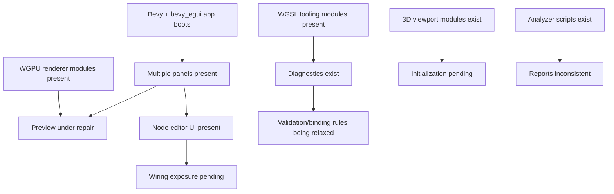
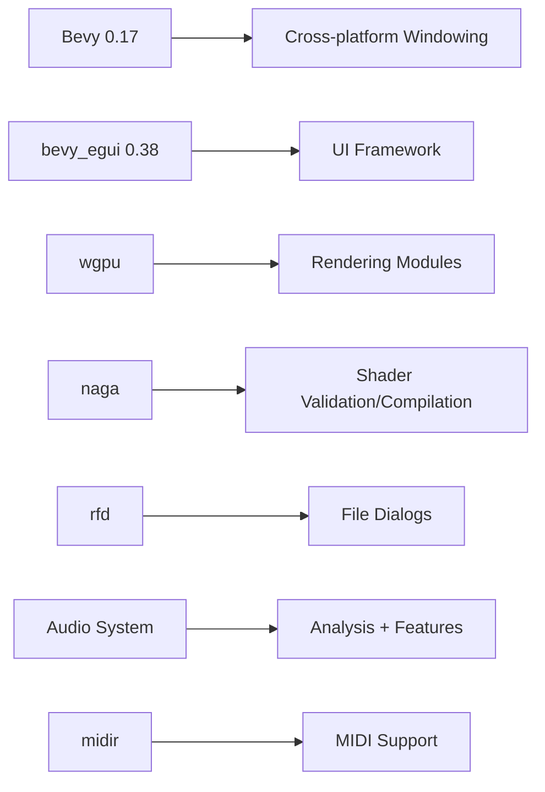
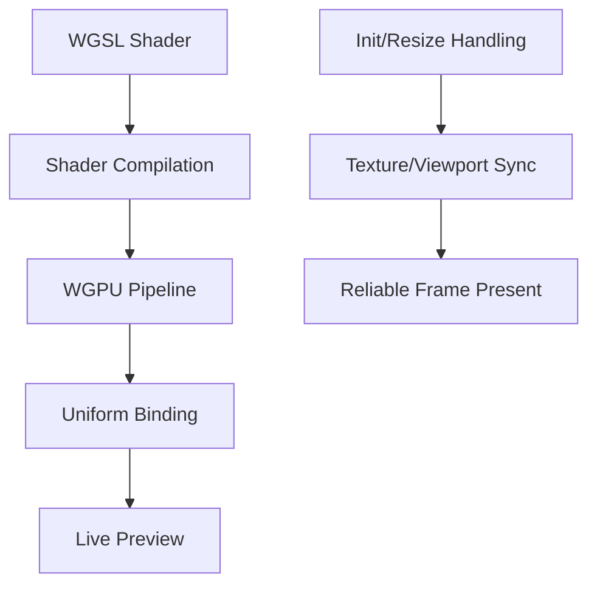
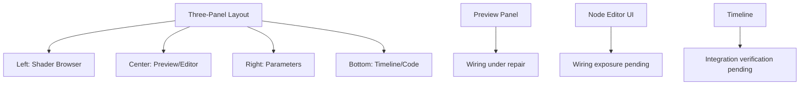
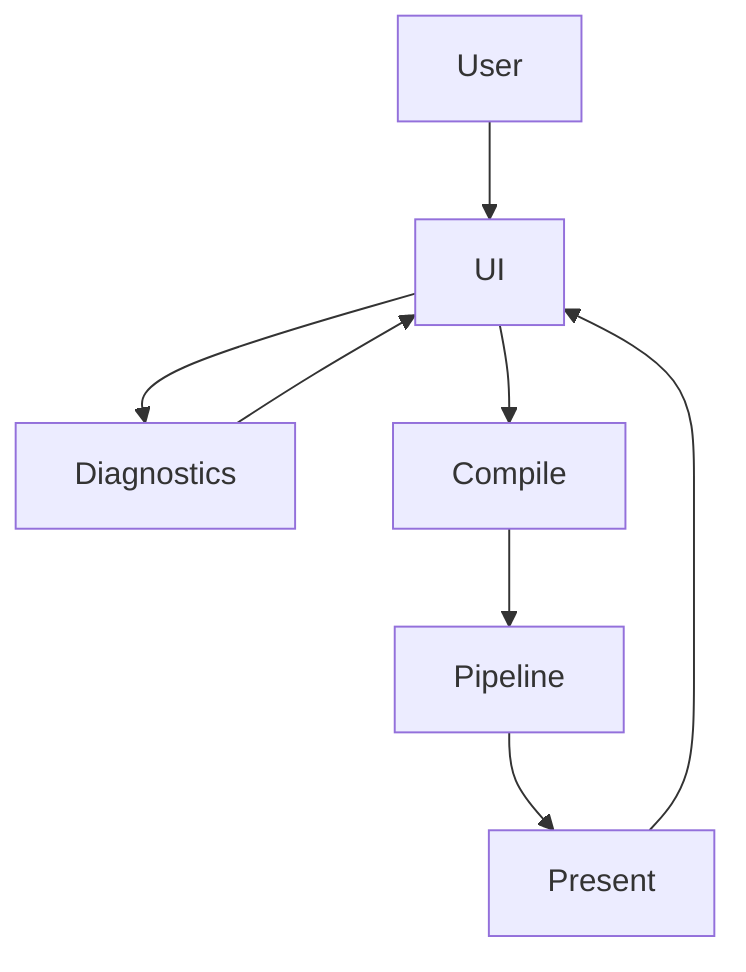
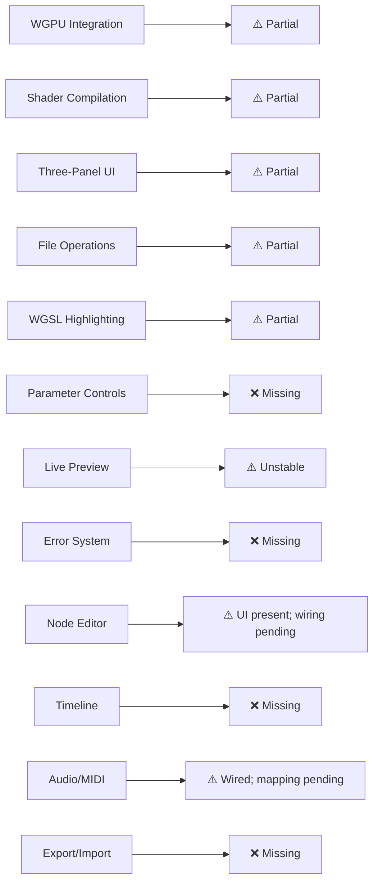
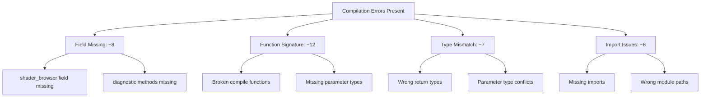
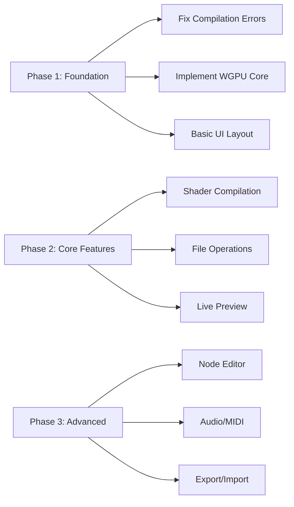
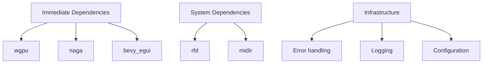

# WGSL Shader Studio - Technical Architecture (Current Reality)

## Current Reality (Updated 2025-12-14)



## Technology Stack (Updated Snapshot)



| Component | Current Version | Status | Required For |
|-----------|-----------------|---------|--------------|
| Bevy | 0.17 | ✅ Available | Window management |
| bevy_egui | 0.38 | ✅ Available | UI rendering |
| wgpu | Present (modules) | ⚠️ Wired; preview unstable | GPU rendering |
| naga | Available | ⚠️ Wired; validation active | Shader compilation |
| rfd | 0.15.x | ⚠️ Wired in UI | File dialogs |
| Audio system | Custom (dasp/ringbuf) | ⚠️ Wired; analysis present | Audio analysis |
| midir | 0.10.x | ⚠️ Wired; mapping pending | MIDI control |

## Application Architecture (Active Repair)

```mermaid
flowchart TD
    Main[src/main.rs] --> Flag[Feature Flag]
    Flag --> GUI[bevy_app::run_app()]
    Flag --> CLI[CLI Fallback]
    GUI --> App[App::new()]
    App --> Plugins[DefaultPlugins]
    App --> Egui[EguiPlugin]
    App --> EditorUI[EditorUI Systems]
    EditorUI --> PreviewRepair[Preview wiring repair]
    EditorUI --> NodeWiring[Expose node editor wiring]
```

## Core Systems Status

### Rendering Pipeline (Under Repair)



### UI Layout System (Partial)



### File System Integration (❌ MISSING)

```mermaid
flowchart TD
    Required[Required Operations] --> Dialogs[Open/Save WGSL]
    Required --> Import[Import ISF/GLSL/HLSL]
    Required --> Export[Export Formats]
    Required --> Projects[Project Management]
    Current[Current Status] --> NoDialogs[File dialogs partially wired]
    Current --> NoOps[Limited file operations]
    Current --> NoImportExport[Import/Export pending]
    Current --> NoSaveLoad[Project save/load pending]
    Missing[Missing Infrastructure] --> RfdIntegration[rfd integration completion]
    Missing --> Filters[File filters]
    Missing --> Recent[Recent files]
    Missing --> Format[Project format]
```



## Data Flow Architecture (Operational Flow)



## Feature Implementation Matrix



## Compilation Error Analysis



## Recovery Roadmap



## Critical Dependencies Required



---

## Summary

**CURRENT REALITY**: This project is **partially wired** with:
- ⚙️ Core systems present; wiring and integrations incomplete
- ⚠️ Preview path unstable; renderer lifecycle refinement needed
- 🧩 UI panels present; wire controls and diagnostics reliably
- 🔗 File dialog hooks present; project system wiring pending

**FOCUS**: Stabilize wiring, unify state, refine integrations; progress features to reliable baseline.

**⚠️ CRITICAL**: Development should align with Bevy 0.17 + bevy_egui 0.38 and the current wired dependencies.

---

*This document reflects the **ACTUAL CURRENT STATE** based on comprehensive code analysis - not wishful thinking or false claims.*
