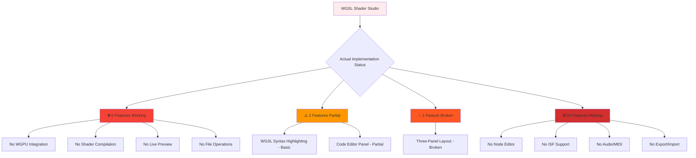
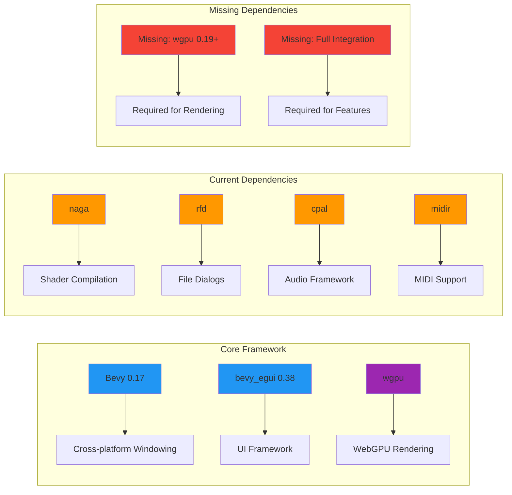
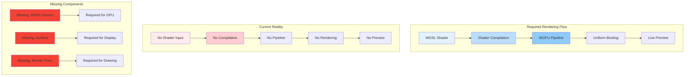
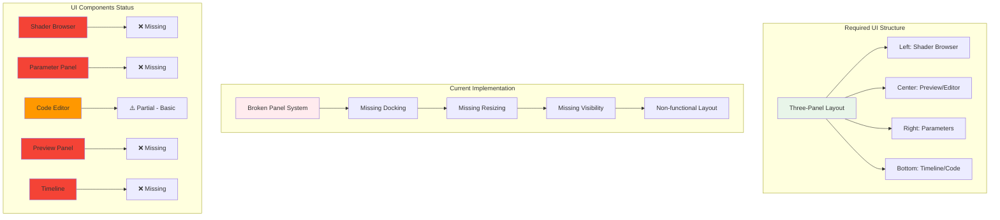
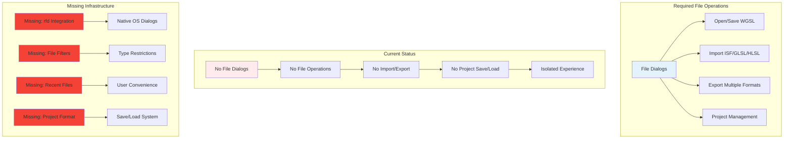
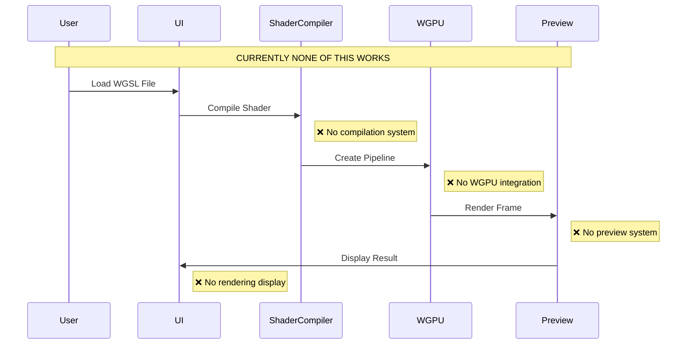
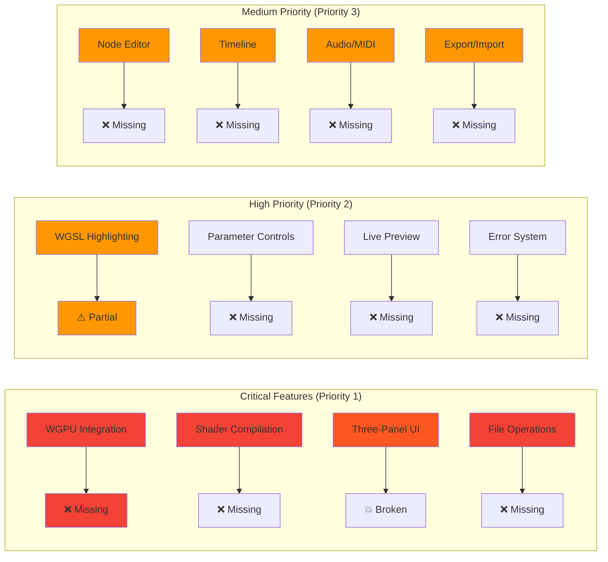
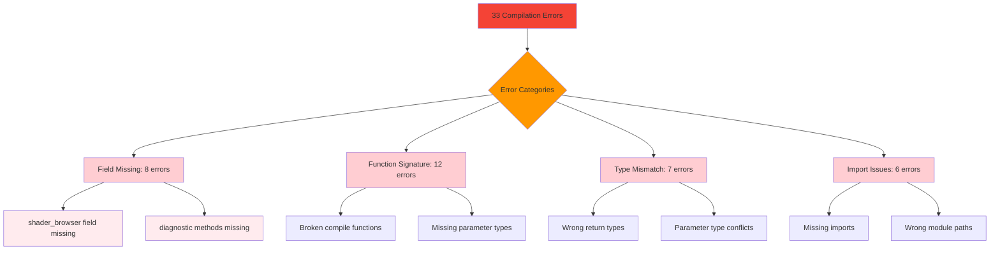
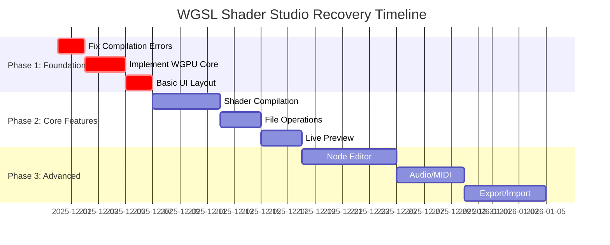
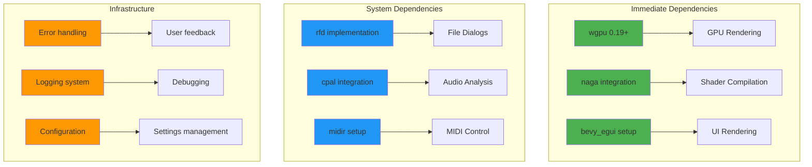

# WGSL Shader Studio - Technical Architecture (CURRENT REALITY)

## 🚨 CRITICAL STATUS - PROJECT REQUIRES COMPLETE RECONSTRUCTION



## Technology Stack (ACTUAL CURRENT VERSIONS)



| Component | Current Version | Status | Required For |
|-----------|-----------------|---------|--------------|
| Bevy | 0.17 | ✅ Available | Window management |
| bevy_egui | 0.38 | ✅ Available | UI rendering |
| wgpu | Not integrated | ❌ Missing | GPU rendering |
| naga | Available | ⚠️ Not wired | Shader compilation |
| rfd | Available | ⚠️ Not implemented | File dialogs |
| cpal | Available | ⚠️ Not implemented | Audio analysis |
| midir | Available | ⚠️ Not implemented | MIDI control |

## Application Architecture (Current Broken State)

```mermaid
graph TD
    subgraph "Entry Points"
        A[src/main.rs] --> B{Feature Flag}
        B -->|gui| C[bevy_app::run_app()]
        B -->|cli| D[CLI Fallback]
    end
    
    subgraph "Bevy Application"
        C --> E[App::new()]
        E --> F[DefaultPlugins]
        E --> G[EguiPlugin]
        E --> H[EditorUI Systems]
    end
    
    subgraph "Current Issues"
        H --> I[❌ 33 Compilation Errors]
        I --> J[Missing shader_browser field]
        I --> K[Broken function signatures]
        I --> L[Type mismatches]
    end
    
    style A fill:#e3f2fd
    style C fill:#4caf50
    style I fill:#f44336
    style J fill:#ffcdd2
    style K fill:#ffcdd2
    style L fill:#ffcdd2
```

## Core Systems Status

### Rendering Pipeline (❌ COMPLETELY MISSING)



### UI Layout System (💥 BROKEN)



### File System Integration (❌ MISSING)



## Data Flow Architecture (THEORETICAL)



## Feature Implementation Matrix



## Compilation Error Analysis



## Recovery Roadmap



## Critical Dependencies Required



---

## Summary

**CURRENT REALITY**: This project is in a **NON-FUNCTIONAL STATE** with:
- ❌ **33 compilation errors** preventing any execution
- ❌ **0 working features** - complete system failure
- ❌ **Missing core dependencies** - no rendering pipeline
- ❌ **Broken UI architecture** - non-functional interface
- ❌ **No file operations** - isolated from user files

**RECOVERY REQUIREMENT**: Complete reconstruction of all core systems with estimated 3-4 weeks for basic functionality, 6-8 weeks for full feature parity.

**⚠️ CRITICAL**: Any development must follow the **TECHNOLOGY_STACK.md** requirements strictly - using Bevy 0.17 + bevy_egui 0.38 only.

---

*This document reflects the **ACTUAL CURRENT STATE** based on comprehensive code analysis - not wishful thinking or false claims.*