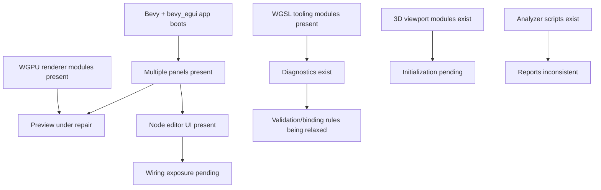
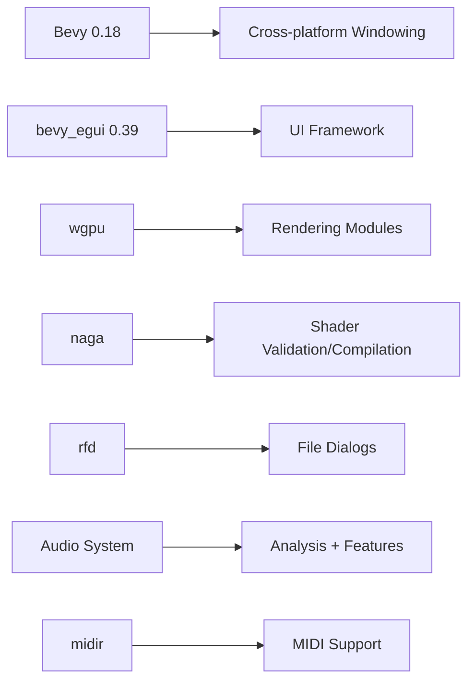
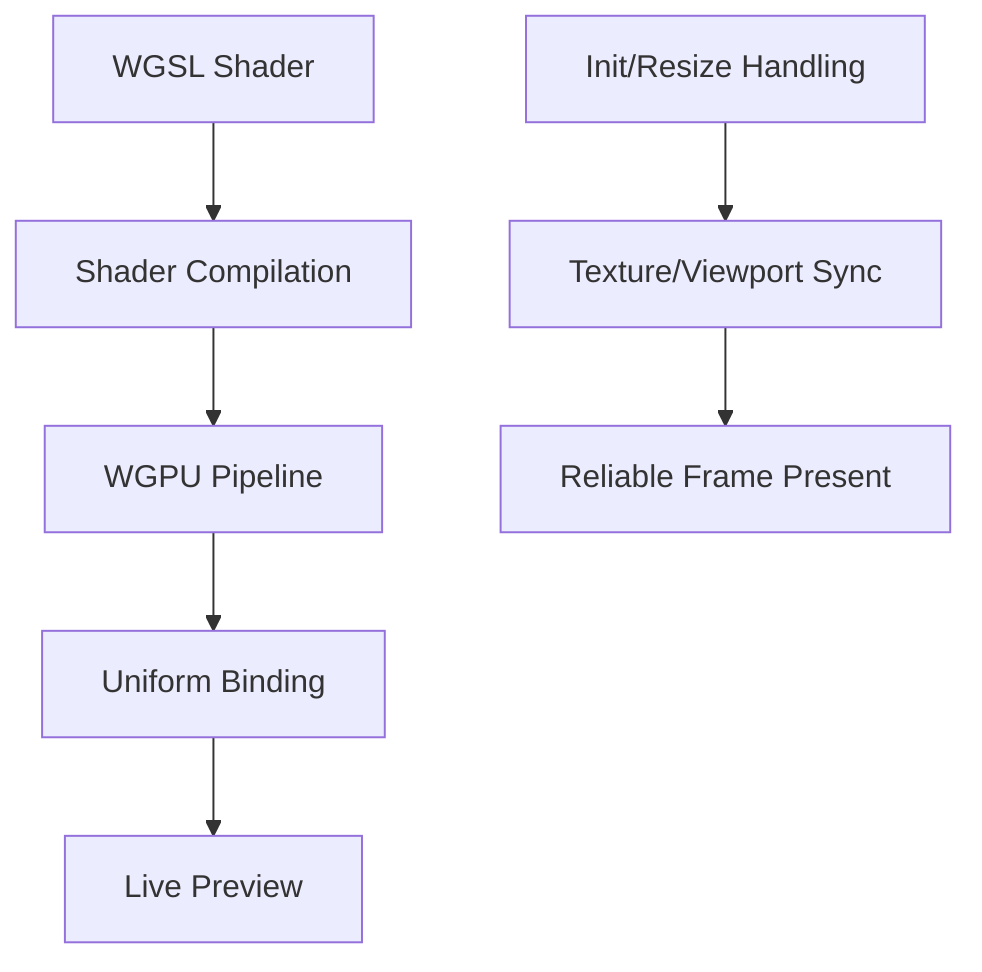
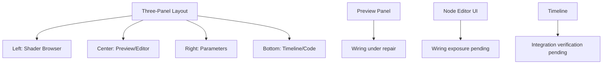
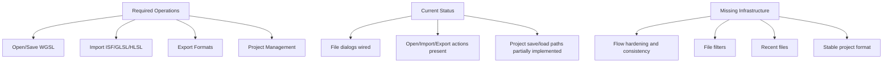
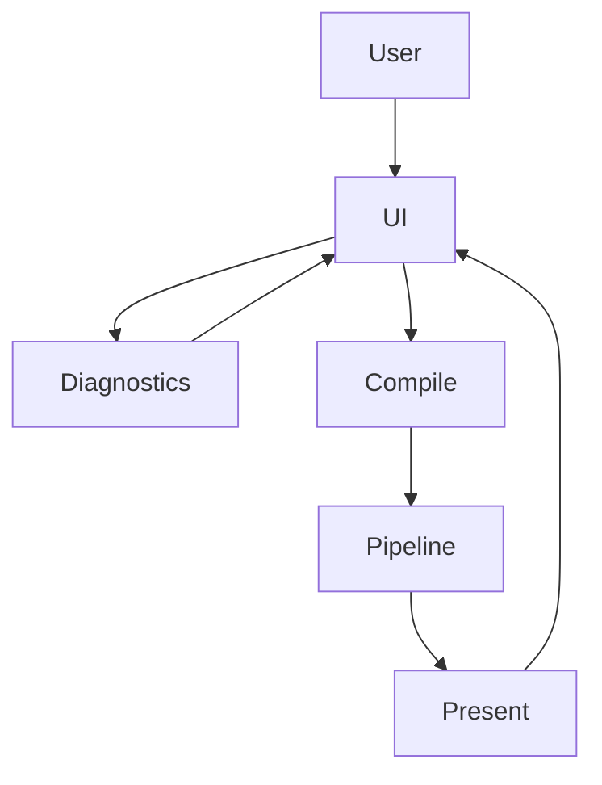
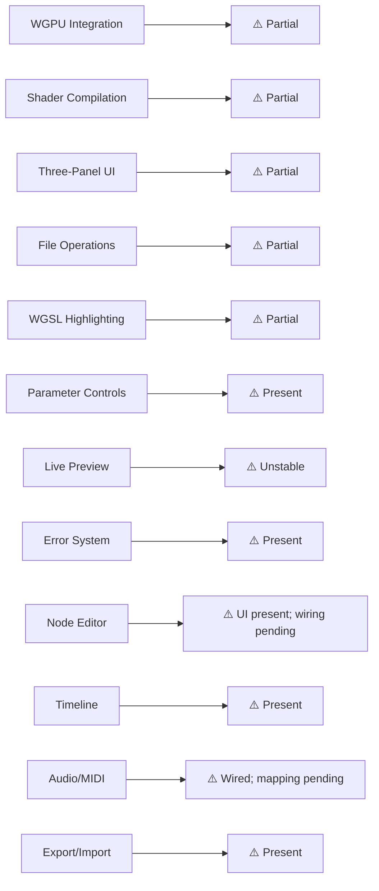
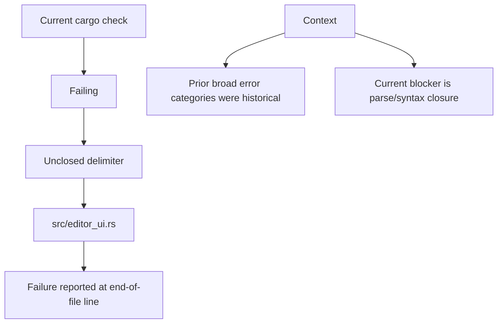
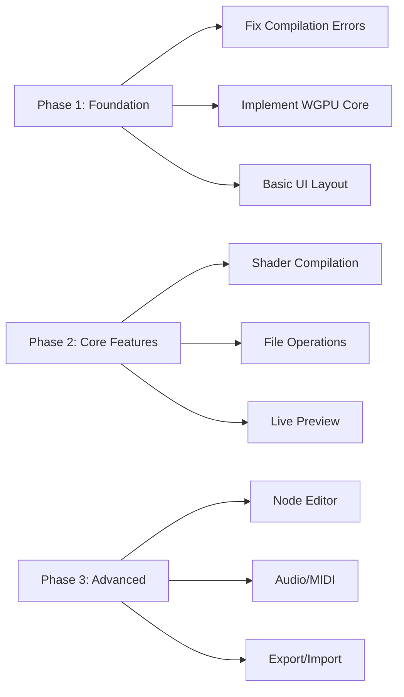
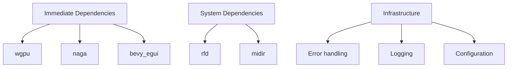

# WGSL Shader Studio - Technical Architecture (Current Reality)

## Current Reality (Updated 2026-03-06)

```mermaid
flowchart TD
    App[Bevy + bevy_egui app boots] --> Panels[Multiple panels present]
    Panels --> Preview[Preview under repair]
    Panels --> NodeUI[Node editor UI present]
    NodeUI --> Wiring[Wiring exposure pending]
    Tooling[WGSL tooling modules present] --> Diagnostics[Diagnostics exist]
    Diagnostics --> Relax[Validation/binding rules being relaxed]
    Renderer[WGPU renderer modules present] --> Preview
    ThreeD[3D viewport modules exist] --> InitPending[Initialization pending]
    Analyzer[Analyzer scripts exist] --> Inconsistent[Reports inconsistent]
```

## Technology Stack (Updated Snapshot)

```mermaid
flowchart LR
    Bevy[Bevy 0.18] --> Windowing[Cross-platform Windowing]
    Egui[bevy_egui 0.39] --> UIF[UI Framework]
    WGPU[wgpu] --> Render[Rendering Modules]
    Naga[naga] --> Compile[Shader Validation/Compilation]
    Rfd[rfd] --> Dialogs[File Dialogs]
    Audio[Audio System] --> FFT[Analysis + Features]
    Midir[midir] --> MIDI[MIDI Support]
```

| Component | Current Version | Status | Required For |
|-----------|-----------------|---------|--------------|
| Bevy | 0.18 | ✅ Available | Window management |
| bevy_egui | 0.39 | ✅ Available | UI rendering |
| wgpu | Present (modules) | ⚠️ Wired; preview unstable | GPU rendering |
| naga | Available | ⚠️ Wired; validation active | Shader compilation |
| rfd | 0.15.x | ⚠️ Wired in UI | File dialogs |
| Audio system | Custom (dasp/ringbuf) | ⚠️ Wired; analysis present | Audio analysis |
| midir | 0.10.x | ⚠️ Wired; mapping pending | MIDI control |

## Application Architecture (Active Repair)

```mermaid
flowchart TD
    Main[src/main.rs] --> Flag[Feature Flag]
    Flag --> GUI[bevy_app::run_app()]
    Flag --> CLI[CLI Fallback]
    GUI --> App[App::new()]
    App --> Plugins[DefaultPlugins]
    App --> Egui[EguiPlugin]
    App --> EditorUI[EditorUI Systems]
    EditorUI --> PreviewRepair[Preview wiring repair]
    EditorUI --> NodeWiring[Expose node editor wiring]
```

## Core Systems Status

### Rendering Pipeline (Under Repair)

```mermaid
flowchart TD
    A[WGSL Shader] --> B[Shader Compilation]
    B --> C[WGPU Pipeline]
    C --> D[Uniform Binding]
    D --> E[Live Preview]
    F[Init/Resize Handling] --> G[Texture/Viewport Sync]
    G --> H[Reliable Frame Present]
```

### UI Layout System (Partial)

```mermaid
flowchart TD
    A[Three-Panel Layout] --> B[Left: Shader Browser]
    A --> C[Center: Preview/Editor]
    A --> D[Right: Parameters]
    A --> E[Bottom: Timeline/Code]
    Preview[Preview Panel] --> Repair[Wiring under repair]
    NodeUI[Node Editor UI] --> Expose[Wiring exposure pending]
    Timeline[Timeline] --> Verify[Integration verification pending]
```

### UI Layout Integration (Updated)
- No floating windows are used for normal panels; layout uses `egui::SidePanel`, `egui::CentralPanel`, and `egui::TopBottomPanel` exclusively.
- Main menu and central-view tab switching are implemented in `src/editor_ui.rs` and `src/ui/central_panel.rs`.
- Central tabs for Preview, Node Graph, 3D Editor, and Timeline are implemented in `src/ui/central_panel.rs`.
- Right sidebar mode switching for Parameters/Compute/Outputs/Audio/MIDI/Gestures is implemented in the editor UI layer.
- Legacy floating-window paths still exist in places, but the primary workflow is embedded panels.
- Timeline UI is implemented in `src/timeline.rs` and rendered from the central panel.

### Optional Dialogs Policy
- A small set of optional dialogs is allowed and does not classify as floating panels.
- Examples:
  - Gesture calibration dialog (`Gesture Calibration`) toggled by `show_gesture_calibration`.
  - Advanced mapping dialogs (e.g., MIDI mapping) may be added as optional dialogs; default off and opened explicitly.
- Rule: Core panels remain embedded; optional dialogs are few, contextual, and never open by default.

### Signal Mapping and Outputs
- Parameter control is primary; MIDI/OSC/Gestures influence shader parameters rather than a separate mapping layer.
- DMX and other outputs derive from shader-driven parameter values and preview data.
- Embedded mapping UIs:
  - MIDI parameter mapping in the right sidebar under `MIDI`.
  - Gestures parameter mapping embedded under `Gestures` mode.
  - DMX/lighting controls and parameter-to-output mapping in right-sidebar output/control sections.
- OSC configuration appears as an optional section in the right sidebar.
  - OSC embedded controls include enable, start/stop, config apply, and per-parameter mapping.

### File System Integration (⚠️ PARTIAL)

```mermaid
flowchart TD
    Required[Required Operations] --> Dialogs[Open/Save WGSL]
    Required --> Import[Import ISF/GLSL/HLSL]
    Required --> Export[Export Formats]
    Required --> Projects[Project Management]
    Current[Current Status] --> DialogsWired[File dialogs wired]
    Current --> BasicOps[Open/Import/Export actions present]
    Current --> SaveLoadPartial[Project save/load paths partially implemented]
    Missing[Missing Infrastructure] --> Hardening[Flow hardening and consistency]
    Missing --> Filters[File filters]
    Missing --> Recent[Recent files]
    Missing --> Format[Stable project format]
```

## Data Flow Architecture (Operational Flow)

```mermaid
flowchart TD
    User --> UI
    UI --> Diagnostics
    Diagnostics --> UI
    UI --> Compile
    Compile --> Pipeline
    Pipeline --> Present
    Present --> UI
```

## Feature Implementation Matrix

```mermaid
flowchart LR
    P1[WGPU Integration] --> P1s[⚠️ Partial]
    P2[Shader Compilation] --> P2s[⚠️ Partial]
    P3[Three-Panel UI] --> P3s[⚠️ Partial]
    P4[File Operations] --> P4s[⚠️ Partial]
    P5[WGSL Highlighting] --> P5s[⚠️ Partial]
    P6[Parameter Controls] --> P6s[⚠️ Present]
    P7[Live Preview] --> P7s[⚠️ Unstable]
    P8[Error System] --> P8s[⚠️ Present]
    P9[Node Editor] --> P9s[⚠️ UI present; wiring pending]
    P10[Timeline] --> P10s[⚠️ Present]
    P11[Audio/MIDI] --> P11s[⚠️ Wired; mapping pending]
    P12[Export/Import] --> P12s[⚠️ Present]
```

## Compilation Status Snapshot

```mermaid
flowchart TD
    Now[Current cargo check] --> Fail[Failing]
    Fail --> Delim[Unclosed delimiter]
    Delim --> File[src/editor_ui.rs]
    File --> EOF[Failure reported at end-of-file line]
    Context[Context] --> Prior[Prior broad error categories were historical]
    Context --> Current[Current blocker is parse/syntax closure]
```

## Recovery Roadmap

```mermaid
flowchart LR
    Phase1[Phase 1: Foundation] --> FixErrors[Fix Compilation Errors]
    Phase1 --> WGPUCore[Implement WGPU Core]
    Phase1 --> BasicUI[Basic UI Layout]
    Phase2[Phase 2: Core Features] --> ShaderComp[Shader Compilation]
    Phase2 --> FileOps[File Operations]
    Phase2 --> LivePreview[Live Preview]
    Phase3[Phase 3: Advanced] --> NodeEditor[Node Editor]
    Phase3 --> AudioMIDI[Audio/MIDI]
    Phase3 --> ExportImport[Export/Import]
```

## Critical Dependencies Required

```mermaid
flowchart TD
    Immediate[Immediate Dependencies] --> WGPU[wgpu]
    Immediate --> NAGA[naga]
    Immediate --> EGUI[bevy_egui]
    Systems[System Dependencies] --> RFD[rfd]
    Systems --> MIDIR[midir]
    Infra[Infrastructure] --> Errors[Error handling]
    Infra --> Logging[Logging]
    Infra --> Config[Configuration]
```

---

## Summary

**CURRENT REALITY**: This project is **partially wired** with:
- ⚙️ Core systems present; wiring and integrations incomplete
- ⚠️ Preview path unstable; renderer lifecycle refinement needed
- 🧩 UI panels embedded in existing sections (no floating windows); wire controls and diagnostics reliably
- 🔗 File dialog hooks present; project system wiring pending

**FOCUS**: Stabilize wiring, unify state, refine integrations; progress features to reliable baseline.

**⚠️ CRITICAL**: Development should align with Bevy 0.18 + bevy_egui 0.39 and the current wired dependencies.

---

*This document reflects the **ACTUAL CURRENT STATE** based on comprehensive code analysis - not wishful thinking or false claims.*
