# WGSL Shader Studio - Technical Architecture (Current Reality)

## Current Reality (Updated 2025-12-14)


## Technology Stack (Updated Snapshot)


| Component | Current Version | Status | Required For |
|-----------|-----------------|---------|--------------|
| Bevy | 0.17 | ✅ Available | Window management |
| bevy_egui | 0.38 | ✅ Available | UI rendering |
| wgpu | Present (modules) | ⚠️ Wired; preview unstable | GPU rendering |
| naga | Available | ⚠️ Wired; validation active | Shader compilation |
| rfd | 0.15.x | ⚠️ Wired in UI | File dialogs |
| Audio system | Custom (dasp/ringbuf) | ⚠️ Wired; analysis present | Audio analysis |
| midir | 0.10.x | ⚠️ Wired; mapping pending | MIDI control |

## Application Architecture (Active Repair)

```mermaid
flowchart TD
    Main[src/main.rs] --> Flag[Feature Flag]
    Flag --> GUI[bevy_app::run_app()]
    Flag --> CLI[CLI Fallback]
    GUI --> App[App::new()]
    App --> Plugins[DefaultPlugins]
    App --> Egui[EguiPlugin]
    App --> EditorUI[EditorUI Systems]
    EditorUI --> PreviewRepair[Preview wiring repair]
    EditorUI --> NodeWiring[Expose node editor wiring]
```

## Core Systems Status

### Rendering Pipeline (Under Repair)


### UI Layout System (Partial)


### UI Layout Integration (Updated)
- No floating windows are used for normal panels; layout uses `egui::SidePanel`, `egui::CentralPanel`, and `egui::TopBottomPanel` exclusively.
- Top menu toggles under `Studio` map to embedded views, switching the central tab instead of opening windows (`src/editor_ui.rs:1000`–`src/editor_ui.rs:1006`).
- Central tabs: Preview, Node Graph, 3D Editor, Timeline are defined and rendered in the central panel (`src/editor_ui.rs:1822`–`src/editor_ui.rs:1830`, `src/editor_ui.rs:1839`–`src/editor_ui.rs:2066`).
- Right sidebar modes switch between Parameters, Compute, Outputs, Audio, MIDI, Gestures, Lighting (`src/editor_ui.rs:735`–`src/editor_ui.rs:746`, `src/editor_ui.rs:754`–`src/editor_ui.rs:800`).
- Legacy floating windows are disabled by default (`src/editor_ui.rs:311`), and any legacy window code is gated behind `use_legacy_windows` (`src/editor_ui.rs:1017`).
- Timeline UI is embedded in the central panel and uses a snapshot pattern for track/keyframe data (`src/editor_ui.rs:2063`–`src/editor_ui.rs:2066`, `src/timeline.rs:467`).

### Optional Dialogs Policy
- A small set of optional dialogs is allowed and does not classify as floating panels.
- Examples:
  - Gesture calibration dialog (`Gesture Calibration`) toggled by `show_gesture_calibration` (`src/editor_ui.rs:1009`–`src/editor_ui.rs:1015`).
  - Advanced mapping dialogs (e.g., MIDI mapping) may be added as optional dialogs; default off and opened explicitly.
- Rule: Core panels remain embedded; optional dialogs are few, contextual, and never open by default.

### Signal Mapping and Outputs
- Parameter control is primary; MIDI/OSC/Gestures influence shader parameters rather than a separate mapping layer.
- DMX and other outputs derive from shader-driven parameter values and preview data.
- Embedded mapping UIs:
  - MIDI parameter mapping in the right sidebar under `MIDI` (`src/editor_ui.rs:895`–`src/editor_ui.rs:926`).
  - Gestures parameter mapping embedded under `Gestures` mode (`src/editor_ui.rs:832`–`src/editor_ui.rs:916`).
  - DMX lighting controls and parameter-to-DMX mapping under `Lighting` (`src/editor_ui.rs:895`–`src/editor_ui.rs:925`).
 - OSC configuration appears as an optional section in the right sidebar (`src/editor_ui.rs:960`–`src/editor_ui.rs:964`).
  - OSC embedded controls include enable, start/stop, config apply, and per-parameter mapping (`src/editor_ui.rs:1095`–`src/editor_ui.rs:1135`).

### File System Integration (❌ MISSING)


## Data Flow Architecture (Operational Flow)


## Feature Implementation Matrix

```mermaid
flowchart LR
    P1[WGPU Integration] --> P1s[⚠️ Partial]
    P2[Shader Compilation] --> P2s[⚠️ Partial]
    P3[Three-Panel UI] --> P3s[⚠️ Partial]
    P4[File Operations] --> P4s[⚠️ Partial]
    P5[WGSL Highlighting] --> P5s[⚠️ Partial]
    P6[Parameter Controls] --> P6s[❌ Missing]
    P7[Live Preview] --> P7s[⚠️ Unstable]
    P8[Error System] --> P8s[❌ Missing]
    P9[Node Editor] --> P9s[⚠️ UI present; wiring pending]
    P10[Timeline] --> P10s[❌ Missing]
    P11[Audio/MIDI] --> P11s[⚠️ Wired; mapping pending]
    P12[Export/Import] --> P12s[❌ Missing]
```



## Compilation Error Analysis


## Recovery Roadmap


## Critical Dependencies Required


---

## Summary

**CURRENT REALITY**: This project is **partially wired** with:
- ⚙️ Core systems present; wiring and integrations incomplete
- ⚠️ Preview path unstable; renderer lifecycle refinement needed
- 🧩 UI panels embedded in existing sections (no floating windows); wire controls and diagnostics reliably
- 🔗 File dialog hooks present; project system wiring pending

**FOCUS**: Stabilize wiring, unify state, refine integrations; progress features to reliable baseline.

**⚠️ CRITICAL**: Development should align with Bevy 0.17 + bevy_egui 0.38 and the current wired dependencies.

---

*This document reflects the **ACTUAL CURRENT STATE** based on comprehensive code analysis - not wishful thinking or false claims.*
